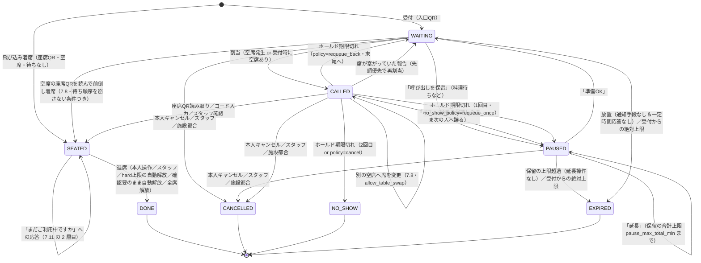
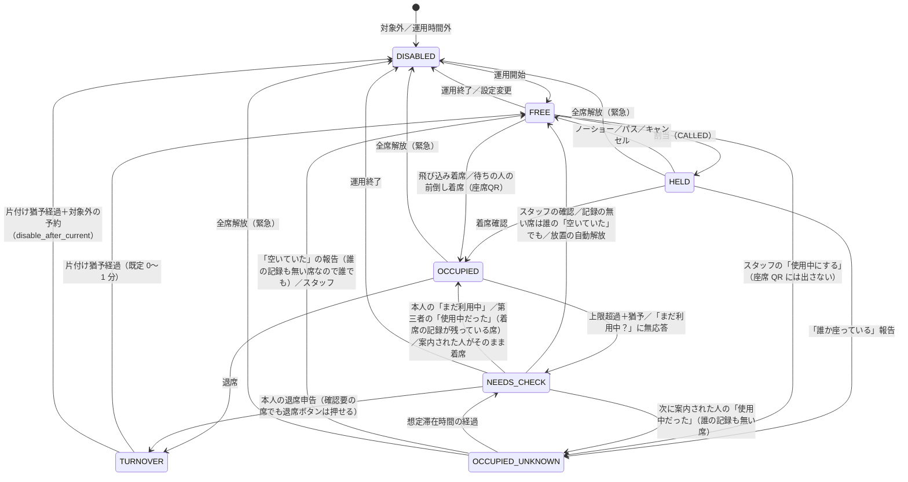
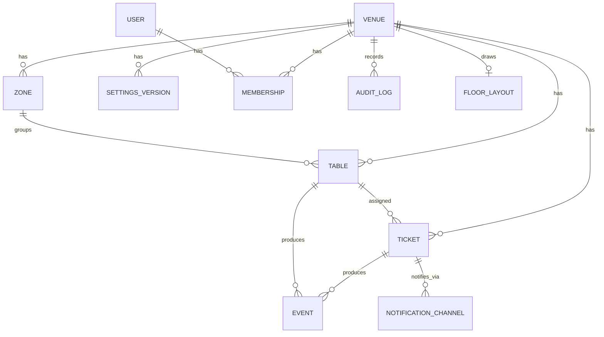
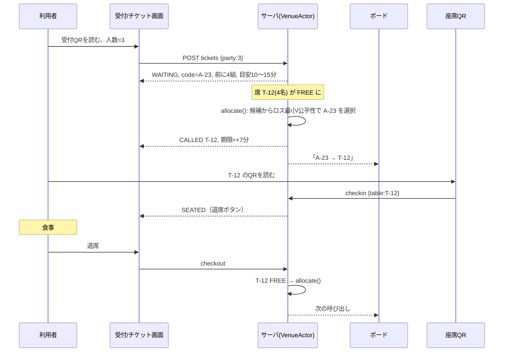

# OpenSeat 開発プラン

- 作成日: 2026-09-16
- 対象: `docs/260916_memo.md` のメモをもとにした、OpenSeat（フードコートの席取り問題を解決する OSS）の開発・導入計画
- 位置づけ: 実装前の「設計と進め方の基準書」。各章は独立して読めるようにし、決定事項は「決定」、未決は 16 章にまとめる。数値の既定値はシミュレーションと実証実験で更新する
- 本文中の [n] は 17.7 の参考資料番号。外部の事実は 2026-09-16 時点の調査に基づき、確度が低いものは「要確認」と記す
- 実装時の作業指針は `.claude/CLAUDE.md`、設計判断の記録は `docs/adr/`、フェーズと現在地は `docs/ROADMAP.md` にある。
- **各フェーズの実装プランは `YYMMDD_plan_PhaseN.md` として別に作る。** 本計画書が「何を作るか」、フェーズ別プランが「どの順番で、どの粒度で作るか」、CLAUDE.md が「どう作るか」を定める。Phase 1 は [`260917_plan_Phase1.md`](260917_plan_Phase1.md)。**本計画書が設計の唯一の出典**で、CLAUDE.md と食い違ったら本計画書を正とし、CLAUDE.md を直す
- 更新履歴: 2026-09-16 初版。同日、名称の重複確認（商標・ドメイン・GitHub・npm・アプリストア・ソーシャル）を実施して 4.8 を全面的に書き換え、**名称を「OpenSeat」で確定**し、13・15・16 章を更新。同日さらに、**運用費を誰が負担するかを OSS の先例に照らして整理**し、14 章を全面的に書き換え、技術選定（9 章）を単一コンテナで確定、9.13・4.7・5.3〜5.5・11・12・13.5・15・16 章を更新。2026-09-17 以降は、Phase 1 の実装で分かったことを 7 章と 9 章へ随時反映している（**どの PR が何を直したかは [`260917_plan_Phase1.md`](260917_plan_Phase1.md) の各 PR の「実装後の記録」にある**）

## 目次

1. エグゼクティブサマリー
2. 課題と提供価値
3. 既存ソリューションと差別化
4. プロダクトコンセプト
5. ステークホルダーと導入戦略
6. 利用体験と物理設計
7. コアロジック仕様
8. シミュレーションによるロジック検証
9. システムアーキテクチャ
10. 画面設計
11. 開発ロードマップ
12. 実証実験計画
13. OSS 運営と法務
14. コストと資金
15. リスクと対策
16. 直近 30 日のアクションと未決事項
17. 付録

---

## 1. エグゼクティブサマリー

**課題**: フードコートのピーク時（土日祝 11:30〜13:30 が典型）に、席が空くのを探し回り、いつ空くか分からないことがストレスになっている。荷物での席取りは慣習化しているが、盗難やトラブルの原因にもなっている [2][3]。

**解**: OpenSeat は「席を探す」を「順番を待つ」に置き換える。入口の受付 QR で人数を登録すると仮想の待ち行列に入り、席が空くと人数に合う席が割り当てられて呼び出される。各席の座席 QR で着席と退席を記録し、占有状況を正確に保つ。センサーやカメラは不要で、施設は「対象にする席」を管理画面で選び、QR を印刷して貼るだけで始められる。

**既存製品との違い**: 国内で普及している VACAN などは混雑の可視化（カメラ・センサー）やデジタル整理券が中心で、「待ち行列から空いた席を人数に合わせて割り当てる」型は確認できなかった [9][12]。有料の指定席（三菱地所・サイモン系アウトレットの実証や大阪・関西万博）は課金と係員確認を前提にしている [19][22]。OpenSeat は無料・匿名・ハード不要・OSS で、一部の席・特定の時間帯から始められることを差別化の軸にする。

**ロジックの要点**（7 章）: 席は定員の小さい順に処理し、候補のうちロス（定員−人数）最小の組を優先、ただし 10 分以上長く待つ組を保護する。呼び出し後は 7 分のホールド（2 分前リマインド、1 回 3 分延長）。期限切れ 1 回目は順番を保持して保留、2 回目で終了。時間上限は「ソフト 60 分・待ちがいる時だけ」を既定にし、自動解放はしない。退席の押し忘れと無断利用は、問いかけ・次の利用者の確認・スタッフ画面・時間経過の 5 層で回復する。

**技術**（9 章）: TypeScript のモノレポ。純粋関数のドメインロジック（`packages/core`）をサーバとシミュレータで共有し、**Hono + SQLite の単一コンテナ**で動かす。利用者はアプリもアカウントも不要。通知は「画面内＋入口ボード」を基本に、Web Push と LINE を任意で足す。単一コンテナを選ぶのは速度や流行ではなく、**成果物をそのまま他者に引き取ってもらえる**ことが運用費の問題を解く唯一の道だからである（9.13、14.4）。

**お金**（14 章）: OSS の標準は「コードは無料、動かす場所は有料」で、メンテナが商用ユーザーの本番運用費を無償で持ち続ける例は調査した 7 件すべてで存在しなかった。したがって **実証期間だけ開発者が無償でホストし、その終期を覚書に明記する**（負担ではなく販売経費として扱う。月 900 円程度）。継続時は 3 つの座組みから施設に選んでもらい、**第一目標は施設に出入りしている IT 事業者への引き渡し**とする。開発者がマネージドで提供する場合の価格は月 10,000 円からで、既存サービスの半額以下にあたる。

**進め方**（11・12 章）: Phase 0 で現地観察と渉外を始め、Phase 1 でロジックとシミュレーション、Phase 2 で MVP、Phase 3 で OSS 公開、2027 年 3〜4 月に 8 卓 26 席程度・土日 4 日間の実証実験を目標にする。総工数は 280〜390 時間の見込み。

**渉外の現実**（5 章）: YOXO BOX は 2025 年度から次世代起業人材育成拠点（YOXO NEXT）に役割を変え、会員登録は紹介制で運用されている [89][90]。横浜ワールドポーターズは 2025 年にイオンモールが直営化し、横浜市との資本関係は解消されている [98][99]。したがって「YOXO BOX 会員→施設紹介」の一本足ではなく、YOXO BOX の運営共同体の幹事である三菱地所（MARK IS の所有者）とのつながり、横浜市の共創フロント、YOXO FESTIVAL 2027 への出展（締切 2026-10-20）、横浜市役所内のフードホール（京急運営）など複数の経路を並行して当たる。

**直近 30 日**（16 章）: KID2027 ピッチ応募（締切 9/28）、YOXO FESTIVAL 2027 出展申込（締切 10/20）、YOXO BOX への直接コンタクト、現地観察 2 回、名称・ライセンス決定、リポジトリ公開。

---

## 2. 課題と提供価値

### 2.1 利用者の課題

- **探索のストレス**: ピーク時は空席を求めてフロアを歩き回り、見つけても先に取られる。「いつ空くか」が分からないため、待つべきか諦めるべきかも判断できない。
- **席取りの負担と摩擦**: 一人が席を確保し、他の人が買いに行く分業が必要になる。一人客は席を確保したまま買いに行けない。荷物で席取りする慣習は盗難やゴミとの誤認、食事中の人に次の席を頼まれる気まずさなどを生んでいる [2][3][4]。注文後は呼び出しベル（ページャー）で受け取りに行く運用が一般的で [7]、席の確保はその前に済ませておく必要がある。
- **人数のミスマッチ**: 2 名が 4 人席を使い、4 名家族が座れない。逆に大人数席しか空いていないと一人客が遠慮する。

### 2.2 施設の課題

- 席の稼働と回転が見えない。ピークの平均滞在時間は 35〜40 分程度、稼働率 85% 程度が運営上の目安と解説されるが [1]、実測データを持つ施設は少ない。
- 席案内はフロアアテンダントや清掃スタッフが目視で行っており [1][6]、混雑時ほど手が回らない。
- 長時間利用（作業・読書・睡眠）への対応は掲示による「ご遠慮ください」にとどまる [5]。

### 2.3 提供価値

| 対象 | 価値 |
|---|---|
| 利用者 | 探し回らない。待ち時間の目安が分かる。人数に合う席に案内される。一人でも席を確保してから買いに行ける |
| 施設 | 初期費用・ハード不要で導入し、一部の席・時間帯から試せる。席の稼働・待ち時間・滞在時間のデータが取れる。席案内業務をスタッフ画面で補助できる。席取りトラブルが減る。地域発 OSS の実証という広報価値 |
| 社会・OSS コミュニティ | 学食・社員食堂・イベント会場など、同じ構造の課題に無償で転用できる |

### 2.4 成功の定義

- 短期（実証実験）: 12 章の仮説 H1〜H4 を満たし、施設が継続を検討できると評価する。
- 中期（1 年）: 横浜市内の 1 施設で定常運用、2 施設目の合意、OSS として第三者が自前で立ち上げた事例が 1 件。
- 長期: フードコート以外（学食・社員食堂・図書館併設カフェなど）への転用と、コミュニティによる多言語化・機能追加。

---

## 3. 既存ソリューションと差別化

### 3.1 国内の関連製品・事例

| 製品・事例 | 仕組み | OpenSeat との関係 |
|---|---|---|
| VACAN AIS / Maps（バカン） | 天井 AI カメラやセンサー、スタッフの手動ボタンで混雑度を判定し、地図やサイネージに表示。成田空港 T3（2018 実証）、うめきたグリーンプレイス（2025）などのフードコートに導入 [9][10][11][13][14][15] | 「空いているかどうか」の可視化。席の割当や順番待ちはしない。ハード費用がかかる（第三者経由の情報で混雑センサー付きプラン月額 8,250 円/台＋初期 385,000 円/台 [17]、要確認） |
| VACAN Q ticket | デジタル整理券（順番待ちのみ、席割当なし）。スマホ完結プラン初期 0 円・1 日 980 円 [12][16]。2026 年には並んだ時間にポイントを付与する実証も行っている [18] | 順番待ちの UI は参考になるが、席の割当・着席確認がない |
| VACAN AutoKeep | 席横タブレットで直前予約・課金（カフェ・コワーキング向け） [12] | 席単位の管理をタブレットで行う例。フードコートの無料席には重い |
| Connected Space Share（イッツコム × 三菱地所・サイモン） | LINE で予約・決済し、アウトレットのソファ席を時間貸し（550〜880 円/時）。2024〜2026 に神戸三田・ふかや花園・佐野で実証 [19][20][21] | 三菱地所グループが商業施設の席に課題意識を持つ根拠。有料・係員確認・時限式で、無料席の課題は解かない |
| 大阪・関西万博「大阪のれんめぐり」 | 約 500 席を有料指定席（550 円/50 分）、事前決済と QR 提示 [22] | 「席を保証するには入替制と課金が要る」という一つの答え。OpenSeat は無料で公平性を保つ設計を目指す |
| イオンモール大阪ドームシティ 4F フードコート座席予約（LINE ミニアプリ） | 存在は確認できたが告知ページが消えており仕組み・結果は不明 [23]（要確認） | 横浜ワールドポーターズの運営元であるイオンモールが座席予約を試した形跡。提案の切り口になる |
| EPARK / Airウェイト / TableCheck | 飲食店の順番待ち。Airウェイトは月額約 2 万円＋呼び出し従量で LINE 呼び出しが標準 [24][25]。フードコートの導入事例は確認できず | 呼び出し・ノーショー処理の UX の参考。席割当はない |
| ららぽーと「スマホ de 注文」等のモバイルオーダー | 席で注文して受け取りに行く [8] | 将来の連携先。席が確保されていることが前提になるため相性が良い |

### 3.2 図書館・学食・オフィスの座席システムから学べること

- 公立図書館の座席予約は「Web 予約→館内で確定、未確定は 15 分（施設により 20〜30 分）で自動取消」「予約票を机上に掲示」「離席中で票がなければ取消」「繰り返しの不履行で予約制限」が共通型 [26][27][28]。**15 分の猶予と物理的な表示** は実証実験の比較条件として採用する。
- LibCal Seats の事例では、チェックイン必須化でノーショーが 22% から 13% に下がり、利用者の 74% が「予約席が占有されていた」経験を持つとの二次情報がある [30]。会議室予約では未チェックインの幽霊予約が 30〜40% と言われる [32]。**着席確認を必須にする** 判断の裏付け。
- シンガポール経営大学の図書館は席の QR を開始 15 分以内に読ませ、ブラウザの位置情報を必須にしている [29]。OpenSeat は位置情報を要求しない（プライバシーと iOS の許可 UI の負担）代わりに、席の QR が物理的にその場にあることを「その場にいる証拠」として使う。
- オフィスのフリーアドレス管理（Colorkrew Biz）は QR で着席・退席を記録し、退席忘れをプッシュ通知で補っている [31]。7.11 の「問いかけ」設計と同じ発想。
- ハードは万能ではない: Yahoo の 2019 年の実証ではセンサー 300 個中 1/10 しか送信に成功せず、ゲートウェイの電源抜けも起きた [33]。在席センサーの精度は 80〜90% 程度との事業者情報もある [34]。**まず自己申告で回し、データが取れてからセンサーを検討する** 順番が合理的。

### 3.3 海外の待ち行列運用のルール

| 事例 | ルール |
|---|---|
| Toast Tables（レストラン） | 通知後 15 分で来店・応答がなければ自動で完了扱い。SMS で 1=確認、9=辞退 [35] |
| Yelp Guest Manager | 通知後 5 分超の組を要注意表示。2025 年に無応答の自動除外を追加 [36] |
| Disney Virtual Queue | 呼び出し後 1 時間の帰還枠 [37] |
| シンガポールのホーカー | ティッシュ等での席取り（chope）が慣習。当局は罰則を設けず、施設ごとのハウスルール掲示にとどまる [38][39] |

飲食店は「通知→本人の応答で意思確認→15 分で自動完了」が定石だが、これらは来店前の客を対象にしている。フードコートでは利用者がすでに施設内にいるため、OpenSeat のホールドは短め（既定 7 分）から始め、5〜15 分で感度分析する（7.7、8 章）。

### 3.4 ポジショニング

```
                 席の割当あり
                     ▲
   有料指定席         │        OpenSeat（無料・匿名・自己申告・OSS）
  （万博、CSS）      │
                     │
 ────────────────────┼──────────────────────▶ ハード不要
                     │
   VACAN AIS/Maps    │   VACAN Q ticket / EPARK / Airウェイト
  （カメラで可視化）  │  （順番待ちのみ、席は自分で探す）
                 席の割当なし
```

差別化の軸は 4 つ。(1) 待ち行列と席割当を結び付ける、(2) センサー・カメラ・専用端末を使わない、(3) 一部の席・一部の時間帯から始めていつでも戻せる、(4) OSS で誰でも自前で立ち上げられ、ロックインがない。

---

## 4. プロダクトコンセプト

### 4.1 一言で

「席を探す」を「順番を待つ」に置き換える、フードコートのための順番待ち・席割当システム。

### 4.2 仕組みの全体像

```
入口                            対象席ゾーン（例: 8 卓 26 席）              スタッフ・管理
┌──────────────┐               ┌─────────────────────────────┐        ┌─────────────────┐
│ 受付 QR       │ 人数を登録    │ 各席に 座席 QR ＋ 席番号 ＋ 4桁コード │        │ スタッフコンソール │
│ （メモの      │──────────▶   │                             │        │ 管理画面          │
│ 「予約用QR」）│ 待ち行列へ    │ 呼び出し → 席の QR を読む → 着席 │◀──────▶│ ・席の状態        │
│ 呼び出しボード │◀──────────   │ 食べ終わったら「退席」ボタン    │        │ ・確認要の席      │
│ （タブレット） │ 「A-23→T-12」 │                             │        │ ・設定・印刷      │
└──────────────┘               └─────────────────────────────┘        └─────────────────┘
```

メモの「予約用 QR」を本計画では **受付 QR**、「着席・離席確認用 QR」を **座席 QR** と呼ぶ。座席 QR は着席・退席だけでなく、空席への飛び込み着席、他人の席に来てしまった時の案内、席が塞がっていた時の報告も 1 枚で担う（7.8）。

### 4.3 利用者の体験（30 秒で説明できる形）

1. 入口の QR を読み、人数を入れる（10 秒）。
2. 目安時間と番号を見ながら、料理を買いに行くなど自由に過ごす。画面は開いたまま。
3. 席が決まると画面が変わり音が鳴る（入口ボードにも番号が出る）。7 分以内に席へ行き、席の QR を読む。
4. 食べ終わったら「退席」を押す。次の人に席が届く。

### 4.4 施設の体験

1. 管理画面で施設を作り、フロア図の上に席を置いて定員を入れ、対象にする席を選ぶ（10.2）。
2. QR 台紙とポスターを PDF で印刷し、席と入口に置く。
3. 運用時間帯を設定する（例: 土日祝 11:00〜14:30）。時間外は自由席に戻る。
4. スタッフはスマホで状態を見て、確認が必要な席だけ巡回する。
5. 翌日にレポート（待ち時間・滞在時間・稼働率）を見る。

### 4.5 設計上の決定

| 決定 | 内容 |
|---|---|
| 予約ではなく順番待ち | 時刻指定の予約は空席を保証できない。仮想待ち行列＋割当で「今から並ぶ」体験にする |
| 対象席はゾーン単位 | 全席を管理しようとすると無断利用に負ける。まとまった区画を「順番待ちの方専用席」として明示し、時間帯限定で運用する |
| 着席確認は QR 必須、退席はボタンだけ | その場にいる証拠は着席時にだけ必要。退席は手間を減らして申告率を上げる |
| 個人情報を取らない | 人数と匿名トークンだけで動く。通知先（Push/LINE）は任意で、チケット終了時に削除 |
| 通知は多重化 | 画面内・ボード・Push・LINE のどれか 1 つが届けばよい設計 |
| 不整合を前提にする | 7.11 の 5 層で回復する。「システムが正しい」と主張しない |
| すべて設定可能 | 施設の方針の違い（厳しめ・ゆるめ）をプリセットとパラメータで吸収 |

### 4.6 非目標（v1 でやらないこと）

- 有料の席予約・課金。
- 時刻指定の事前予約。
- モバイルオーダーや決済との統合（将来の連携先として API は残す）。
- センサー・カメラによる自動検知（v2 で入力インターフェースとして検討）。
- ネイティブアプリ。
- 利用者同士のメッセージ機能（法的な届出の対象になりうるため入れない。13.4）。

### 4.7 施設の導入ハードルを下げるための設計

メモの「企業側の導入のハードルは下げたい」を、機能ではなく設計原則として扱う。

| 施策 | 内容 |
|---|---|
| ハード不要 | QR と利用者のスマホだけで動く。ボードは既存のサイネージや手持ちのタブレットで代用できる |
| 実証は費用ゼロ、継続は選べる | 実証期間中は無償で開発者がホストし、施設の技術的な作業はゼロ。継続時は 3 つの座組みから選べる（14.4）。**無償の終期を最初に示す**ことで、後出しにしない |
| 引き取れる | 成果物は 1 つの Docker コンテナ。施設・親会社・出入りの IT 事業者のいずれでも `docker compose up -d` で運用を引き取れる（9.13） |
| 既存業務に乗せる | 席案内・清掃スタッフの巡回にスタッフ画面を添えるだけ。新しい人員を要求しない |
| 一部の席・一部の時間帯から | ゾーンと運用時間帯を設定し、それ以外は従来どおり。いつでも OFF にして自由席に戻せる |
| 設定はプリセット | 「ゆったり／標準／混雑対応」から選び、細かい値は後から |
| 印刷物は自分で出せる | QR 台紙・ポスターを管理画面から PDF 出力。デザインは施設のトーンに差し替え可能 |
| 個人情報を持たない | 施設側のプライバシー対応が最小で済む |
| 撤退が容易 | データのエクスポートと削除、掲示物の撤去だけで終えられる。ソースも運用手順も公開されているため、開発者がいなくなっても続けられる |
| 実証のパッケージ | 掲示物テンプレート、運用手順書、評価指標、報告書の形式を用意し、施設の担当者の社内説明を肩代わりする |
| データを返す | 待ち時間・滞在時間・稼働率のレポートを施設に提供し、導入自体が施設の資産になる |

### 4.8 名称の重複確認（2026-09-16 実施）

「OpenSeat」について、商標・同名事業・ドメイン・パッケージレジストリ・GitHub・アプリストア・ソーシャルの重複を確認し、**この名前を継続すると決定した**。確認方法と限界は 4.8.7 に記す。

#### 4.8.1 結論

**「OpenSeat」を継続する。日本国内では商標・法人・ドメインのいずれにも障害がなく、個人開発で日本を主戦場にする以上、これが実質的な判断材料のすべてである。**

当初は改名を推奨したが、次の理由で判断を改めた。

1. **日本は完全にクリア。** 商標の登録も出願もなく（4.8.2）、同名の法人もない。**openseat.jp・openseat.co.jp・open-seat.jp はすべて空いている**（4.8.4）。npm・PyPI・crates.io・Docker Hub・RubyGems の `openseat` もすべて空きで、**パッケージの名前空間は丸ごと取れる**。
2. **失うものは限定的。** 取れないのは openseat.com、GitHub 組織 `openseat`、X の @openseat の 3 つ。いずれも日本での実証実験と OSS 公開を止めるものではない。
3. **代替候補は商標が未確認。** 本調査の後に商標データベースへ到達できなくなったため、**4.8.6 の候補はいずれも商標を確認できていない**（4.8.7）。つまり **「OpenSeat」は、日本での商標クリアランスを実際に取った唯一の名前**である。確認済みの名前を、未確認の名前に替えるのは割に合わない。

**継続の条件（必須）**

1. **openseat.jp を直ちに取得する**（年数千円）。空いていて、かつ誰にでも取られうる唯一の重要資産である。防御的に open-seat.jp も押さえてよい。
2. **npm・PyPI・Docker Hub の `openseat` を同時に押さえる。** 空いているうちに確保する。
3. **リポジトリは個人アカウント配下に `kusui26/OpenSeat` として作る。** GitHub で取得できないのは**アカウント名（組織名）の `openseat`** だけで、**リポジトリ名の `OpenSeat` は誰でも自由に使える**（リポジトリ名は所有者ごとに一意であればよく、実際に複数の個人アカウントが `OpenSeat` という名前のリポジトリを持っている）。組織アカウントを作る必要はない。詳細は 4.8.5。
4. **提案資料に「OpenTable 社とは無関係」と明記し、ロゴで出所を差別化する。** 施設向けの呼称は日本語（例「席の順番待ち」）にして OSS 名と分離する。これは「オープンシート」が日本語では座席の種類を指す普通の語として通じてしまう問題（4.8.2）への対策も兼ねる。

**受け入れるリスク。** 米国の OpenSeat, LLC（openseat.cc）が「No app required」を掲げるチケット販売 SaaS を稼働させており、売り文句まで重なる（4.8.3）。フランスでは 2026 年に「Open Seat」が広い区分で登録され、トルコでは第 9・35・42・43 類の出願が異議期間中（2026-11-12 まで）にある。**将来の国際展開と、英語圏での検索上の地位はこの名前では取れない**。国内で完結する限り実害はないが、海外展開を本気で考える段階が来たら、その時点で英語圏向けの別名を用意する（プロダクト名と OSS 名を分ける運用は 4.8.1 の条件 4 と同じ考え方で拡張できる）。

**判断を覆す条件。** トルコ出願 2026-087570 が公告されて権利者が同種サービスであり、日本への出願に動いた場合。この 1 点だけは 2026-11-12 の異議期間満了に合わせて確認する。

#### 4.8.2 商標

**日本: 「OpenSeat」「オープンシート」の商標登録・出願は見つからなかった。**

| 調べたこと | 結果 |
|---|---|
| 日本の登録・出願（`openseat` / `OPEN SEAT` / `open-seat` / `オープンシート` / `ｵｰﾌﾟﾝｼｰﾄ`、第 9・35・39・42・43 類での絞り込みを含む） | **該当なし** |
| あいまい一致した 2 件 | 「デュアルオープンシート」登録 5108686（ヤマハ発動機、第 12 類＝乗り物、存続）。二輪車のシート名称で本件と無関係。「ライオン＼オーブンシート」登録 4643046（第 16 類、消滅）。「オーブン」であって「オープン」ではない |
| 日本の法人名 | 「オープンシート」「OpenSeat」を名乗る法人は **0 件**（国税庁法人番号データのミラーで検索）[118] |
| マドプロ国際登録（WO）の openseat | **0 件**。日本への事後指定によるリスクは現時点でなし |

**海外には権利が存在する。**

| 国 | 内容 | 状態 |
|---|---|---|
| **トルコ** | 出願 2026-087570、出願日 **2026-07-07**、**第 9・35・42・43 類**（43 類＝飲食物の提供）[115] | **出願中**。異議期間 2026-08-12〜**2026-11-12**。区分構成が本プロジェクトとほぼ同一で、同種サービスの可能性が高い。権利者は公告まで非公開 |
| **フランス** | 「Open Seat」登録 5262595、出願 2026-05-28、第 **9・35・36・38・41・42・45 類**（非常に広い）、権利者 CHOUCRY ELAMRI | **登録済**。アヌシーで設立中の同名企業の実体と一致（4.8.3） |
| 中国 | OPENSEAT 登録 27813793、第 9 類、广州美凯信息技术股份有限公司 | 存続 |
| 米国 | OPENSEAT 出願 87697652 / 登録 5582242、権利者 Openseat（カリフォルニア）、第 35 類（広告）・第 42 類（美容・医療の予約を可能にするサイト）[114] | **消滅**（宣誓書の不提出により 2025-04-25 取消） |
| 米国 | OPENSEATS.COM 出願 78013794 / 登録 2515454、第 35 類 | 消滅（2022-06-17 取消） |
| 米国 | OPEN SEAT 出願 87176473、ManeStreem, Inc.、第 9・42 類 | 消滅（2017-06-28 放棄） |
| 米国 | OPENSEATDIRECT 出願 88606207、第 9 類 | 消滅（2020-06-16 放棄） |
| EUIPO・WIPO 国際登録 | openseat / open seat | **0 件** |

**OpenTable との関係。** OpenTable, Inc. は世界で 70 件規模の商標を持ち、日本では登録 4964008（「ＯＰＥＮＴＡＢＬＥ」、第 9・35・43 類、2006-06-23 登録、**存続期限 2036-06-23**）を維持している。米国 registration 5235948（第 9・35・36・42・43 類）、EU・英国・国際登録も生きている。一方で **OpenTable は「OPENSEAT」をどの国でも出願していない**。また、連邦裁判例で OpenTable が当事者となった 19 件はいずれも特許・TCPA・契約・ADA・独占禁止に関するもので、**商標権者として類似名称を提訴した例は確認できなかった**[119]（米国特許商標庁の異議申立記録 TTABVUE はサーバ障害のため確認できず、不明）。法的には「Open」の識別力が弱く、要部は Table と Seat で称呼・外観とも明確に異なるため非類似と判断される可能性が高い。ただし次の 3 点でリスクはゼロではない。

1. 生きている登録 4964008 が第 9・35・43 類で、飲食店の座席という需要者・用途が完全に重なる。
2. OpenTable 自身が 2018 年に米バージニア州で「OpenSeat」という相席マッチング機能を実施した実績がある（未登録、日本未展開）。
3. 法的リスクとは別に、商業施設の担当者に「OpenTable の関連サービスですか」と誤解される営業上のノイズになる。

**「オープンシート」は日本語で記述的に使われている。** 快活 CLUB（複合カフェチェーン）が座席タイプの正式名称として「オープンシート」を使い、「壁で仕切られた空間ではない、オープンカフェスタイルのお席」と説明している [120]。座席に直結する第 43 類では「役務の質の表示」として識別力なしで拒絶される可能性があり、逆に他社も同区分で独占しにくい。第 9 類（アプリ）・第 42 類（SaaS）なら登録可能性は相対的に高い。なお日本語表記では **「オーブンシート」（クッキングシート）と濁点 1 つしか違わない**。

**既存の座席・順番待ちサービスとは紛らわしくない。** VACAN（登録 6011442、第 9・35・42 類、存続）、EPARK（登録 5739490 ほか、存続）、AirWait（登録 5670922、第 9・42 類、存続）。称呼・外観とも大きく異なる。参考として、大量出願で知られる事業者が「FREE SEAT」を 2015〜2019 年に繰り返し出願していずれも登録料未納で消滅している。座席系の英単語名は狙われやすいが登録には至っていないという傾向が読み取れる。

**この調査の限界（重要）。** J-PlatPat は JavaScript 主体の画面で直接検索できず、WIPO Global Brand Database と Toreru 商標検索も bot 対策で到達できなかった。そのため **TMview**（EUIPO/TMDN が各国特許庁のデータを集約する公式の横断データベース）の API を主情報源とし、次の 2 点で妥当性を確かめている。

- 対照実験: 同じ方法で「opentable」を日本指定で検索すると、既知の日本登録が正しく返る。
- 鮮度確認: 日本データの最新出願日が 2026-07-24 で、本日から 1〜2 か月のラグに収まる。
- さらに本セッションから独立に同 API を叩き、`openseat` の日本指定で該当 0 件を再確認した。

したがって「日本に登録なし」は **JPO の一次データに基づくが、J-PlatPat 本体では未確認** という位置づけになる。出願や商用展開の前に J-PlatPat で目視確認すること。

**商標出願の費用。** 特許庁の公式料金 [116] による 2026-09 時点の額。

| | 出願料 | 設定登録料（10 年一括） | 合計 |
|---|---|---|---|
| 1 区分 | 12,000 円 | 32,900 円 | **44,900 円** |
| 2 区分 | 20,600 円 | 65,800 円 | **86,400 円** |

設定登録料は 5 年分納も選べ、その場合は 1 区分 29,200 円・2 区分 55,000 円で始められる。出願料は 3,400 円＋区分数×8,600 円、設定登録料は区分数×32,900 円（分納は区分数×17,200 円）、更新は区分数×43,600 円。自分で電子出願すればこの特許庁費用だけで済む。弁理士に依頼すると別途 10〜20 万円程度（未検証）。出願から登録までは概ね 1 年前後で、早期審査を使えば短縮できる（期間は未検証）。

#### 4.8.3 同名で稼働している事業・プロダクト

| 名称 | 内容 | 本プロジェクトとの距離 |
|---|---|---|
| **OpenSeat, LLC**（openseat.cc）[121] | 「OpenSeat — Sell tickets and registration. No app required.」。無料・軽量のチケット販売プラットフォームで、イベントごとに URL と **QR コード**を発行する。iOS アプリ「OpenSeat Tickets」（2026-01 公開、2026-06 更新）[128] と Android 版あり。商標登録はなく、米国のコモンロー上の権利のみ | **最も近い**。QR を使う点、「アプリ不要」を掲げる点が重なる |
| Open Seat（フランス、アヌシー）[124] | 起業家・フリーランスのマッチング。2026 年設立、2〜10 名。LinkedIn で活動中。**FR 商標 5262595 の権利者と同一主体とみられる** | 分野は遠いが、広い区分で権利を持つ |
| OpenSeat｜Salon Innovations（openseat.com）[122] | 美容サロン向け（セット面レンタル系とみられる）。Coming soon ページのみだがメールは稼働 | 遠い |
| OpenSeat（openseat.me）[123] | 米国の NPO。K-12 学校向けの 1 対 1 メンタルヘルス／SEL コーチング | 遠い |
| openseat.org | ダラス／DFW 地域のクリスチャン女性向け食事会コミュニティ（席は事前予約・事前決済制） | 遠い |
| Beauty Careers Network（open-seat.com） | 美容業界の求人。2026-08 登録と新しい | 遠い |
| Open Seat - Spontaneous Dating | デーティングアプリ。2026-07-17 公開、**日本の App Store でも配信中** [125] | 遠いが、日本で名前が見える |
| OpenSeatz Events（Seatz, Inc.） | 音楽イベント系アプリ。2026-02 公開 | 遠い |

日本の App Store で「openseat」を検索すると、上位は OpenTable・Resy・AutoReserve などの飲食予約アプリが占め、同名としては上記のデーティングアプリが 1 本出る。**フードコートや飲食店の座席管理を名乗る実体は、世界のどこにも存在しない。** 用途は空いているが、名前は空いていない。

#### 4.8.4 ドメイン

**登録済み（取得できない）**

| ドメイン | 登録 | 実体 |
|---|---|---|
| openseat.com | 2003-08、Amazon Registrar、AWS ＋ Google Workspace | OpenSeat｜Salon Innovations（4.8.3）。メールは稼働中 |
| **openseat.cc** | Google Cloud DNS | **OpenSeat, LLC のチケット販売 SaaS が稼働中**（4.8.3） |
| openseat.me | 2021-05、Wix ＋ Google Workspace | 米国の K-12 向けコーチング NPO（4.8.3） |
| openseat.app | 2022-10、Namecheap、**openseat.me と同じ Wix の NS** | 未接続（Wix のエラー画面）。上記 NPO が押さえているとみられる。期限 2026-10-31 |
| openseat.co | 2012-04、GoDaddy、期限 2027-04 | ライドシェアの rideshare2.com へ転送（車の「空席」の意味） |
| openseat.dev | 2022-01、Name.com、AWS | 応答なし（保有のみ） |
| openseat.org | 2016-04、GoDaddy、Microsoft 365 | ダラスの女性コミュニティ（4.8.3） |
| openseat.io / .net / .xyz | GoDaddy 他、**Afternic の NS** | パーキング（売出中）。交渉すれば買える可能性はあるが価格は不明 |
| openseat.cloud / .live / .shop | AWS / Spaceship | 応答なし（保有のみ） |
| open-seat.com | 2026-08、GoDaddy | Beauty Careers Network（4.8.3） |

**空き（取得できる）**

- **openseat.jp / openseat.co.jp / open-seat.jp**（JPRS の whois [117] が "No match!!"、DNS 委任もなし。2 経路で確認）
- openseat.tokyo / openseat.yokohama
- openseat.tech / .space / .works / .team / .site / .info / .biz / .store / .one / .food

主要な gTLD はほぼ埋まり、**日本向けの .jp 系だけが空いている**という偏りになっている。

#### 4.8.5 パッケージレジストリ・GitHub・ソーシャル

| 対象 | 結果 |
|---|---|
| npm（`openseat` / `open-seat` / `openseats` / `@openseat`） | **すべて空き** |
| PyPI・crates.io・Docker Hub・RubyGems | すべて空き |
| GitHub 組織 `openseat` [127] | **使用中**。2014-03 作成の「openSEAT（Open Systems Engineering & Architecture Toolkit）」。公開リポジトリ 3 件、最終 push は 2015-12-31、サイトは 404。実質廃止だが名前は解放されない |
| GitHub 組織 `OpenSeatApp` / `OpenSeats` / `openseathq` | 使用中（いずれも実質廃止または名前の押さえのみ） |
| GitHub 組織名（空き） | `openseat-jp` / `openseat-app` / `open-seat` / `getopenseat` / `openseat-dev` |
| GitHub のリポジトリ | 名前に openseat を含むものが **96 件**、名前が完全一致するものだけで 39 件。**最大スター数は 3** で、著名 OSS との衝突はない |
| X（旧 Twitter）`@openseat` | **使用中**（存在しないハンドルが 404 を返すことを確かめたうえでの判定） |
| LinkedIn `/company/openseat` | 未使用。ただし `/company/open-seat` はフランスの同名企業が活動中（4.8.3） |
| Zenn `/openseat`、Qiita `/openseat` | 空き |
| Instagram `@openseat` | 判定不能（存在しないハンドルでも同じ応答が返るため）。要手動確認 |

GitHub は休眠を理由とした名前の解放・移管・回収の依頼を受け付けておらず、審査の対象になるのは有効な商標に基づく申立てのみである [126]。したがって `github.com/openseat` は取得できない。

**ただしこれはリポジトリ名の問題ではない。** GitHub の URL は `github.com/<所有者>/<リポジトリ名>` という形で、**リポジトリ名が一意である必要があるのは同じ所有者の中だけ**である。実際に `davida2212/OpenSeat`、`doitformyset/OpenSeat`、`pqmx/openseat` が同時に存在している。埋まっているのは**所有者名（個人アカウント名または組織名）としての `openseat`** だけで、`OpenSeat` というリポジトリ名は誰でも使える。

**本プロジェクトは `kusui26/OpenSeat` で始める**（2026-09-16 時点で未作成であることを確認済み）。個人開発の段階で組織アカウントを作る利点はなく、管理が増えるだけである。組織が必要になるのは、(a) 複数のメンテナに権限を割り振りたくなったとき、(b) 提案資料に載せる URL をブランド化したくなったとき、のいずれかで、**そのときにリポジトリを組織へ移管すればよい**。移管ではスター・ウォッチャー・Issue・プルリクエスト・Wiki・コミット履歴が引き継がれ、**元の URL からは自動でリダイレクトされる**。`git clone` / `fetch` / `push` もリダイレクトされるが、ローカルのリモート URL は更新しておくのが望ましい [129]。注意点として、移管後に元の場所へ同名のリポジトリを新しく作るとリダイレクトは恒久的に失われる。

同名リポジトリのうち問題領域が近いもの: 座席指定チケッティング（`nkieu-config/openseat`、MIT）、大学図書館の座席予約（`zhiwei531/OpenSeat`）、図書館の混雑・空席可視化（`aryanbakshi25/openseat`、`sakshikarande26/openseat`）、履修科目の空き枠通知（`AzamAbdul/OpenSeatNotifier`、`jmath1/OpenSeatFinder`、`sabrinahaniff/OpenSeat`）、満席列車の空席探し（`anhelinakruk/OpenSeat`）、「An OpenTable clone」を名乗るもの（`dkwal/OpenSeat`）、そして日本語の **「今、あいてる？」**（`pugachev/openseat`、Laravel、2026-07 更新）。**「OpenSeat」は空席問題に対して誰もが思いつく名前である**ことを示している。

#### 4.8.6 代替候補

将来改名する場合に備えた候補。2026-09-16 に npm・GitHub 組織・PyPI・.com・.app・.jp・X のハンドルを確認した。**商標は確認できていない**（4.8.7）。

**すべての名前空間が空いているもの**

| 候補 | 読み | 由来・機能との対応 | .com | .app | .jp | X |
|---|---|---|---|---|---|---|
| **SeatNavi** | シートナビ | 席へ案内する。本アプリの中心機能（呼び出し→席へ誘導）そのもの。「〜ナビ」は日本語で極めて自然 | 空き | 空き | 空き | 空き |
| **SeatTurn** | シートターン | turn が「順番」と「回転」の両方を指す。順番待ちと席の回転という 2 つの側面を同時に表す | 空き | 空き | 空き | 使用中 |
| **SeatAnnai** | シートアンナイ | 席案内。日本語で意味が直結する | 空き | 空き | 空き | 空き |
| **Sekiannai** | セキアンナイ | 席案内（全体を日本語読みに） | 空き | 空き | 空き | 空き |
| **OpenSeki** | オープンセキ | Open ＋ 席。OpenSeat の語感を残す | 空き | 空き | 空き | 空き |
| TableNavi | テーブルナビ | ※ OpenTable と観念が近く、避けるべき | 空き | 空き | 空き | 空き |

**.com だけ取られているもの**（いずれも npm・GitHub 組織・PyPI・.app・.jp・X は空き）

| 候補 | 読み | 由来・機能との対応 | .com の状況 |
|---|---|---|---|
| **SeatCall** | シートコール | 呼び出し。7.7 の中心的な動作そのもの | 登録済だが中身なし |
| **SeatQueue** | シートキュー | 順番待ちそのもの。ただし「キュー」は日本語で通じにくい | 応答なし（保有のみ） |
| SeatSign | シートサイン | 席の合図 | 応答なし（保有のみ） |
| SeatWay | シートウェイ | 席への道 | 応答なし（保有のみ） |
| SeatPing | シートピング | 通知 | 応答なし（保有のみ） |

**取れないもの（衝突あり）**

| 候補 | 理由 |
|---|---|
| NextSeat | **日本で第 35 類の商標登録あり** |
| Zaseki | **日本で第 9・42 類の登録あり（Ｚａｓｅｋｉ７）**。.com・.app・.jp も登録済 |
| Suwaru | **.jp を自動車シート大手が保有**。韓国に第 35 類の登録 |
| Aiteru | .com・.app・.jp すべて登録済 |
| SeatRelay | .com でチケット二次流通事業が稼働中 |
| SeatGuide | .com で座席レビューのサービスが稼働中 |
| Machiseki / Machiai / SekiNavi / AkiNavi / Sekijun / AkiSeat / Seatly / SeatHub / SeatLink / SeatNow / SeatMate / SeatSpot / OpenChair / OpenSpot / OpenWait / OpenQ | ドメインまたは GitHub 組織または X のいずれかが埋まっている |
| FreeSeat | 「自由席」の意で記述的。商標登録が困難で、過去の出願もすべて消滅 |

**改名する場合の第一候補は SeatNavi。** 唯一「すべての名前空間が空いている」かつ「名前が機能を説明している」を両立する。次点は SeatCall（.com だけ取られているが中身はなく、呼び出しという核心機能を名指しする）。

#### 4.8.7 確認方法と限界

- **パッケージレジストリ**: npm・PyPI・crates.io・Docker Hub・RubyGems の各 API に直接リクエストし、404 を「空き」と判定。
- **GitHub**: Users API（200＝使用中）とリポジトリ検索 API。名前解放の可否は GitHub の公式ポリシーで確認。
- **ドメイン**: RDAP（レジストリ別のエンドポイントと IANA ブートストラップ）、`whois`（`.jp` は whois.jprs.jp へ直接照会）、`dig` による NS レコードの有無、の 3 点を突き合わせた。**RDAP だけで判定した際に `.app` `.dev` `.co` を誤って「空き」と出したため**、DNS の委任を最終確認とした。本節の値は再確認後のもの。
- **実体の確認**: 各ドメインを実際に取得し、タイトル・本文・MX・NS から稼働状況を判断。
- **アプリストア**: iTunes Search API（日本・米国ストア）。Google Play はページ取得による確認のみ。
- **ソーシャル**: 存在するハンドルと存在しないハンドルで応答が変わることを確かめたうえで判定。応答が変わらないサービス（Instagram）は「判定不能」とした。
- **商標**: **TMview**[113]（欧州連合知的財産庁と各国特許庁が運営する横断データベース。日本・米国・欧州連合・世界知的所有権機関を含む 70 以上の官庁を収録）の API と、米国特許商標庁の TSDR [114]（登録の生死をシリアル番号で直接確認）。米国の裁判例は CourtListener の API [119]。
- **費用**: 特許庁の産業財産権関係料金一覧 [116] から取得。

**限界。**

- **J-PlatPat 本体では確認していない。** JavaScript 主体の画面で直接検索できず、WIPO Global Brand Database と Toreru 商標検索も bot 対策で到達できなかった。TMview は日本特許庁の一次データを収録しており、(a) 同じ方法で「opentable」を日本指定で検索すると既知の日本登録が正しく返ること、(b) 日本データの最新出願日が 2026-07-24 で本日から 1〜2 か月のラグに収まること、(c) 本セッションから独立に同 API を叩いても `openseat` の日本指定が 0 件であること、の 3 点で妥当性を確かめたが、**出願や商用展開の前に J-PlatPat で目視確認すること**。
- TMview の米国データは 2025-03 出願分までの収録を確認したため、**2025 年半ば以降の米国出願は反映されていない可能性がある**。
- 米国特許商標庁の異議申立記録（TTABVUE）はサーバ障害のため確認できなかった。OpenTable が異議申立を行った履歴は**不明**。
- Instagram のハンドル、openseat.com と openseat.io の登録者名（whois 非公開）は不明。
- **4.8.6 の代替候補は商標を確認できていない。** 本調査の終盤で商標データベース（TMview）へ到達できなくなったため、名前空間（ドメイン・レジストリ・GitHub・X）の確認にとどまる。改名するなら、その時点で第 9 類・第 42 類を中心に商標を確認すること。逆に言えば、**日本での商標クリアランスを実際に取れているのは「OpenSeat」だけ**である。

いずれの結果も 2026-09-16 時点のもの。ドメインとハンドルは他者に取得されうるため、採用する名前の資産は早く押さえること。

なお、利用者向けの呼び名は施設が差し替えられる（例: 「みんなのフードコート 席の順番待ち」）ようにし、OSS 名と施設向けブランドは分離する。これは名称をどちらに決めた場合も変わらない。

---

## 5. ステークホルダーと導入戦略

### 5.1 調査で分かった前提（2026-09-16 時点）

| 対象 | 事実 | 含意 |
|---|---|---|
| YOXO BOX（中区尾上町、ICON 関内 1F） | 2025 年度から「次世代起業人材育成拠点」に役割転換し、YOXO NEXT（起業家と中高生等の起業マインド醸成）の拠点。運営は横浜市経済局イノベーション推進課、受託は三菱地所（幹事）・ウィルパートナーズ・plan-A の共同企業体。会員登録は無料で個人・学生可だが、2025 年度は試行期間として「市・運営者からの協力依頼者または登録済会員の紹介者のみ」受付。2026 年度の運用は要確認 [89][90][91] | 「会員になれば支援が受けられる」前提は弱まっている。ただし運営共同体の幹事が MARK IS の所有者である三菱地所で、三菱地所横浜支店が MARK IS・YOXO BOX・TECH HUB YOKOHAMA を所管している [92]。**YOXO BOX を「三菱地所横浜支店に届く入口」として使う** のが現実的 |
| YOXO アクセラレーター | 2024 年（法人限定）を最後に募集なし。YOXO NEXT へ移行したと解釈される [93] | 個人が使える枠ではない |
| YOXO NEXT 検証ラボ | 個人可・無料。展示会型（関内フード＆ハイカラフェスタ 11/3、象の鼻テラス 11/14〜15）と伴走型。2026 年募集は 8/31 で終了 [94] | 2027 年の募集（例年 7 月発表）を狙う。フードイベントでの展示はニーズ検証に最適 |
| ACT!（県×市の 5 日間起業スクール、会場 YOXO BOX） | 修了後に会員登録可。2026 年募集は終了、10〜11 月開催 [95] | 2027 年の募集（6〜8 月）で会員化の正規ルート |
| MARK IS みなとみらい | 所有: 三菱地所、運営: 三菱地所プロパティマネジメント。4F「みんなのフードコート」9 店・450 席超、月〜木 10〜20 時、金〜日祝 10〜21 時。空席表示や順番待ちの既存システムは確認できず [96][97] | 第一候補。三菱地所グループはアウトレットで席の時間貸し実証をしており（3.1）、席に関心があることは示せる |
| 横浜ワールドポーターズ | 2019 年に横浜市がイオンモールへ株式を売却、2025-03-01 にイオンモールが吸収合併し直営化。1F「ワールドフードホール」10 店・約 500 席（2024-07 開業）[98][99] | 公民連携の経路は使えない。イオンモールが大阪ドームシティでフードコート座席予約（LINE ミニアプリ）を試した形跡 [23] を切り口に、施設の販促・運営担当へ直接提案する |
| 横浜未来機構 | 法人会員のみ。主催の YOXO FESTIVAL 2027（2027-01-23/24、みなとみらい 12 施設、前回会場に MARK IS・ワールドポーターズを含む）は個人も出展可（有料、締切 2026-10-20 12:00）で、PoC・実証の場と明示 [100][101] | **もっとも具体的な「施設と同じ場に立てる」機会**。出展費用は要問合せ |
| 横浜市の実証支援 | TECH-PoC・Y-Pad は法人限定。横浜実証ワンストップセンターは相談フォームあり（個人可否は明記なし）。共創フロント（フリー型）はテーマ不問・無料で、対象は「民間事業者」（個人可否は明記なし）[102][103][104] | 共創フロントは、市庁舎内のフードホール（下記）を提案する経路として試す価値がある |
| ラクシス フロント（横浜市役所 1〜2F、京急電鉄運営） | 飲食 5〜6 店の「もとまちユニオンフードホール」。席数は要確認 [105] | 小規模で公共性が高く、京急はアクセラレーターを常時募集（法人前提）[106]。**小さく始める会場として有力** |
| 神奈川県 KID2027 ピッチ | 創業前でも応募可。締切 2026-09-28。企業賞や SHIN みなとみらい利用権など [107] | コンセプト段階でも応募可能な直近の露出機会 |
| 横浜市「輝く横浜起業家プロモーション事業」 | 無料、30 事業者程度、締切 2026-09-30。参加施設に MARK IS を含むが、2027 年 1〜3 月の売場出店が前提で物販色が強い [108] | 適合性は低いが、事務局に「サービス実証の相談が可能か」を一度問い合わせる価値はある |
| 専門家相談（IDEC 横浜、スタートアップポートヨコハマ） | 市内で創業予定の個人も無料 [109] | 覚書・開業届・補助金の相談先 |
| 関内イノベーションイニシアティブ（mass×mass） | 個人可、月額 18,700 円〜 [110] | 作業場所と人脈。必須ではない |

### 5.2 施設候補の評価

| 候補 | 規模 | 運営 | 経路 | 適合 | 難易度 | 優先 |
|---|---|---|---|---|---|---|
| ラクシス フロント（横浜市役所） | 小 | 京急電鉄 | 共創フロント（市）＋京急オープンイノベーション | 公共性・小規模・市の政策との親和性が高い | 中 | **A** |
| MARK IS みんなのフードコート | 大（450 席超） | 三菱地所 PM | YOXO BOX 運営共同体（三菱地所幹事）→ 横浜支店 → 施設 | 本命。450 席のうち 26 席から | 高 | **A** |
| YOXO FESTIVAL 2027 の会場（2 日間） | 期間限定 | 横浜未来機構＋各施設 | 出展申込（10/20 締切） | 実証の場として公式に位置づけられる。施設担当者と接点ができる | 中 | **A** |
| 横浜ワールドポーターズ ワールドフードホール | 大（約 500 席） | イオンモール直営 | 施設の販促・運営担当へ直接提案。大阪ドームシティの事例を切り口に | 大企業の直営で現場判断がしにくい可能性 | 高 | B |
| ららぽーと横浜 フードコート | 大（600〜720 席） | 三井不動産商業マネジメント | 三井不動産のオープンイノベーション公募（2025 年実施、2026 は要確認）[111] | ブログ情報では「座席指定制」との記述があり要現地確認 [112]。先行事例として観察価値が高い | 高 | B |
| 大学の学食（横浜国大・横浜市大など） | 中 | 大学生協 | 生協・大学の DX 部門へ直接 | 学生の協力を得やすく、昼の混雑は深刻。公式な学生提案制度は確認できず | 中 | B |
| 社員食堂・コワーキング | 小 | 各社 | 知人経由 | 閉じた環境で Stage A/B の練習に向く | 低 | C（練習用） |
| イベントのフードエリア（赤レンガ倉庫のフードイベント等） | 期間限定 | 各実行委員会 | 主催者へ提案 | 席不足が顕著で短期実証に向くが、屋外・仮設で QR 運用が荒れる | 中 | C |

### 5.3 施設への提案パッケージ

施設の担当者が社内で説明できる材料を、こちらで全部用意する。

1. **1 枚資料**: 課題／仕組み（図）／施設のメリット／実証実験の提案（規模・期間・実証期間は費用ゼロ）／お願いすること（掲示の許可・連絡担当・スタッフへの周知）。
2. **デモ**: シミュレーションモードで動く Web デモと、手元のスマホでの 1 分実演（受付→呼び出し→着席→退席）。
3. **実証実験の計画書**（12 章の要約）と **覚書のひな形**（13.5）。
4. **掲示物のサンプル**: 受付ポスター、卓上 POP、ゾーン表示。施設のトーンに合わせて差し替え可能であることを見せる。
5. **リスクと撤退条件**: 障害時は掲示を出して自由席に戻すこと、いつでも中止できること、個人情報を取らないこと。
6. **データの提供**: 実証後に待ち時間・稼働率・滞在時間のレポートを施設に渡す（施設にとっての一次的な価値）。
7. **継続の選択肢**: 実証が無償であることとその終期、継続する場合の 3 つの座組みと概算費用（14.4、14.5）。**最初に示す。** 「実証は無償です。継続される場合は、御社の出入り事業者に運用をお渡しする、当方が月額で運用する、御社の環境へ移す、のいずれかをお選びいただけます」という形にする。

### 5.4 施設側の想定される懸念と回答

| 懸念 | 回答 |
|---|---|
| 専用席を作ると他のお客様から不満が出る | ピーク時間帯だけ・一部区画だけ。区画外は従来どおり。掲示で「順番待ちに登録すれば誰でも使える」と説明し、飛び込み着席（7.12）で空席時は誰でも使える |
| スタッフの負担が増える | 巡回は既存の清掃・案内業務に乗せる。スタッフ画面は「確認が必要な席」だけを出す。実証期間中は開発者が常駐する |
| トラブル時の責任 | 席の案内は「目安」で、利用の可否を強制しない。覚書で免責と一次対応を明確にする |
| 個人情報 | 氏名・電話・位置情報を取らない。通知先はチケット終了時に削除 |
| 費用 | 実証期間中は無償（終期を覚書に明記）。継続時は 3 つの座組みから選べ、月額 10,000 円からの提供でも既存サービスの半額以下（14.4、14.5） |
| 個人が運用して大丈夫か、いなくなったらどうなるか | ソースも運用手順も公開しており、**御社または御社の指定する事業者の環境へいつでも移せる**。成果物は Docker コンテナ 1 つで、データも全量エクスポートできる（9.13） |
| 止められるか | 管理画面で OFF にすれば自由席に戻る。掲示物を外すだけ |
| 効果が分からない | 実証の評価指標（12.1）と報告書を事前に約束する |

### 5.5 渉外の進め方（順序）

1. **今月**: KID2027 ピッチ応募（9/28）、輝く横浜起業家プロモーション事務局への問い合わせ（9/30 締切なので問い合わせのみ）、YOXO BOX 地域連携マネージャーへ 1 枚資料を添えて連絡、月例 Meetup 参加。
2. **10 月**: YOXO FESTIVAL 2027 出展申込（10/20）。共創フロント（フリー型）にラクシス フロントでの実証を提案。専門家相談（IDEC）で覚書と契約の建て付けの相談（14.6）。現地観察（MARK IS・ワールドポーターズ・ららぽーと横浜）。
3. **11 月**: 検証ラボ展示会（関内フード＆ハイカラフェスタ 11/3、象の鼻テラス 11/14〜15）を見学し、2027 年の応募に備える。方針比較レポート（8 章）を渉外資料に加える。**あわせて「施設に出入りしている IT 事業者」を探し始める**（下記）。
4. **12〜1 月**: MVP のデモを持って三菱地所横浜支店・MARK IS 運営、ワールドポーターズ運営、京急（ラクシス フロント）に提案。YOXO FESTIVAL でデモ出展。
5. **2〜3 月**: 実証実験の合意・準備。合意が得られない場合は学食・社員食堂で Stage B 相当を実施し、実績を作ってから再提案。

**渉外の目標をもう 1 つ持つ。** 施設を紹介してもらうことに加えて、**運用を引き取れる地域の IT 事業者を見つける**ことを並行して進める（14.4 の座組み A）。相手にとっては「開発費ゼロで継続収入の一行が増える」という話になるので、施設への売り込みとは別の説明ができる。探す先は次のとおり。

- YOXO BOX の応援ネットワーク（先輩起業家・地域事業者）と月例 Meetup
- 横浜未来機構の会員企業（法人会員に地域の IT 企業が含まれる）
- YOXO FESTIVAL 2027 の出展者
- 施設で稼働しているサイネージ・Wi-Fi・POS の事業者（実証当日に現地で分かることがある）
- mass×mass などのコワーキングのコミュニティ

---

## 6. 利用体験と物理設計

### 6.1 利用者のジャーニー（ピーク時・3 名家族）

| 場面 | 現状 | OpenSeat |
|---|---|---|
| 到着 | フロアを一周して空席を探す | 入口の受付 QR を読み「3 名」で登録。「前に 4 組、約 10〜15 分」と表示 |
| 注文 | 誰かが席を確保し、残りが並ぶ | 全員で並べる。画面は開いたまま |
| 席が空く | 気づかない／先に取られる | 画面が変わり音が鳴る。「T-12 へどうぞ、7 分以内に席の QR を」。ボードにも「A-23 → T-12」 |
| 着席 | 荷物を置いて場所取り | 席の QR を読んで「着席」。卓上の表示（任意）を「使用中」に |
| 食事中 | 次の人の視線が気になる | 待ちがいる時だけ「60 分を目安に」の表示 |
| 退席 | そのまま帰る | 「退席」を押す。次の人に席が届く。3 問のアンケート |

### 6.2 一人客のジャーニー

登録→列に並ぶ→呼び出し→「向かっています（+3 分）」で猶予→受け取り後に席へ→着席 QR→（料理を置いたまま飲み物を買いに行くときは、卓上表示で「使用中」）→退席。

呼び出しが料理の受け取り前に来て間に合わないときは「パス」で次の人に譲り、順番を保持したまま「準備OK」で戻る（7.7）。

### 6.3 スタッフの運用

- 開始時: 管理画面で運用 ON（またはスケジュール）。ボードの電源と受付ポスターを確認。
- 運用中: スタッフ画面の「確認要」だけを見る。巡回ついでに解消。無断利用者には「よろしければこちらの QR から登録を」と声かけ（登録すれば `SEATED` として取り込める）。スマホを持たない人には手動受付して紙の番号札を渡す。
- 終了時: 受付停止→残りを解放→運用 OFF。
- 障害時: 「自由席に戻します」の掲示を出し、全席解放。

### 6.4 物理設計

| 物 | 仕様 | 備考 |
|---|---|---|
| 受付ポスター（A3） | 受付 QR（一辺 40 mm 以上。目安は読み取り距離の 1/10 [55]）、3 ステップの説明、正規ドメインの明記、「見るだけ」の導線 | 入口スタンドとゾーンの端に 2 枚 |
| 卓上 POP（各席） | 席番号（大きく）、座席 QR（30 mm 以上、誤り訂正 M 以上 [56]）、4 桁コード、「着席時に読む／退席はボタン」、正規ドメイン | ラミネートまたはアクリルスタンド。貼り替え詐欺への対策として直接印刷・台紙で保護し、開店時に目視点検する運用にする [57][58] |
| ゾーン表示 | 「順番待ちの方専用席（11:00〜14:30）」「登録は入口の QR から」「空いている席は QR から今すぐ使えます」 | 床サインまたは椅子背のカバー。施設の景観ルールに従う |
| 使用中カード（任意） | 表「使用中（料理を取りに行っています）」裏「ご利用いただけます」 | 実証実験で有り／無しを比較 |
| 呼び出しボード | タブレットまたは既存サイネージ。`/board` を全画面表示 | 番号のみ表示。個人情報なし |
| スタッフ端末 | スタッフ自身のスマホまたは貸出タブレット | ブラウザのみ |

QR は標準のカメラアプリで読んで URL を開く前提にし、ブラウザ内でのカメラ読み取りは実装しない（BarcodeDetector API は iOS Safari で既定無効 [59]）。

### 6.5 文言の原則

- 「予約」と言わない（保証できないため）。「順番待ち」「ご案内」を使う。
- 命令形を避け、理由を添える（「次の方のために退席ボタンをお願いします」）。
- 時間上限は「目安」と表現し、強制の印象を与えない。
- 多言語（v1: 日本語・英語、v1.1: 中国語・韓国語）。ピクトグラムを併用。

### 6.6 通知手段の実際（調査結果を反映）

| 手段 | 到達性 | 備考 |
|---|---|---|
| 画面内（開いたまま） | 高（画面を閉じない限り） | 音は受付ボタンのタップ時に AudioContext を解錠しておく（ユーザー操作なしの再生はブロックされる [52]）。画面消灯は Wake Lock API で抑止（iOS 16.4 以降の Safari、ホーム画面追加アプリでは iOS 18.4 以降）[49][50]。バイブは iOS 非対応 [51] |
| 入口ボード | 高（近くにいれば） | 呼び出し中のコードと席番号を大きく。通知が届かない人の受け皿 |
| Web Push | Android は高。iOS はホーム画面に追加した場合のみ（iOS 26 でも変更なし）[46][47][48] | 「通知を受け取るにはホーム画面に追加」の案内を出し、実証で採用率を測る |
| LINE | 高 | LINE Notify は 2025-03 に終了しており [45]、Messaging API のプッシュは無料 200 通/月、ライトプラン 5,000 円/月で 5,000 通 [40][41]。個人でも公式アカウントとチャネルは作れる。実証 4 日分（推定 600〜1,200 通）はライトプランで足りる。LINE ミニアプリの「サービスメッセージ」は認証済ミニアプリ限定で、認証は法人または日本の個人事業主が対象 [42][43][44] |
| メール | 中（遅延あり） | 受付控えとして。Resend の無料枠 3,000 通/月 [54] |
| SMS | 高 | 日本宛 1 通 11〜13 円相当 [53]。v1 では使わない |

方針: v1 は画面内＋ボード＋Web Push。Stage A で「呼び出しに気づかなかった」率が高ければ、実証月だけ LINE ライトプランを有効にする。Phase 5 で開業届を出して個人事業主となり、認証済ミニアプリのサービスメッセージを検討する。

---

## 7. コアロジック仕様（順番待ち・割当・呼び出し・着席・退席）

この章が本計画の中核である。メモの「ロジックは徹底的に考えてください」に対する回答として、状態機械・割当アルゴリズム・遅刻/キャンセル/時間上限の扱いを、実装可能な粒度で定義する。数値パラメータはすべて施設ごとに設定可能とし、ここでは既定値と根拠を示す。最終的な既定値は 8 章のシミュレーションと実証実験で調整する。

### 7.1 設計原則

1. **「予約」ではなく「順番待ち＋割当」**。時刻指定の予約は空席を保証できず、ノーショーで席が遊ぶ。利用者は「今から並ぶ」、システムは「空いた順に、合う席へ案内する」。利用者向けの呼称は「席の順番待ち」とし、施設側の掲示では「予約席（順番待ちの方専用）」など強い表現も選べるようにする。
2. **物理的な強制力はゼロという前提**。システムが決められるのは「誰をどの席に案内するか」だけで、実際に誰が座るかは人の行動で決まる。したがって、すべての状態に「現実と食い違っている可能性」を織り込み、回復手段（本人の申告・次に案内された人の申告・スタッフの操作・時間経過）を必ず用意する。
3. **説明可能性**。「なぜ後から来た 4 人組が先に案内されたのか」を一文で説明できるルールだけを採用する。最適化の精度より、納得感を優先する。
4. **保守的な既定値、すべて設定可能**。施設が「厳しすぎる」「ゆるすぎる」を自分で調整できる。既定値は「利用者に厳しくしない」側に倒す。
5. **ドメインロジックは純粋関数**。`(現在の状態, コマンド or 時刻) → (新しい状態, 発生イベント)` の形で実装し、サーバとシミュレータとテストで同じコードを使う（9 章）。

### 7.2 用語

| 用語 | 意味 |
|---|---|
| テーブル | 割当の最小単位。定員（capacity）を持つ。カウンター席は定員 1 のテーブルとして扱う。 |
| パーティ（組） | 一緒に食事する人の集団。人数（party_size）を持つ。 |
| チケット | 一組の「受付〜退席」までのライフサイクルを表すレコード。短い表示コード（例 `A-23`）を持つ。 |
| 呼び出し（call） | チケットにテーブルを割り当て、通知すること。 |
| ホールド | 呼び出し後、着席確認までテーブルを確保している状態と、その猶予時間。 |
| 着席確認（check-in） | 割り当てられたテーブルの座席 QR を読み取る（またはテーブルコードを入力する）こと。 |
| 退席（check-out） | 利用終了の申告。 |
| ゴースト占有 | システム上は空席なのに実際は使われている状態（逆も含めて「不整合」と呼ぶ）。 |
| 対象席 | 施設が OpenSeat で管理すると設定したテーブル。実証実験では一部の席のみ。 |

### 7.3 チケットの状態機械



各状態の意味と、その状態にいるあいだ利用者の画面に出るもの:

| 状態 | 意味 | 画面の主な要素 |
|---|---|---|
| WAITING | 順番待ち中（割当対象） | 前に何組、目安時間、表示コード、[保留] [キャンセル] |
| PAUSED | 順番は保持しているが割当対象外 | 「準備OKを押すと呼び出し対象に戻ります」、残り保留時間、[準備OK] [延長] [キャンセル] |
| CALLED | 席が確保されている（ホールド中） | 席番号・地図、残り時間カウントダウン、[向かっています(+延長)] [パス] [キャンセル]、「席のQRを読み取ってください」 |
| SEATED | 着席中 | 席番号、利用開始時刻、（時間上限モードに応じて）目安残り時間、[退席する]、（問いかけが出ていれば）[まだ利用中] |
| DONE / CANCELLED / NO_SHOW / EXPIRED | 終了 | 結果と理由、[もう一度並ぶ]、アンケート導線 |

### 7.4 テーブルの状態機械



**運用終了と全席解放は別の操作である。** 通常の運用終了では、`FREE` と `NEEDS_CHECK` と `TURNOVER` の席をすぐ `DISABLED` にし、利用中の席（`HELD` / `OCCUPIED` / `OCCUPIED_UNKNOWN`）は現在の利用が終わってから外す（`disable_after_current`、7.6）。緊急時の「全席解放」は、利用中かどうかにかかわらずすべての席を `DISABLED` にする。

`NEEDS_CHECK`（確認要）は「たぶん空いているが確証がない」状態で、この状態の扱い（7.11）がゴースト占有対策の要になる。

### 7.5 受付（join）

入口の受付 QR から開くページ。入力は **人数のみ** を必須とし、それ以外は任意にして 10 秒で登録できるようにする。

1. 検証
   - `1 ≤ 人数 ≤ max_party_size`（既定: 対象席の最大定員。超える場合は「○名以上は現在対応していません。分かれてご登録ください」と案内。分割登録の自動連携は v2）。
   - 同じ端末（クライアントトークン）に有効なチケットがあれば新規登録せず、そのチケットを表示する（重複防止）。
   - レート制限（端末あたり 1 時間に 5 回など）。
   - 受付時間内か（7.14）。受付終了 15 分前からは新規受付を止め、「本日の受付は終了しました。自由席をご利用ください」と表示。
2. 任意入力: 希望条件タグ（車いす対応席／子ども椅子／カウンター可）。タグは「制約」として割当の候補を絞るだけで、順番を早める効果は持たせない（公平性の争いを避ける）。
3. 通知手段の選択（6.6）: 既定は「この画面を開いたままにする」（画面内の音・バイブ・表示）。加えて Web Push（対応端末）／LINE（施設が有効化した場合）を任意で追加。
4. 登録直後に割当を実行（7.6）。空席があれば `WAITING` を経ずに即 `CALLED` になり、「すぐにご案内できます。T-12 へどうぞ（7 分以内に席の QR を読み取ってください）」と表示する。
5. 待ちがある場合は `WAITING` にして、前に何組か・目安待ち時間（7.13）・表示コードを出す。目安待ち時間が長い場合（既定 40 分超）は登録前に「現在 40 分以上お待ちいただく見込みです。登録しますか？」と確認する。無理に並ばせないことで、放置・キャンセルを減らす。

### 7.6 割当アルゴリズム

**トリガ**: テーブルが `FREE` になったとき、チケットが割当対象になったとき（受付・準備OK・再キュー）、設定変更や運用開始のとき。施設単位で直列化して実行し、競合を排除する（9 章）。

**候補**: テーブル `t` に対し、`WAITING` のチケットのうち `人数 ≤ 定員(t)` かつ希望タグを満たすもの。

**方針: 「ロス最小を基本、長く待つ人を保護」**

- テーブルは定員の小さい順に処理する（大きい席を大人数のために残す）。
- 各テーブルの候補のうち、ロス（`定員 − 人数`）が最小の候補群から、最も早く受付した人を選ぶ（best fit）。
- ただし公平性オーバーライド: 候補の中で最も長く待っている人が、上の best fit の人より `fairness_override_min`（既定 10 分）以上長く待っていれば、その人を優先する。
- 同じ定員の空席が複数あるときは、「最近まで使われていて退席が確認された席」（`verified_free_at` が新しい）を優先する。長時間「空席」のままの席は、ピーク時ほど無断利用されている可能性が高いため。さらに同点なら管理者が設定した席の優先順（入口に近い席から埋める等）、最後にラベル順。

擬似コード（`packages/core` の実装イメージ）:

```ts
function allocate(state: VenueState, now: Time): Event[] {
  const events: Event[] = [];
  const freeTables = state.tables
    .filter(t => t.status === 'FREE' && t.enabled)
    .sort(by(capacityAsc, verifiedFreeAtDesc, adminRankAsc, labelAsc));

  for (const table of freeTables) {
    const candidates = state.tickets.filter(tk =>
      tk.state === 'WAITING' &&
      tk.partySize <= table.capacity &&
      satisfiesTags(table.tags, tk.requiredTags));
    if (candidates.length === 0) continue;
    const pick = choose(candidates, table, now, state.policy);
    events.push(...call(state, pick, table, now));   // FREE→HELD, WAITING→CALLED
  }
  return events;
}

function choose(candidates: Ticket[], table: Table, now: Time, p: Policy): Ticket {
  const byWait = [...candidates].sort(priorityAtAsc);          // 早い受付が先頭
  const minWaste = Math.min(...candidates.map(c => table.capacity - c.partySize));
  const bestFit = byWait.find(c => table.capacity - c.partySize === minWaste)!;
  const longest = byWait[0];
  if (longest !== bestFit &&
      waitedMin(longest, now) - waitedMin(bestFit, now) >= p.fairnessOverrideMin) {
    return longest;                                             // 公平性オーバーライド
  }
  return bestFit;
}
```

**実装では `choose` に現在時刻を渡していない。** 2 人の待ち時間の差は「現在時刻 − 受付時刻」どうしの差なので、現在時刻が打ち消し合って受付時刻の差だけが残るためである。上の擬似コードと同じ結果になる（`packages/core/src/allocation/choose.ts`）。

**数値例**（4 人席が 1 卓空いた。待ち: A=2 名 10 分待ち、B=4 名 3 分待ち）
- ロス: A=2、B=0 → best fit は B。A は B より 7 分長く待っているが 10 分未満 → **B に案内**。A には「4 名席は 4 名のお客様を優先しています。2 名席が空き次第ご案内します」と表示できる。
- もし A が 15 分待っていれば差は 12 分 ≥ 10 分 → **A に案内**（ロス 2 を受け入れて長待ちを解消）。

**なぜこの方式か**
- 厳密な先着順（FIFO）は公平だが、2 名組が 4 人席を次々に取り、4 名組が長時間待つ。フードコートは大人数席が少ないため、大人数の最悪待ち時間が極端に悪化する。
- 純粋な best fit は効率的だが、2 名組が 4 人席しか空かない状況で無限に後回しになりうる。
- 「ロス最小＋一定以上の長待ちを保護」は両者の中間で、一文で説明できる。`fairness_override_min = 0` にすれば FIFO、`∞` にすれば純 best fit になり、施設が連続的に調整できる。

**エッジケース**

| 状況 | 扱い |
|---|---|
| 最大定員を超える人数 | 受付で拒否し分割登録を案内（v2: 連結チケットで隣接席をまとめて割当） |
| 待ちが空で空席あり | 受付と同時に `CALLED`。ホールド時間は通常どおり |
| 待ち先頭が `PAUSED` | 飛ばして次の対象者へ。先頭は順番を保持 |
| 空席が複数、待ちが 1 組 | ロス最小の席 → 退席確認が新しい席 → 管理者優先順 |
| 人数の変更（待ち中） | 減らす: 順番保持。増やす: 受付時刻を現在に更新（「1 名で登録して 4 名に変える」抜け道を防ぐ） |
| 席の設定変更（対象外にする・定員変更） | **使われていない席はその場で外れる**（空席と、運用時間外で外れている席）。`HELD`/`OCCUPIED` の席は現在の利用が終わってから反映（`disable_after_current`）。即時に外す操作はスタッフ用に別途用意し、`CALLED` の人には謝罪表示のうえ先頭優先で再割当 |
| 車いす対応席など制約付きの人 | 候補集合を制約するのみ。優先度は変えない（手動での繰り上げはスタッフ操作として監査ログに残す） |
| 待ちの上限 | 安全弁として `max_queue_length`（既定 100）。到達時は「受付を一時停止しています」 |
| 割当後により良い席が空いた | 再割当はしない（席の入れ替わりで混乱するため） |

### 7.7 呼び出し・ホールド・遅刻への対処

```
呼び出し(0:00) ──── リマインド(5:00) ──── 期限(7:00) ──[延長 +3]──> 期限(10:00)
 通知＋音＋表示        「あと2分」         1回目: PAUSED（順番保持）
                                          2回目 or 厳格設定: NO_SHOW
```

1. **通知**: `CALLED` になった瞬間に、画面更新（開いていれば音・バイブ）、Web Push、LINE（有効時）、入口ボード（「A-23 → T-12」）へ同時に出す。1 チャネルに依存しない。
2. **ホールド時間** `hold_min`（既定 7 分）: 料理の列に並んでいる人が離脱して席へ向かえる現実的な時間と、空席を遊ばせる損失の折衷。ホールド中の席は他の人に割り当てない。図書館の座席予約や飲食店のウェイトリストでは 15 分が定番だが [26][27][35]、それらは来館・来店前の人を対象にしている。フードコートの利用者はすでに施設内にいるうえ、滞在時間が 35〜40 分程度と短く [1]、15 分のホールドは 1 回のノーショーで席時間の 4 割を失う。よって短めから始め、5・7・10・15 分をシミュレーションと実証で比べる。
3. **リマインド** 期限の `hold_reminder_before_min`（既定 2 分）前に「あと 2 分で呼び出しが無効になります。[向かっています（+3 分）] [パス] [キャンセル]」。
4. **延長** `hold_extension_min`（既定 3 分）× `max_extensions`（既定 1 回）。「向かっています」を押した人だけ延長される。押さない人の席は早めに次へ回る。
5. **パス**: 「まだ料理待ちなので次の人に譲る」。テーブルは即座に `FREE` に戻り次の人へ、本人は `PAUSED`（順番保持）になる。準備ができたら「準備OK」で `WAITING` に戻り、元の受付時刻で評価される（実質的に先頭付近）。
6. **ノーショー（期限切れ）** `no_show_policy`
   - `requeue_once`（既定）: 1 回目は `PAUSED` にして順番を保持する。ただし本人が「準備OK」を押すまで呼び出さない。呼び出しに応じなかった人を自動で再呼び出しすると、また席を遊ばせるため。2 回目は `NO_SHOW` で終了。
   - `cancel`: 1 回で終了（混雑が激しい施設向け）。
   - `requeue_back`: 順番を末尾に戻す（緩い施設向け）。
7. **保留の上限**: `PAUSED` は放置されると幽霊チケットになる。保留の期限を `pause_step_min`（既定 10 分）先に置き、画面に残り時間を出す。「延長」または「準備OK」の操作があれば期限をそこから `pause_step_min` 先へ延ばし、操作が無ければ期限で `EXPIRED`。延長できるのは保留の合計が `pause_max_total_min`（既定 45 分）に達するまでで、残りが 1 回分に満たなければ残りぶんだけ延びる。受付からの絶対上限 `ticket_max_age_min`（既定 90 分）も設ける（保留の期限より先に来たほうで終わる）。期限切れの画面には「もう一度並ぶ」を置く（順番は新規）。
8. **遅れて来た人**（`NO_SHOW`/`EXPIRED` 後に席へ来た人）: 座席 QR を読むと「この呼び出しは無効になっています」と表示し、その席が今 `FREE` で待ちがなければそのまま飛び込み着席として `SEATED` にする（7.12）。待ちがあれば受付へ誘導する。

**ホールド時間の動的調整**（v1.1、既定 OFF）: 待ち組数が多いときはホールドを短く（例: 待ち 10 組以上で 5 分）する `adaptive_hold`。説明が難しくなるため、実証実験では固定値で始める。

### 7.8 着席確認（座席 QR の読み取り）

座席 QR の URL は `https://<domain>/v/<venue>/t/<tableToken>`。読み取った人の状態とテーブルの状態の組み合わせで画面が変わる（**同じ QR が、受付・着席・退席・報告のすべてを兼ねる**）。

| 読み取った人 | テーブル | 表示・動作 |
|---|---|---|
| `CALLED` でこの席に割当 | `HELD` | 「T-12 に着席しますか？（3 名）」→ [着席する] → `SEATED`/`OCCUPIED`。「席を離れる際は退席ボタンを押してください」と案内 |
| `CALLED` で別の席に割当 | `FREE` かつ人数が収まる | 「あなたの席は T-08 です。この席（T-12）に変更しますか？」→ 変更可（`allow_table_swap`、既定 ON）。元の席は `FREE` に戻り次の人へ |
| `CALLED` で別の席に割当 | それ以外 | 「あなたの席は T-08 です」＋地図 |
| `CALLED`/`SEATED` 以外の有効チケット（`WAITING`） | `FREE` かつ人数が収まる かつ この席を待つ人が他にいない | 「この席をすぐ使いますか？」→ 即 `SEATED`（実質は割当の前倒し。待ち順序を崩さない条件つき） |
| `SEATED` でこの席 | `OCCUPIED` | 「ご利用中」画面。[退席する] [まだ利用中] |
| チケットなし | `FREE`、この席に収まる待ちがいない | 「何名ですか？」→ 収まれば [この席を使う] → 飛び込み着席として `SEATED`。収まらなければ受付へ |
| チケットなし | `FREE`、待ちがいる | 「順番待ちの方が優先です。受付はこちら」→ 受付ページへ（人数を入れれば、この席が候補なら即割当されうる） |
| チケットなし | `HELD` | 「この席は呼び出し中のお客様の席です（まもなく着席予定）」＋受付導線 |
| チケットなし | `OCCUPIED`/`OCCUPIED_UNKNOWN` | 「この席は使用中です」＋受付導線＋[空席になっていたら報告] |
| `CALLED` でこの席に割当 | 実際には誰かが座っていた | [誰かが座っています] → テーブルは `OCCUPIED_UNKNOWN`、チケットは `WAITING` に戻り最優先（受付時刻を保持し、さらに `conflict_priority` フラグで同時刻の他者より前）。他に空席があれば即再割当 |

**表のうち 2 行は、実装では別の形で現れる。** どちらも同じことの帰結である。割当はコマンドの適用のたびに必ず走るので、**「収まる空席があるのに待っている人が残っている」という状態が作れない**（9.12 の不変条件）。

**4 行目（前倒しの着席）は「確認要の席」でだけ起きる。** 空席の QR を読んだ待ち人は、その瞬間にはもう呼ばれていて、通常の着席（1 行目）になる。前倒しが実際に要るのは、空席だと確証が無いために呼び出しが起きない「確認要」の席のほう（7.11 の 3 層目）である。画面の分岐としては同じもので、利用者から見た振る舞いも変わらない。

**7 行目（受付へ誘導）は、空席に対しては起こらない。** ここでの「待ちがいる」は **「その席に収まる待ちがいる」** と読む。収まる人が待っていれば、その席はすでにその人のために確保されていて空席ではない。したがって、空席の QR を読んだチケットなしの人には、いつでも 6 行目（飛び込み着席）を出せる。2 名席が空いていて 4 名組だけが待っている場面では、2 名の飛び込み客はそのまま座ってよい。受付へ回しても、人数を入れた瞬間に同じ席へ案内されるだけで、**手順が 1 つ増えるぶん登録をやめる人が出るほうが損である**（7.12）。保留中（`PAUSED`）の人は割当の対象外なので、ここでも「待ち」には数えない（7.6）。

分岐そのものは実装に残してあり、**到達しないことを性質テストが見張っている**（「空席に前倒しで座れる人は残らない」「空席の QR にはいつでも『この席を使う』を出せる」）。割当の走らせ方を変えたときに、この 2 行が生き返ることがありうるためである。

QR が読めない端末や失敗時のために、各席に **4 桁のテーブルコード** を併記し、チケット画面から手入力で着席確認できるようにする。着席確認だけは「その席にいる証拠」として QR/コードを要求し、退席はチケット画面のボタンだけで完了できる（退席を偽る動機がなく、手間を減らすほど退席の申告率が上がるため）。

### 7.9 キャンセルへの対処

| 種別 | 挙動 |
|---|---|
| 本人の明示的キャンセル | 待っている間（`WAITING` / `PAUSED` / `CALLED`）ならどの状態からでも可。着席後（`SEATED`）は「退席」にあたるので `CHECK_OUT` で扱い、キャンセルとは区別する（7.3 の図）。確認ダイアログ 1 回。`CALLED` 中なら席は即 `FREE` になり次の人へ割当。理由の任意選択（「席が見つかった」「帰る」「時間がかかりすぎ」）を統計に使う |
| 暗黙のキャンセル（放置） | `WAITING` で通知手段がなく、画面の接続（ハートビート）が `abandon_timeout_min`（既定 10 分）途絶えたら `EXPIRED`。通知手段（Push/LINE）がある人は呼び出しまで待ち続け、ノーショー処理に委ねる |
| スタッフによるキャンセル | 理由必須。監査ログに残る |
| キャンセル後の再登録 | 可。順番は新規（受付時刻はやり直し）。頻繁な繰り返しはレート制限で抑止 |
| 施設都合（緊急・運用終了） | 「全席解放」操作で全チケットを `CANCELLED(施設都合)` にし、利用者に「自由席をご利用ください」を表示 |

### 7.10 着席時間の上限を設けるか

メモの論点「上限設定をするかしないか、するなら何分か」への回答は「**モードとして 3 種類を用意し、既定は『ソフト上限 60 分・待ちがいる時だけ有効』**」である。

| モード | 動作 | 向く施設 |
|---|---|---|
| `off` | タイマー表示なし。退席ボタンのみ。「混雑時はゆずり合いを」の文言だけ | 席に余裕がある／ルールを掲げたくない施設 |
| `soft`（既定） | 上限を「目安」として表示・リマインド。超過しても自動解放しない。上限＋猶予で `NEEDS_CHECK` にしてスタッフ画面に載せる | 一般的なフードコート |
| `hard` | 上限＋猶予で自動的に `DONE` とし、席を `NEEDS_CHECK`（次の人に「空席の可能性大」として案内可）にする | スタッフが常駐し、掲示ルールが確立している施設 |

`soft` の既定値と挙動:
- `time_limit_min` = 60、`limit_only_when_waiting` = true（**待っている人がいないときは誰も急かさない**。これが「上限がある」ことへの心理的抵抗をもっとも下げる）。
- 上限 10 分前: 「お席のご利用は 60 分を目安にお願いしています。現在 3 組がお待ちです」。
- 上限到達: 「目安時間になりました。次の方のためにご協力をお願いします」（退席ボタンを大きく）。
- 上限＋`overstay_grace_min`（既定 15 分）: テーブルを `NEEDS_CHECK` に。利用者画面は変えない（本人に「強制」を感じさせない）。スタッフが状況を見て声かけ、または 7.11 の流れで解消。
- 上限とは別に、**滞在時間の統計に基づく確認**を入れる: 施設の滞在時間分布の 90 パーセンタイル（初期値 50 分）を超えたら「まだご利用中ですか？[はい] [退席しました]」を出す。5 分無応答なら `NEEDS_CHECK`。**答えが返ったら、その時刻から測り直してもう一度問いかける**（理由は 7.11 の 2 層目）。これは「退席ボタンの押し忘れ」を拾うためのもので、上限モードが `off` でも動く。

判断の根拠:
- フードコートのピーク時の平均滞在は 35〜40 分程度と解説されており [1]、60 分の目安は大半の利用者に影響しない一方、長時間の滞在（勉強・休憩）を減らす効果が期待できる。実際の掲示は「作業・読書・勉強などの長時間のご利用はご遠慮ください」程度で、分数を明示した例は今回の調査では確認できなかった [5]。分数を出すなら「目安」として出す `soft` が現実的。実測値は Phase 0 の現地観察と実証実験で確認し、`time_limit_min` を施設の p90 前後に置き直す。
- 自動解放（`hard`）は物理的な退席を伴わないため、次の人を「まだ座っている席」に案内する事故を生む。スタッフ常駐でない限り勧めない。
- 「目安」の掲示とリマインドだけでも回転が改善するかどうかは実証実験の検証項目（12 章）とする。

### 7.11 退席の申告率とゴースト占有への対策（整合性回復）

自己申告に頼る以上、**退席の押し忘れ** と **無断利用（対象席に登録なしで座る）** は必ず起きる。対策は 5 層で重ね、どれか 1 つが機能すれば回復するようにする。

1. **申告を最小の手間にする**: 退席は開いている画面のボタン 1 つ（QR 再読み取り不要）。卓上 POP に「退席時にボタン → 次の方に席が届きます」と書く。着席時の画面にも「食べ終わったら退席ボタン」を常に見せる。
2. **タイミングを見計らった問いかけ**: 滞在時間の p50（初期 30 分）を過ぎたら控えめなバナー、p90（初期 50 分）で「まだご利用中ですか？」。Push/LINE があれば通知でも出す（オフィスの座席管理でも退席忘れは通知で補っている [31]）。

   **答えたら、そこから測り直してもう一度問いかける。** 当初は「1 回だけ」としていたが、それだと **一度答えた人の席は二度と時間では回収されない**。運用が終わったあと（7.14）や、待つ人がいなくて上限が効かない施設（`limit_only_when_waiting`）では、その席が永久に塞がったままになり、下の 5 層目が掲げる「最悪でも席が永久に塞がらない」と食い違う。答える手間は 1 タップで、答えているかぎり席はその人のものなので、繰り返し聞くほうが利用者の利益にもかなう。
3. **確認要（`NEEDS_CHECK`）の解消を次の利用者に委ねる**: 空席がなく `NEEDS_CHECK` の席がある場合、`assign_needs_check`（既定 ON）なら待ちの先頭に「T-12 は空いている可能性が高い席です。空いていれば着席の QR を、使用中なら『使用中』を押してください」として案内する。着席されれば解消、「使用中」なら使用中の記録に戻し、その人は最優先で次の席へ。**現状の「歩き回って探す」より悪くならない** ことが重要で、画面では「確実な空席」と「可能性の高い席」を明確に区別して表示する。

   案内は割当ではない。**席を確保しないので、確かめに行った人がその席を得られる保証を別に用意する。** 案内された本人だけが、着いた先で「空いていました」からそのまま着席できる（実装では前倒し着席と同じ扉を通す）。いったん空席に戻してから通常の割当にかけると、そのあいだに別の人へ渡りうるためで、それでは見に行く理由が無くなる。

   `NEEDS_CHECK` には 2 通りある。**着席の記録が残っている席**（退席ボタンの押し忘れが疑われる席）と、**誰の記録も無い席**（無断利用が時間で落ちてきた席）である。「使用中だった」の報告で戻る先が変わり、前者は `OCCUPIED`（その人が居たと分かる）、後者は `OCCUPIED_UNKNOWN`。前者ではこの報告を 2 層目の問いかけへの答えとしても扱う。第三者が見た事実なので、本人の答えと同じ重みで決着させないと、同じ席がすぐまた確認要に落ちて繰り返しになる。

   **退席ボタンは、席が `NEEDS_CHECK` に落ちていても押せる。** 1 層目が「申告を最小の手間にする」と言っている以上、押し忘れを疑われた人の退席ボタンが効かないのでは本末転倒になる。

   **「空いていました」の報告で、着席の記録が残っている席を空席に戻せるのは、スタッフだけである。** この操作はその記録の人のチケットを終わらせる（申告せずに去ったものとして扱う）ので、通りすがりの一押しで他人の順番が消えることになってしまう。利用者に厳しくしない、という原則に反する。**誰の記録も無い席は、これまでどおり誰でも空席に戻せる**（終わるチケットが無く、誤っていても次に案内された人の報告で戻るだけである）。3 層目が速さで効いているのはこちらなので、狭めない。案内された本人は、この操作を使わずに **座ること** で同じ場面を解消できる。判断の経緯は [ADR-0011](adr/0011-who-may-free-an-uncertain-seat.md)。
4. **スタッフ画面**: `NEEDS_CHECK` と `OCCUPIED_UNKNOWN` の一覧を経過時間つきで表示し、1 タップで「空席にする」「使用中にする」。巡回のタイミングで解消できる。
5. **時間経過による自動整理**: `OCCUPIED_UNKNOWN` は想定滞在時間（既定 40 分）で `NEEDS_CHECK` へ。`NEEDS_CHECK` は `needs_check_auto_free_min`（既定 30 分、`off` も可）で `FREE` に戻す。最悪でも席が永久に塞がらない。

   **ただし、この保証が成り立つのは自動解放を設定したときだけである。** `off` にした施設では、確認要の席は 4 層目（スタッフの確認）を待って残り続ける。性質テスト（「どんな筋書きのあとでも、時間を十分に進めれば席が空く」）も、自動解放を入れたときにだけ緑になる。`off` を選ぶのは、スタッフが必ず巡回する施設に限ること。

無断利用（ゴースト）そのものを減らす施策:
- 対象席をまとまった区画にし、床・卓上・立て看板で「順番待ちの方専用席」と明示する。
- 座席 QR から **飛び込み着席** ができるため、登録しない理由を減らす（登録すれば「他の人が案内されて来る」ことがなくなるという利益がある）。
- 実証実験の期間中はスタッフが区画を巡回し、無断利用者に登録を勧める（QR を読めば `SEATED` として取り込める）。
- 卓上の物理的な「使用中」表示（裏返しカード）は、着席した人が料理を買いに離席する間の防御になるが、戻し忘れによる不整合も生む。公立図書館の座席予約が「予約票を机上に掲示し、票がなければ確保を取り消す」運用で成立していることは参考になる [26][27]。実証実験で **有り／無しの両方** を試して決める（12 章）。

### 7.12 飛び込み（ウォークイン）利用

対象席の QR を読んだ人が、その席に収まる待ちがなく席が `FREE` であれば、人数を入れて即 `SEATED` にできる。これにより (a) 待ちがない時間帯でも占有状況が正確になり、(b) 「登録した人が守られる」という利益が生まれ、(c) 割当ロジック側の「待ちがいるのに席が空いている」矛盾がなくなる。収まる待ちがいる場合は受付へ誘導し、人数を入れるとその席が候補なら通常の割当で即 `CALLED` になる。

**「待ちがいる」は「その席に収まる待ちがいる」と読む**（7.8 の 7 行目）。収まる人が待っていれば、その席はすでに確保されていて空席ではない。したがって、実際には空席の QR を読んだ人はいつでも飛び込み着席できる。人数が入らない組を待たせたまま席を空けておいても、誰の利益にもならない。

### 7.13 待ち時間の推定

利用者の意思決定（並ぶか、他へ行くか）に直結するため、**幅を持たせて表示** し、精度を継続的に測る。

- v1（データがない段階）: 人数 `p` が収まるテーブル集合 `T_p`（`n` 卓）について、各卓の推定残り時間 `r_t` を求める。`FREE`/`TURNOVER` は 0、`HELD` はホールドの残り＋平均滞在、`OCCUPIED` は `max(0, D − 経過時間)`（`D` は平均滞在時間、初期値 35 分）。`r_t` を昇順に並べ、自分より前にいて `T_p` を取り合う組数を `k` として、`k+1` 番目の `r_t` を目安とする。表示は 5 分刻みの幅（例「約 10〜20 分」「5 分未満」）と「前に k 組」。
**v1 が決めていなかった 3 つを、実装で決めた**（Phase 1 の PR 13）。どれも「悲観側に寄せる」に沿わせてある。

| 決めたこと | 内容 |
|---|---|
| 確証の無い席の数え方 | **システムが空けると決めている時刻で数える。** 「確認要」は自動解放まで（既定 30 分）、「使用中（誰か不明）」は確認要に落ちてから自動解放まで（既定 40 ＋ 30 分）。7.11 の回復の期限をそのまま使うので新しい仮定が要らず、席の状態が移るところで数字が跳ねない。自動解放を切っている施設にはその期限が無いので、使用中の席と同じに見積もる |
| 待ちが席数より多いとき | **席が回るのを待つ。** 席が空くたびに前の人から入っていき、入られた席は滞在（`D`）のぶんだけまた埋まる、として数える。`k` が席数より小さければ上の式と一致する。7.5 の 5 は過負荷のときにこそ数字を要るので、そこを空白にしない |
| 保留中の人 | **前の組に数える。** 順番は保持されているので、戻ってくれば先に案内される（7.7 の 5） |

片付け中（`TURNOVER`）は猶予の残りで数える。既定（0 分）では空席と同じになる。この 3 つは、レポートの数字とともに ADR-0010 で確定する。

**精度（Phase 1 の PR 13 で実測）。** 土日ピークのシミュレーション（4 シード、114 件）で、**予測と実績の差は平均 16 分**、平均予測 36 分に対して平均実績 28 分だった。**系統的に長めに出る**のは意図どおりだが、1.3 倍は大きい。差の主因は **前に並んでいる人が全員そのまま案内される前提**で数えていることで、実際にはノーショーや期限切れで抜ける人がいる。過負荷のシナリオではこれが効いて、予測 160 分に対し実績 55 分になった。**確証の無い席の数え方を 3 通り試しても差は 0.1 分程度**で、精度を決めているのはそちらではない。補正は下の v1.1 で扱う。

- v1.1（データが溜まったら）: 施設ごとの滞在時間分布から「経過時間 t を条件とした残り時間の期待値」を使い、さらに退席申告率の低さ（打ち切り）と、**前に並んでいる人が抜けること**を補正する。予測と実績の差（MAE）を管理画面に出し、施設に「精度」を見せる。
- 表示原則: 悲観側に寄せる（早く案内されると嬉しい、遅いと不満）。目安を大きく上回りそうなときは「混雑のため目安より長くかかっています」と画面で更新する。

### 7.14 運用時間帯とモード切替

- `managed_schedule`: 曜日・時間帯ごとに「OpenSeat 運用 ON」を設定（例: 土日祝 11:00〜14:30、17:30〜19:30）。運用外は対象席が `DISABLED` で自由席に戻り、QR を読むと「現在は自由席です。ご自由にお使いください」と表示。
- 運用終了の `join_cutoff_before_close_min`（既定 15 分）前に新規受付を止め、既存のチケットは自然終了させ、終了時刻に残った `WAITING/PAUSED` は施設都合でキャンセル、`SEATED` は `DISABLED` になっても座り続けて問題ない。
- **`CALLED`（席を確保して向かっている人）も終了で締め出さない。** 7.4 が「利用中の席（`HELD` を含む）は現在の利用が終わってから外す」としているのと同じ理由で、到着すれば普通に着席でき、来なければホールドの期限で片づく。取り消すのは待っている人だけである。
- **使われていた席は、利用が終わった時点で運用から外れる。** 終了時刻にすぐ外れるのは使っていない席（`FREE` / `TURNOVER` / 記録の無い `NEEDS_CHECK`）だけ。
- スタッフの手動 ON/OFF（「混雑モード」）を優先させる。突然の混雑や、逆にガラ空きの日に対応できる。
- 待ちがゼロで空席が多い状態が続くときの自動 OFF（`auto_idle_off`）は v2 で検討。

**時刻の扱い。** `managed_schedule` は曜日と時間帯の設定なので、評価には施設のタイムゾーンが要る。コアロジックは時刻を UTC のミリ秒でしか受け取らない（9.4）ので、**変換は境界側が行い、コアには「この営業回が終わる絶対時刻」だけを渡す**。こうすると運用終了がホールドの期限や保留の期限とまったく同じ仕掛けで処理でき、個別のタイマーを持たずに済む。再起動しても取りこぼさない。

**「対象席から外す」と「運用時間外」は別のことである。** 前者は管理者の設定（その席を OpenSeat で扱わない）、後者はいまの時間帯の話である。運用が始まると対象席だけが自由席から戻り、管理者が外した席は戻らない。外す操作は 7.6 のエッジケースに従い、使われている席では利用が終わってから反映される。誤って外した席を戻す操作も対にして用意する。

**外すと決めた席は、使われなくなった瞬間に外れる。** 席が使われなくなる道は 3 つある（片付けの猶予が明けたとき、運用終了、全席解放）。**どれを通っても、保留していた「対象外にする」をその場で反映する。** 残したまま運用から外すと、翌日の運用開始でその席が一度空席として戻り、すぐまた外れる。画面には一瞬「空きました」と出て消え、席が空いた回数を数える側（8.3）もその 1 回を拾ってしまう。運用時間外に外した席も同じ理由で、待たせずにその場で外す。

### 7.15 公平性・不正利用への対策

| リスク | 対策 |
|---|---|
| 同一人物の多重登録 | 端末トークンあたり有効チケット 1 枚。グループの複数人が別々に登録することは防げないため、受付画面に「グループで 1 回」と明記し、実証実験で頻度を測る |
| 少人数で登録して大人数で座る | 定員超過は物理的に座れないことが多い。スタッフ画面に人数を表示し、目視で気づけるようにする。ペナルティは設けない |
| 登録してから長時間戻らない（席の確保目的） | ホールド期限・保留期限・受付からの絶対上限で自動的に消える |
| キャンセル→再登録の繰り返しで順番操作 | 再登録は常に新規の受付時刻。得にならない |
| QR の貼り替え（偽サイト誘導） | 座席トークンは推測不能なランダム値。卓上 POP に正規ドメインを印字し、ラミネート・台紙で物理的に保護。受付ページ冒頭にドメインを表示 |
| 第三者による虚偽の「空席報告」「使用中報告」 | **人のチケットを終わらせる操作だけを限定する。** 着席の記録が残っている席を空席に戻せるのはスタッフだけ（7.11 の 3 層目、[ADR-0011](adr/0011-who-may-free-an-uncertain-seat.md)）。記録の無い席の「空いていた」と、どの席への「使用中でした」も誰でも報告できる。どちらも誰かの順番を消さず、誤っていても次の報告で戻るためである。あわせて端末トークン単位のレート制限と、監査ログへの記録を行う |
| スタッフ操作の恣意性 | 全操作を監査ログに記録し、管理者が閲覧可能 |

### 7.16 パラメータ一覧（既定値と根拠）

| キー | 既定値 | 意味・根拠 |
|---|---|---|
| `max_party_size` | 対象席の最大定員 | それ以上は分割登録を案内 |
| `hold_min` | 7 | 料理の列から離脱して席へ着ける現実的な時間と、空席の遊びの折衷 |
| `hold_reminder_before_min` | 2 | 期限前の最終確認 |
| `hold_extension_min` / `max_extensions` | 3 / 1 | 「向かっています」を押した人だけに猶予 |
| `no_show_policy` | `requeue_once` | 1 回は順番保持（要「準備OK」）、2 回目で終了 |
| `pause_step_min` / `pause_max_total_min` | 10 / 45 | 保留は操作があるたび延長、合計上限あり |
| `ticket_max_age_min` | 90 | 受付からの絶対上限（幽霊チケット防止） |
| `abandon_timeout_min` | 10 | 通知手段なし＆接続断で放置とみなす |
| `fairness_override_min` | 10 | この分数以上長く待つ人は best fit より優先 |
| `table_order` | `capacity_asc, verified_free_desc, admin_rank, label` | 席の処理順 |
| `allow_table_swap` | true | 呼び出し中に別の空席へ変更可 |
| `turnover_min` | 0（実証では 1 も試す） | 退席後に次を案内するまでの片付け猶予 |
| `time_limit_mode` / `time_limit_min` | `soft` / 60 | 7.10 参照 |
| `limit_only_when_waiting` | true | 待ちがいない時は急かさない |
| `overstay_grace_min` | 15 | 上限超過後、`NEEDS_CHECK` にするまで |
| `still_here_prompt_at` | 滞在 p90（初期 50 分） | 「まだご利用中ですか？」 |
| `still_here_timeout_min` | 5 | 無応答で `NEEDS_CHECK` |
| `assign_needs_check` | true | 空席がないとき「可能性の高い席」を案内 |
| `unknown_occupancy_to_check_min` | 40 | 無断利用の想定滞在時間 |
| `needs_check_auto_free_min` | 30 | 確認要のまま放置された席の自動解放（`off` 可） |
| `long_wait_confirm_min` | 40 | 受付前に「それでも並びますか」を出す目安時間 |
| `max_queue_length` | 100 | 安全弁 |
| `join_rate_limit` | 5 回/時/端末 | 悪用抑止 |
| `join_cutoff_before_close_min` | 15 | 運用終了前の受付停止 |
| `assumed_stay_min` | 35 | 待ち時間の推定に使う想定滞在時間（7.13 の `D`）。測った平均ではなく仮定する値で、実測が溜まったら施設ごとに置き直す |
| `eta_display` | 5 分刻みの幅表示 | 過度な精度を避ける |

**既定値は 8.2 の比較で確かめた（2026-09-21）。7 項目すべて据え置きで、変えるべきだと数字が言ったものは 1 つも無かった。** 根拠は [方針比較レポート](260921_report_policy_comparison.md)、決定は ADR-[0007](adr/0007-allocation-and-fairness-override.md)・[0008](adr/0008-hold-and-no-show.md)・[0009](adr/0009-seating-time-limit.md)・[0010](adr/0010-eta-estimation.md) にある。`pnpm sim --compare --runs 200` で再現できる。

**ただし「据え置き」は「どの施設でもこの値」という意味ではない。** 飽和する施設では `fairness_override_min` を 0〜5 分へ下げるほうが良く（レポート 4 章）、片付けの猶予は 1 分あたり待ち時間が約 1 分延びる値段で買うものである。プリセット（10.3）はこのレポートを根拠に作る。

### 7.17 メモの 4 論点への決定記録

| 論点 | 決定 | 理由 | 検証方法 |
|---|---|---|---|
| 人数による割り振り | 席は定員小さい順、候補はロス最小、ただし 10 分以上長く待つ人を優先。制約タグは順番に影響しない | 大人数席の希少性と小人数の公平性の両立。一文で説明できる | **検証済み**（[ADR-0007](adr/0007-allocation-and-fairness-override.md)）。純 best fit は席に着けた組が 1.6 組減り、厳密 FIFO は 4 名組の p90 が 4.9 分延びる。**この閾値の役割は「飢えさせないこと」だった** |
| 遅れてきた人 | 7 分ホールド＋2 分前リマインド＋1 回 3 分延長。期限切れ 1 回目は順番保持で保留（要「準備OK」）、2 回目で終了。自発的な「パス」も可 | 料理待ちという正当な遅れを救いつつ、空席を遊ばせない | **検証済み**（[ADR-0008](adr/0008-hold-and-no-show.md)）。5〜10 分の感度分析を実施。**延長を外すと席の遊びが 11 分増える**。押下率は実証実験で測る |
| キャンセル | 明示キャンセルは即時に席を回す。放置は接続断＋通知手段なしで 10 分。再登録は新規扱い | 席を遊ばせない・順番操作を無効化 | **シミュレーションでは測れない**（利用者の模型が `CANCEL` も心拍も出さない。8.3）。キャンセル理由の分布と放置率は実証実験で測る |
| 着席時間の上限 | `soft` 60 分、待ちがいる時のみ、超過 15 分で確認要。**上限による席の自動解放はしない**（`time_limit_mode` は `hard` にしない） | 大半に影響せず、長時間滞在だけを抑える。強制は事故を生む | **検証済み**（[ADR-0009](adr/0009-seating-time-limit.md)）。60 分はほとんど発火せず、4 つの設定の差は 1 分以内。数字ではなく方針で `soft` を選んだ |

**「自動解放」という語が 2 つのものを指していたので書き分けた。** 上の行が言っているのは `time_limit_mode` の `hard`（上限を超えた席を取り上げる）で、これはしない。**確認要の席の自動解放（`needs_check_auto_free_min`、既定 30 分）は別物で、こちらは必要である。** 切ると 7.11 の「最悪でも席が永久に塞がらない」が成り立たなくなる（Phase 1 の PR 10・PR 12 で確認済み）。

---

## 8. シミュレーションによるロジック検証

実証実験の前に、7 章のルールとパラメータを **離散事象シミュレーション** で評価する。目的は 3 つ。(1) 既定値の妥当性を数字で示す、(2) 施設への提案資料に「待ち時間がこう変わる」を載せる、(3) サーバの負荷試験と E2E テストの入力を自動生成する。シミュレータは `packages/core` の同じ状態機械を使うため、ロジックの二重実装にならない。

### 8.1 モデル

| 要素 | モデル | 初期値（現地観察で置き換える） |
|---|---|---|
| 到着 | 15 分刻みの到着率を持つ非定常ポアソン過程 | 平日昼 20 組/時、土日昼ピーク 60〜90 組/時（11:30〜13:30） |
| 人数分布 | 離散分布 | 1 名 25%、2 名 40%、3 名 15%、4 名 15%、5 名以上 5% |
| 滞在時間 | 対数正規分布（人数が多いほど長い） | 中央値 30 分、σ=0.4。4 名以上は中央値 40 分 |
| 呼び出し→着席までの時間 | 対数正規 | 中央値 2 分、p90 6 分 |
| ノーショー率 | ベルヌーイ（待ち時間が長いほど上昇） | 基礎 8%、待ち 20 分超で 15% |
| 退席申告率 | ベルヌーイ | 60%（申告なしは p90 の問いかけ→無応答→確認要の経路を通る） |
| 無断利用 | 空席がある時間に一定率で発生 | ピーク時 1 卓あたり 0.2 件/時 |
| 席構成 | 実証実験の候補区画 | 2 名席×4、4 名席×3、6 名席×1（26 席）／比較用に 50 席・100 席 |
| ベースライン（自由席） | 空席探索時間を占有率の関数でモデル化（占有率 95% 超で探索 5〜15 分、席取り失敗で再探索） | 現地観察で「見つけるまでの時間」を計測して校正 |

### 8.2 比較する方針

1. 割当: 厳密 FIFO／純 best fit／本方式（`fairness_override_min` = 5, 10, 15）
2. ホールド: `hold_min` = 5, 7, 10、延長あり／なし
3. ノーショー: `cancel`／`requeue_once`／`requeue_back`
4. 時間上限: `off`／`soft` 45, 60／`hard` 60（`hard` は「次に案内された人が着席できない確率」も出す）
5. 席の処理順: 定員昇順のみ／退席確認の新しさ優先を追加
6. `assign_needs_check` あり／なし
7. 片付け猶予 `turnover_min` = 0, 1, 2

### 8.3 評価指標

- 待ち時間: 平均・p90・最大を人数別に（2 名組と 4 名組の差を必ず見る）
- 席の稼働率、ホールドで遊んだ時間の割合、ノーショーで失われた席時間
- 「案内された席が塞がっていた」事故の件数と率
- 放置・期限切れ・キャンセルの率
- 自由席ベースラインとの比較: 探索時間の合計、着席までの時間
- スタッフの介入回数（`NEEDS_CHECK` 解消など）
- **順番がどれだけ守られたか**: 自分より後から来た組に先を越された回数の平均と最大

最後の 1 つは当初の一覧に無かったが、8.2 の 1 項目目（厳密 FIFO ／ 純 best fit ／
本方式の比較）はこれが無いと評価できないので足した。自由席との違いがいちばん
はっきり出る数字でもある。

**測れないものが 2 つある。** シミュレータの利用者は `CANCEL` も心拍も出さない
ので（8.1 に率が無く、勝手に決めない）、**自発的なキャンセル率と放置率は
構造的に 0 になる。** 出力には終わり方 10 通りの内訳をすべて並べ、どれが 0 かが
見えるようにしてある。「呼ばれたのに来ない」はノーショー率が覆っているので、
8.1 に無いこの 2 つは実証実験で測る（8.5）。

**スタッフの介入回数も直接は測れない。** スタッフの操作をシミュレータが
出さないためである。代わりに**確認要になった席が次にどの姿になったか**を数える。
自動解放で空席に戻った回数が、自動解放を切っている施設でスタッフが出向く回数に
あたる。

**稼働率だけはイベントログから計算できない。** `TableReportedInUse` は
「使用中（誰か不明）」と「使用中（本人）」の両方へ向かい、`StillHereAnswered` は
席が使用中へ戻ったことを語らず、`VenueOpened` はどの席が運用に戻ったかを
持たない。イベントは「起きたこと」を語るが「席がいまどの姿か」を語る責任を
負っていない。シミュレータは席の状態を直に観測している。**Phase 2 の管理画面で
同じ統計を出すなら、イベントに席の姿を持たせるかスナップショットを残すかを
先に決めること**（9 章の宿題）。

### 8.4 成果物

- `packages/core/sim` に CLI（`pnpm sim --scenario weekend-peak --runs 200 --seed 1 --out result.csv --html report.html`）。結果は CSV（1 行 1 実行）と簡易 HTML レポート（分布のヒストグラム）。`--policy` は付けていない。設定を振るのは 8.2 の比較の仕事で、そこはコードから `withPolicy()` で組み立てる。
- 「方針比較レポート」（docs）: 上の 7 項目それぞれについて表と 1 段落の結論。施設向け資料の付録にする。
- 管理画面の「シミュレーション」タブ（v1.1）: 施設が自分の席構成と設定値で「土曜ピークの待ち時間」を見られる。営業提案でその場で見せられるデモとして価値が高い。
- 現地観察（Phase 0）: 17.4 の観察シートで、15 分ごとの到着組数・人数・空席探索の様子、10 組程度の滞在時間（着席〜離席）、席数・席種の実測、掲示・スタッフ配置を記録する。2 回（平日昼・土日昼）行い、上の初期値を差し替える。

### 8.5 シミュレーションの限界

- 人の行動（掲示に従う率、無断利用率、目安を見て引き返す率）は観察でしか分からない。シミュレーションは「ルールの相対比較」に使い、絶対値は実証実験で確かめる。
- 席の物理配置（隣接・見通し）は v1 ではモデル化しない。
- 自発的なキャンセルと放置はモデル化していない（8.3）。その 2 つの率は実証実験で測る。
- **自由席のベースラインは、自由席に有利な側へ倒してある。** 片付けの猶予も無断利用も無く、席を探す速さ（1 分に 2 卓）は観察で校正していない。**比較の結果が OpenSeat に有利に出たなら、それは少なくとも過大ではない**、という読み方をすること。
- 自由席の探索時間は「座れた組」だけの平均である。諦めた組を外して平均を取ると実態より短く見えるので、諦めた組の数と必ず並べて読む。

---

## 9. システムアーキテクチャ

### 9.1 要件の整理

| 観点 | 要件 |
|---|---|
| 規模 | 1 施設あたり対象席 20〜100、同時接続 100〜300（利用者・ボード・スタッフ）。更新は 1 分に数十件 |
| 即時性 | 呼び出しから利用者の画面更新まで数秒以内 |
| 可用性 | 運用時間帯（週末の昼など）に落ちないこと。障害時は「自由席に戻す」運用でカバー |
| 一貫性 | 1 席に 2 組を割り当てない。割当は施設単位で直列化 |
| 導入形態 | (a) 開発者がホストする共用環境に施設を追加、(b) **施設・協力企業・地域の IT 事業者が引き取って自前で運用できる**。両方を同じ成果物で。(b) は「あれば良い」ではなく **必須要件** で、理由は 14 章（運用費を開発者が持ち続けない）にある |
| コスト | 実証実験の段階で月 1,500 円以内。継続段階では開発者の負担をゼロにできること |
| 保守性 | 個人で保守できる単一言語（TypeScript）・単一コンテナ・依存最小。**引き取る側にとっても「Docker が動く環境が 1 つ」で済むこと** |
| 拡張性 | 通知チャネル、センサー入力、モバイルオーダー連携を後から足せる境界を持つ |

### 9.2 全体構成

```
┌────────────────────────── apps/web（PWA, React + Vite）──────────────────────────┐
│ 利用者（受付／チケット／座席QR）  ボード  スタッフコンソール  管理画面（フロア設定・設定・印刷・レポート）│
└──────────────▲──────────────────────────────▲───────────────────────────────────┘
               │ HTTPS (REST, zod で型共有)      │ WebSocket（SSE/ポーリングにフォールバック）
┌──────────────┴──────────────────────────────┴───────────────────────────────────┐
│ apps/server（Hono on Node 22）                                                     │
│  ├ VenueActor（施設ごとの単一ライター: コマンド適用・tick・イベント発行）             │
│  ├ packages/core（純粋ドメイン: 状態機械・割当・ETA・tick・シミュレータ）             │
│  ├ packages/notify（画面内／Web Push／LINE／メール のアダプタ）                        │
│  ├ 永続化: Drizzle ORM + SQLite（Postgres に切替可）、イベントログ＋スナップショット     │
│  └ 認証: スタッフ・管理者のみ（利用者は匿名トークン）                                  │
└──────────────────────────────────────────────────────────────────────────────────┘
   単一の Docker イメージ。Litestream で SQLite を外部ストレージへ継続バックアップ。
```

リポジトリ構成（pnpm monorepo）:

```
openseat/
  apps/web          利用者・ボード・スタッフ・管理を 1 つの SPA にし、ルートで分割（PWA）
  apps/server       API・WebSocket・スケジューラ・静的配信（web のビルド成果物を同梱）
  packages/core     ドメインロジックとシミュレータ（依存ゼロ、ブラウザでも動く）
  packages/shared   API スキーマ（zod）・型・i18n メッセージ
  packages/notify   通知アダプタ
  infra/            Dockerfile, docker-compose.yml, Railway/Fly の設定, systemd の例, Litestream 設定
  docs/             VitePress（利用者向け・施設向け・開発者向け）、ADR、ケーススタディ
  tools/            QR 台紙生成、負荷試験スクリプト
```

### 9.3 技術選定と比較

| 候補 | 評価 | 結論 |
|---|---|---|
| **Node + Hono + SQLite（単一コンテナ）** [70][145][146] | ロジックが 1 か所に集まり、施設単位の直列化が自然。**成果物が 1 つのコンテナなので、施設や地域の IT 事業者がそのまま引き取れる**。安価な VPS でもコンテナ実行サービスでも動く | **採用** |
| Vercel + Supabase（Postgres + Realtime + Cron） | **技術的には成立する。** 施設単位の直列化は `pg_advisory_xact_lock` で行え [137]、時刻起因の遷移は Supabase Cron が 1 秒間隔から設定できる [136]（Vercel Cron は Pro でも最短 1 分 [138]）。Pro プランは非アクティブでも停止しない [60]。不採用の理由は技術ではなく **引き渡しにある**。自前ホスト Supabase は 13 サービスで本番推奨がメモリ 8GB 以上・4 コア以上 [135] であり、「引き取ってください」と言える重さではない。加えて日本企業には米ドル建て海外 SaaS の調達障壁がある（14.6） | **不採用**（9.13 に経緯） |
| Cloudflare Workers + Durable Objects | 施設ごとの単一ライター・アラーム・WebSocket が揃い、実証規模なら無料。ただし自前ホストの標準経路がなく、OSS としての「どこでも動く」に反する | v2 の代替デプロイ先として `core` を共有する形で検討 |
| Firebase | Firestore のリアルタイムは楽だが、割当の直列化に Cloud Functions が必要（従量プランでのみ利用可 [63]）で、ロックとタイマーの設計が煩雑。ベンダー依存が強い | 不採用 |
| PocketBase（単一バイナリ + SQLite） | 自前ホストは最も軽いが、v1.0 未到達で後方互換が保証されず [69]、割当ロジックをフックとして書くことになる | 不採用（思想は参考にする） |
| フロント: React + Vite | 貢献者の裾野が最も広い。SEO 不要なので SPA で十分。Next.js の機能は不要 | 採用（ルーティングは React Router [71]、UI は Tailwind + shadcn/ui、状態は TanStack Query + WS） |
| フロント: SvelteKit | 軽く書きやすいが貢献者の裾野が狭い | 不採用 |
| ORM: Drizzle | SQLite/Postgres 両対応、型安全、マイグレーション | 採用 |
| テスト: Vitest + fast-check + Playwright | 状態機械の性質テストに fast-check が有効 | 採用 |

この選定は 2026-09-16 に一度見直している。開発者が Vercel Pro と Supabase Pro を既に契約している事実を踏まえ、Vercel + Supabase 案を再評価した。結論は上表のとおりで、**技術的な障害はないが、運用を引き取ってもらえないため不採用**とした。経緯は 9.13 に残す。

### 9.4 コアの実行モデル（VenueActor）

- 施設ごとに 1 つのアクター（プロセス内のオブジェクト）が状態を保持し、コマンドを **1 件ずつ順に** 適用する。`apply(state, command, now) → { state, events }` と `tick(state, now) → { state, events }` は `packages/core` の純粋関数。
- `tick` は 10 秒ごとに呼ばれ、ホールド期限・保留期限・リマインド・上限超過などの「時刻起因の遷移」を、状態のタイムスタンプから計算して適用する。タイマーを個別に持たないため、再起動しても取りこぼさず、シミュレータでも同じ関数で時間を進められる。
- `tick` の中の順序は **チケットの期限 → 施設の期限（受付の締切・運用終了） → 席の期限 → 割当 → 不変条件の検査**。席の期限を割当より先に明かさないと、空いているはずの席が次の人に渡らない。後半 3 つは `apply` と共有する。
- **渡された時刻が前より戻っていたら拒否する。** 状態は「最後に進んだ時刻」を持ち、`apply` と `tick` が入口で確かめる。期限の判定はすべて絶対時刻の比較なので、時計が戻ると **いったん過ぎた期限がまた「これから」に戻る**。壊れ方が静かなので入口で落とす。
- **止まっていたあいだの呼び出しは遡らない。** 1 時間ぶん飛ばして `tick` を呼ぶと、席が空いた時刻はその期限の時刻で刻まれるが、次の人を呼ぶのは再開した時点になる。遡って呼び出すと、届いていない呼び出しのホールドがすでに切れていることになり、利用者に不利になる。**取りこぼしではなく、そう決めている。**
- **状態そのものが行である。** 施設・席・チケットの行が `VenueState` で、状態が変わるたびに同じトランザクションで書き戻す。起動時はその行から組み立てる（[ADR-0013](adr/0013-what-we-record.md)）。
- 発生したイベントは同じトランザクションで追記してから WebSocket に配信する。**イベントは復元に使わない。** 「起きたこと」を語る契約であって、「席がいまどの姿か」を語る責任を負っていないため、イベントから状態は組み直せない（Phase 1 の PR 14 で判明）。イベントは配信（9.5）・統計（8.3）・監査に使う。
- **順序を問うときはイベントの連番（`seq`）を見る。時刻（`at`）ではない。** 期限で起きたことは期限の時刻で刻むので（上記）、先に記録したイベントより前の時刻を持つことがある。記録した時刻は別に持ち、`at` との差を `tick` の遅れとして監視する。
- **席がどの姿にいつからいつまでいたかは、別に記録する**（`table_status_log`）。稼働率（8.3）を出すために要る投影で、境界側が差分として書く。
- クライアントからのコマンドには冪等キーを付け、モバイル回線での再送で二重適用しない（[ADR-0015](adr/0015-idempotency-key.md)）。**控えるのは結末だけ**で、応答そのものではない。画面に返す中身は、そのときの状態から作り直す。控えは 24 時間で捨てる。
- 時刻はサーバ時刻のみを信頼し、クライアントは期限（絶対時刻）とサーバとの時計差を受け取ってカウントダウンを表示する。

### 9.5 リアルタイム配信

- WebSocket のトピック: `ticket:{id}`（本人の状態）、`venue:{id}:public`（ボード・空き状況）、`venue:{id}:staff`（スタッフ・管理）。
- 接続できない環境向けに SSE、さらに 5 秒ポーリングにフォールバック。
- 利用者ページの接続をハートビートとして扱い、7.9 の放置判定に使う。
- 配信量は小さい（施設あたり数百接続、数十イベント/分）。

### 9.6 データモデル（概略）



| テーブル | 主な列 |
|---|---|
| venues | id, slug, name, timezone, locale, managed_schedule, status, policy, operating, join_open, closes_at, clock_at, next_code_seq |
| zones | id, venue_id, name, sort |
| tables | id, venue_id, zone_id, label, capacity, tags[], admin_rank, token（QR 用、再発行可）, enabled, status, status_since, verified_free_at, occupant_ticket_id, disable_after_current, position(x,y,shape)（Phase 3） |
| tickets | id, venue_id, code, party_size, required_tags[], state, priority_at, created_at, called_at, hold_deadline, hold_reminded_at, extensions, passes, no_shows, seated_at, ended_at, end_reason, table_id, client_token_hash, conflict_priority, pause_deadline, paused_since, paused_total, last_seen_at, has_notification_channel, still_here_asked_at, still_here_answered_at, time_limit_noticed_at |
| events | seq, venue_id, at, recorded_at, actor(kind,id), type, ticket_id?, table_id?, payload(json) |
| notification_channels | id, ticket_id, kind(webpush/line/email), address(暗号化), created_at, expires_at |
| settings_versions | id, venue_id, version, json, published_at, published_by |
| floor_layouts | venue_id, background_asset, canvas(json), draft/published |
| users, memberships, sessions | スタッフ・管理者の認証と役割（owner/admin/staff） |
| audit_log | スタッフ・管理者の操作履歴 |
| table_status_log | 席がどの姿に、いつからいつまでいたか（稼働率のための投影。[ADR-0013](adr/0013-what-we-record.md)） |

**この表は概略です。** 実装の出典は `apps/server/db/schema.ts` で、9.6 との対応は `apps/server/db/mapping.ts` に宣言し、テストが突き合わせています。

### 9.7 API（概略）

| 区分 | エンドポイント | 用途 |
|---|---|---|
| 利用者 | `POST /api/v/{venue}/tickets` | 受付（人数・タグ・通知手段） |
| 利用者 | `GET /api/t/{ticket}?k=` | チケット状態 |
| 利用者 | `POST /api/t/{ticket}/actions` | `cancel / pause / ready / extend / pass / check_in / check_in_early / swap_table / check_out / still_here / report_conflict / change_party_size / heartbeat` |
| 利用者 | `GET /api/v/{venue}/tables/{token}` | 座席 QR ランディングの文脈（7.8 の分岐に必要な情報） |
| 利用者 | `POST /api/v/{venue}/tables/{token}/walk-in` | 飛び込み着席 |
| 利用者 | `POST /api/v/{venue}/tables/{token}/report` | この席は使用中／空いていた、という報告（7.8 の 9 行目、7.11 の 3 層目）。**チケットを持たない人も出せる** |
| 利用者 | `GET /api/v/{venue}/status` | 空き状況・目安 |
| ボード | `GET /api/v/{venue}/board` + WS | 呼び出し中一覧 |
| スタッフ | `POST /api/staff/v/{venue}/...` | 手動受付、席の状態変更、キャンセル、モード切替、全席解放 |
| 管理 | `GET/PUT /api/admin/v/{venue}/layout`、`/settings`、`/print/*.pdf`、`/reports/*` | 設定・印刷・レポート |

**この表は概略です。** 実装の出典は `packages/shared/src/api/catalog.ts` で、この 9 行を具体的な 17 本に開いてあります。対応と、9.7 に無いものを足した理由はそこに宣言してあり、テストが突き合わせています。

API スキーマは `packages/shared` の zod 定義から生成し、OpenAPI も出力します（外部連携・将来のセンサー入力用）。生成物は [`docs/openapi.json`](openapi.json) にあり、`pnpm openapi` で更新します。

### 9.8 識別と認証

- 利用者: アカウントなし。端末に生成した匿名トークン（`localStorage` と Cookie の両方に保存）と、チケット URL の秘密パラメータで本人性を扱う。氏名・電話番号は取らない。
- スタッフ・管理者: メール＋パスワード（argon2）＋セッション Cookie。招待制。役割は owner / admin / staff。将来はパスキー対応。
- **誰がどのコマンドを出せるかは、`packages/core` の権限表が決める**（CLAUDE.md 3.2(4)、[ADR-0014](adr/0014-permissions-in-core.md)）。役割は利用者側の 2 つ（`anonymous` / `ticket_owner`）を合わせて 5 つ。`dispatch` が適用の前に必ず評価し、**ルート側では判定しない**。
- **本人性は「どのチケットの本人か」を伴う。** チケット A の秘密パラメータでチケット B を操作できないことを、`core` が確かめる。
- 通常のセキュリティ対策: CSRF トークン、レート制限、セキュリティヘッダ、依存の脆弱性監視、監査ログ。

### 9.9 通知チャネル

`packages/notify` に共通インターフェース `send(ticket, message)` を置き、施設の設定で有効化する。

| チャネル | 位置づけ | 備考 |
|---|---|---|
| 画面内（WS） | 既定・常に有効 | 音・バイブ・全画面変化。画面を閉じられると届かない |
| 入口ボード | 既定・常に有効 | 通知が届かない人の受け皿。コードと席番号のみ表示 |
| Web Push | 任意 | 対応状況は 6.6、コストは 14 章 |
| LINE | 任意（施設が有効化） | 同上 |
| メール | 任意 | 送信は無料枠内で可。到達が遅いことがあり呼び出しには不向き。受付控えに使う |
| SMS | v1 では非対応 | コストと番号要件のため |

### 9.10 プライバシーとデータ保持

- 収集しない: 氏名・電話・位置情報・カメラ画像。
- 収集する: 人数、状態遷移の時刻、端末トークン（ハッシュ化）、任意の通知先（Push の購読情報／LINE のユーザー ID）、アンケート回答（匿名）。
- 保持: 通知先はチケット終了時に削除。イベントログは 90 日で端末トークンを除去して統計のみ保持。施設は自施設のデータをいつでもエクスポート・削除できる。
- プライバシーポリシーと利用規約を利用者画面のフッターに置く（13 章）。
- アクセス解析を入れる場合は自前ホストの軽量なもの（例: Plausible/Umami）にし、外部送信の公表義務に対応する（13 章）。

### 9.11 運用・監視

- デプロイ: 単一 Docker イメージ。環境変数で設定。`docker compose up -d` と、コンテナ実行サービス（Railway）・VPS の手順を docs に用意。
- バックアップ: Litestream で SQLite を S3 互換ストレージへ継続レプリケーション。日次スナップショットも。
- 監視: 死活監視（外形）、エラー通知（Sentry 互換の自前 GlitchTip か無料枠）、簡易メトリクス（接続数・イベント数・tick 遅延）を管理画面に表示。
- 障害時の運用: 「自由席に戻します」の掲示テンプレート、全席解放操作、復旧後に状態を再構築する手順。

### 9.12 テスト戦略

- `core`: 単体テストに加え、fast-check による性質テスト。不変条件の例: (1) 1 つの席に有効なチケットは最大 1 枚、(2) `CALLED`/`SEATED` のチケットは必ず 1 つの席を持つ、(3) `allocate` 後に「収まる空席があるのに `WAITING` の対象者が残る」ことはない、(4) 保留を挟んでも受付時刻の順序は保たれる、(5) `tick` は同じ時刻で何度呼んでも状態が変わらない。
- シミュレータをファズテストとして流し、不変条件違反を検出する。
- `server`: メモリ内 SQLite での結合テスト、冪等性・再起動復元のテスト。
- `web`: コンポーネントテストと Playwright の E2E（受付→呼び出し→着席→退席、座席 QR の分岐、ボード表示）。時計は偽装して期限切れを再現する。
- 負荷試験: 300 接続・1 時間の再生で tick 遅延と配信遅延を確認。


### 9.13 デプロイ先と引き渡し

**成果物は 1 つ。置き場は段階で変わる。** 単一コンテナにしておくことで、試行のときは開発者が安い場所に置き、継続のときは施設や事業者がそのまま引き取れる。どちらも同じイメージを使う。

| 置き場 | 月額 | 学ぶこと | 備考 |
|---|---|---|---|
| **Railway Hobby**（試行段階の既定） | 5 ドル（同額の利用枠込み。メモリ 10 ドル/GB・月、CPU 20 ドル/vCPU・月、ボリューム 0.15 ドル/GB・月）[68][139] | Dockerfile のみ | カスタムドメインの SSL 証明書は自動発行・自動更新 [141]。ボリュームは Hobby で 5GB [140]。ボリューム使用時はレプリカ不可で、再デプロイ時に短い停止が入る。運用時間帯を避ければ問題ない |
| Fly.io shared-cpu-1x 512MB | 3.19〜5.16 ドル [143] | Dockerfile と設定ファイル | 公式が「ボリュームは必ず 2 つ以上」と警告しており、単一マシン＋単一ボリュームはホスト障害とデプロイのたびに停止する。スナップショットを主バックアップにするなとも明記 [144] |
| さくらの VPS 1GB | 990 円（税込、2 コア・SSD 50GB）[142] | OS 管理、TLS、systemd、監視 | 国内事業者・円建て・請求書払いが可能。**施設や国内の事業者が自分で契約しやすい**。引き渡し先としての既定 |
| Vercel + Supabase | Supabase プロジェクト追加 10 ドル [60] | なし | 開発者が既に契約している。ただし引き渡し時に相手が米ドル建ての海外 SaaS を契約するか、13 サービスの自前 Supabase を運用することになる [135] |

他に検討した置き場として、Render の無料枠は 15 分無通信で停止するためリアルタイム用途に向かず [67]、Fly.io には恒久的な無料枠がなくトライアルのみである [66]。

**引き渡しやすさの比較**が選定の決め手になった。

| 渡す成果物 | サービス数 | 本番の必要スペック |
|---|---|---|
| OpenSeat 単一コンテナ + SQLite | 1 | メモリ 512MB〜1GB |
| 自前ホスト Supabase + アプリ | 13（studio / api-gw / auth / rest / realtime / storage / imgproxy / meta / functions / db / supavisor ほか） | メモリ 8GB 以上・4 コア以上・SSD 80GB 以上（最小でも 4GB・2 コア・40GB）[135] |

約 10 倍の差がある。施設の情報システム部門や地域の IT 事業者に「引き取ってください」と言えるのは前者だけである。

**SQLite で足りることの根拠。** SQLite の公式ドキュメントは「1 日 10 万ヒット未満のサイトなら問題なく動く」とし、これを控えめな見積もりだとしている [145]。本計画の想定は 1 施設あたり同時接続 100〜300、更新は 1 分に数十件（9.1）で、桁が 2 つ以上違う。「書き込みは常に 1 つだけ」という制約も、割当を施設単位で直列化するという設計（9.4）と一致するため障害にならない。なお Node.js 22 以降は `node:sqlite` が標準で入っている [146]。

**プラットフォーム規約について。** Vercel の利用規約第 11 条 [152] と Supabase の利用規約第 2(c) [153] には、第三者へサービスを利用可能にすること・サービスビューロー目的での利用を禁じる条項がある。ただし Railway の規約にも同種の文言があり、これは PaaS 全般の定型文で技術選定の理由にはならない。守るべき原則は **「施設ごとにプラットフォームのアカウントやプロジェクトを作らず、自分が所有する 1 つのマルチテナントなアプリを運用すること」** で、これはどの置き場でも同じである。施設を第一級の概念として扱う設計（9.6）はこの原則と一致している。

**着手前の 1 日スパイク（Phase 2 の最初）。** Hono と SQLite で「席を 1 つ確保して解放するだけ」のアプリを書き、Dockerfile を作り、Railway に置いて独自ドメインで開くところまでを 1 日で通す。ここで詰まるようなら見積もりが甘いということなので、その時点で 9.3 の判断を見直す。Phase 1 は純粋な TypeScript だけを書くため、この判断は Phase 2 の開始まで先送りできる。

---

## 10. 画面設計（利用者・スタッフ・管理者・ボード）

### 10.1 画面一覧

| 面 | 画面 | 目的 |
|---|---|---|
| 利用者 | 受付（`/v/{venue}`） | 人数入力・目安時間・登録 |
| 利用者 | チケット（`/t/{ticketId}?k=...`） | 状態別の表示と操作（7.3 の表）。この URL をブックマーク／共有できる |
| 利用者 | 座席 QR ランディング（`/v/{venue}/t/{tableToken}`） | 7.8 の分岐 |
| 利用者 | 空き状況（`/v/{venue}/status`） | 登録せずに「今どれくらい待つか」を見るだけ。受付 QR の下に「見るだけ」導線 |
| 利用者 | 完了・アンケート | 退席後の一言アンケート（3 問以内） |
| ボード | 呼び出しボード（`/v/{venue}/board`） | 大画面／タブレット向け。呼び出し中のコード→席、待ち組数、目安、受付 QR。通知が届かない人の受け皿 |
| スタッフ | 運用コンソール（`/staff/{venue}`） | 席のグリッド（状態色）、待ち一覧、確認要一覧、手動受付（スマホを持たない人向け紙チケット）、混雑モード ON/OFF、全席解放 |
| 管理者 | フロア設定（`/admin/{venue}/floor`） | 10.2 |
| 管理者 | 運用設定（`/admin/{venue}/settings`） | 7.16 のパラメータをプリセット＋詳細で編集 |
| 管理者 | QR 印刷（`/admin/{venue}/print`） | 座席 QR 台紙・受付 QR ポスターを PDF 出力 |
| 管理者 | レポート（`/admin/{venue}/reports`） | 日別の待ち時間・滞在時間・稼働率・事故率、CSV |
| 管理者 | メンバー・監査ログ | スタッフ招待、操作履歴 |

### 10.2 フロア設定（席の配置と対象席の設定）

メモの「分かりやすく、使いやすく、フロアのどの位置の席（何人席）を使うかの設定・変更」への回答。

- **キャンバス**: 施設のフロア図（PNG/PDF/SVG）を背景にアップロードするか、白紙のグリッドを使う。背景の縮尺は任意で、位置は「見た目の目安」に使うだけ（座標に業務上の意味を持たせない。これにより雑なスケッチでも運用できる）。
- **テーブルの追加**: パレットから「2 名席」「4 名席」「6 名席」「カウンター 1 席」をドラッグ。まとめて追加（「4 名席を 10 卓、A-01 から連番」）。形（丸・角）と向きは見た目のみ。
- **プロパティ**: ラベル（印刷される席番号）、定員、タグ（車いす対応・子ども椅子・電源・窓側）、管理者優先順、対象席 ON/OFF。
- **対象席の指定**: テーブルをクリックまたは範囲選択して「OpenSeat 対象にする」。対象席は色で区別され、画面上部に「対象席 8 卓 26 席」と常に表示する。運用中の席は「現在の利用が終わってから反映」と表示される（7.6 のエッジケース）。
- **エリア（ゾーン）**: 範囲選択して名前を付ける（例「窓側 A」）。実証実験では 1 ゾーンで足りるが、v2 のゾーン希望・ゾーン別運用の土台になる。
- **バージョン管理**: 変更は下書き→公開。公開時に差分（追加・削除・定員変更）を確認。QR は席ごとの固定トークンに紐づくため、ラベルや位置を変えても印刷し直す必要がない。トークンの再発行は明示操作のみ。
- **印刷**: 対象席分の QR 台紙（席番号・QR・4 桁コード・3 行の使い方）を A4 に面付けした PDF。受付 QR のポスター（A3/A4）と、卓上 POP 用のサイズも。
- **プレビュー**: 「利用者にはこう見える」プレビュー（座席 QR を読んだときの画面）を管理画面内で確認できる。

### 10.3 運用設定のプリセット

設定項目が多いと導入の障壁になる。まず 3 つのプリセットから選ばせ、詳細は折りたたむ。

| プリセット | 特徴 |
|---|---|
| ゆったり | ホールド 10 分、上限なし、ノーショーは末尾へ |
| 標準（既定） | 7.16 の既定値 |
| 混雑対応 | ホールド 5 分、`soft` 45 分、ノーショー 1 回で終了、`assign_needs_check` ON |

各項目には「これを短くすると席の遊びが減りますが、間に合わない人が増えます」といった 1 行の説明を付け、変更の影響を（v1.1 では）シミュレーションで即時に示す。

### 10.4 利用者画面の設計方針

- アプリ不要・アカウント不要・入力は人数だけ。日本語／英語（v1）、中国語・韓国語（v1.1、みなとみらいは観光客が多い）。
- 文字は大きく、状態は色と文字の両方で（色覚多様性）。スクリーンリーダー対応。
- 「この画面を閉じないでください」を強調しつつ、閉じても戻れる URL（ブックマーク・LINE に送る・ホーム画面に追加）を案内。
- 画面内の呼び出しは音＋バイブ＋全画面の色変化。音は最初のタップ後にのみ再生可能なため、受付ボタンのタップ時に無音を再生して準備する。
- スマホを持たない人・操作が難しい人: スタッフが手動受付し、紙の番号札（コード）を渡す。ボードでコードを呼び出す。

---

## 11. 開発ロードマップ

個人開発で週 10〜15 時間の投入を仮定する。**渉外（施設・支援団体）はリードタイムが長いため、開発と並行して Phase 0 から始める**。日付は 2026-09-16 起点の目安。

### 11.1 フェーズ概要

| フェーズ | 期間（目安） | 主な成果物 | 完了条件 |
|---|---|---|---|
| 0. 準備・探索 | 2026-09 下旬〜10 月中旬（3 週） | 現地観察データ、ユーザーインタビュー、名称・ライセンス決定、リポジトリ公開、提案 1 枚資料 v0、YOXO BOX 申込 | 観察 2 回完了、提案資料が人に見せられる |
| 1. コアとシミュレーション（[実装プラン](260917_plan_Phase1.md)） | 10 月中旬〜11 月下旬（5〜6 週） | `packages/core`（状態機械・割当・tick・ETA）、性質テスト、シミュレータ、方針比較レポート | 不変条件テストが緑、レポートで既定値を決定 |
| 2. MVP（[実装プラン](260921_plan_Phase2.md)） | 12 月〜2027-01（8 週） | **1 日スパイク（Hono + SQLite + Docker + Railway）**、サーバ、利用者フロー、座席 QR、ボード、スタッフコンソール、最小の管理（席一覧・QR 印刷・プリセット）、画面内通知＋Web Push、デプロイ・監視 | スパイクが 1 日で通る、E2E が緑、模擬フードコートでの Stage A 完了 |
| 3. 磨き込みと OSS 公開 | 2027-02（4 週） | フロア設定エディタ、レポート、英語対応、アクセシビリティ、docs サイト、デモ（シミュレーションモード）、v0.2 公開 | 第三者が README だけで起動できる |
| 4. 実証実験 | 2027-03〜04（施設の都合次第） | Stage B/C、評価報告書、v0.3 | 12 章の評価完了、継続判断 |
| 5. 展開 | 2027-05〜 | **運用の引き渡し（14.4 の座組み A または B の確定）**、引き渡し手順書と `docker compose` の動作確認、LINE 連携、複数施設運用、2 施設目、センサー連携の検証 | **開発者が運用費を負担しない形が確定**、2 施設目の合意 |

### 11.2 Phase 0（準備・探索）の作業

- 現地観察: MARK IS みなとみらいと横浜ワールドポーターズのフードコートで、平日昼と土日昼に各 1 回、17.4 の観察シートを使って計測。席数・席種・掲示・スタッフ配置・ページャー運用・返却口の位置を記録（写真は施設のルールに従う）。
- ~~ユーザーインタビュー 5 名~~: 開発者自身が想定利用者であるため省略（2026-09-16 判断）。実証実験の退席時アンケート（12.4）で代替する。
- 名称: 「OpenSeat」の商標・ドメイン・npm・GitHub の重複を確認。**2026-09-16 完了**、結果は 4.8、判断は ADR-0001。
- ライセンス決定、リポジトリ作成（README・ロードマップ・行動規範・貢献ガイド・セキュリティポリシー・商標ポリシー・Issue/PR テンプレート）、`docs/` にこの計画と ADR を置く。**2026-09-16 完了。** ADR は 0001 名称、0002 ライセンス、0003 予約ではなく順番待ち、0004 純粋なドメイン層、0005 単一コンテナと SQLite、0006 運用費の負担、の 6 件。
- 提案資料 v0（4 ページ: 課題／仕組み／施設のメリット／実証実験の提案）と 1 分のデモ動画の絵コンテ。**見せられるプロダクトができてから着手する**（2026-09-16 判断。Phase 2 の MVP 以降）。
- 渉外: YOXO BOX の会員申込・イベント参加・相談。並行して 5 章の代替経路（学食・公民連携窓口など）にも 1 通ずつ打診。**提案資料と同じく、見せられるプロダクトができてから着手する**（2026-09-16 判断）。締切のある機会（YOXO FESTIVAL 2027 の 10/20 など）は個別に判断する。

### 11.3 Phase 1（コアとシミュレーション）の作業

**実装プランは [`260917_plan_Phase1.md`](260917_plan_Phase1.md) にある。** 15 個の PR に分解し、粒度と順番の根拠、各 PR の完了条件、横断ルールを定めてある。以下はその要約。

- 型と状態機械の実装（7.3, 7.4）、コマンド適用、`tick`。
- 割当（7.6）と ETA（7.13）。
- 性質テスト（9.12）。
- シミュレータ（8 章）と方針比較レポート。
- ADR: 割当方式、ノーショー方針、時間上限の既定。

### 11.4 Phase 2（MVP）の作業

**実装プランは [`260921_plan_Phase2.md`](260921_plan_Phase2.md) にある。** 19 個の PR に分解し、粒度と順番の根拠、各 PR の完了条件、横断ルールを定めてある。以下はその要約。

- **着手前の 1 日スパイク**: Hono と SQLite で最小のアプリを書き、Dockerfile を作り、Railway に置いて独自ドメインで開くところまでを 1 日で通す（9.13）。ここで詰まったら 9.3 の技術選定を見直す。**2026-09-21 に実施し、Railway 以外は通った**（[報告](260921_report_spike.md)）。
- サーバ: VenueActor、永続化、WS、認証、レート制限、冪等キー、監査ログ。
- 利用者: 受付、チケット（全状態）、座席 QR ランディング（7.8 の全分岐）、空き状況、完了・アンケート。
- ボード、スタッフコンソール（席グリッド・待ち一覧・確認要一覧・手動受付・モード切替・全席解放）。
- 管理（最小）: 施設作成、席の一覧編集（ラベル・定員・タグ・対象 ON/OFF）、設定プリセット、QR 台紙 PDF。
- 通知: 画面内、Web Push。LINE は設定の枠だけ作る。
- インフラ: Docker イメージ、Railway へのデプロイ、Litestream によるバックアップ、監視、障害時手順。あわせて **`docker compose up -d` だけで第三者が起動できること**を、自分以外の環境で 1 回確認する。
- Stage A（模擬フードコート）を 2 回行い、UI の迷い・ルールの穴を修正。

### 11.5 Phase 3（磨き込みと公開）の作業

- フロア設定エディタ（10.2）、レポート（待ち時間・滞在時間・稼働率・事故率・ETA 誤差）。
- 英語対応、アクセシビリティ確認、文言の見直し（施設が差し替えられるように設定化）。
- docs サイト（利用者・施設・開発者）、デモサイト（シミュレーションモードで動く）、紹介記事。
- v0.2 公開。YOXO BOX などでのピッチ、施設への提案。

### 11.6 工数の目安

| フェーズ | 時間 |
|---|---|
| 0 | 30〜40 h |
| 1 | 60〜80 h |
| 2 | 100〜140 h |
| 3 | 50〜70 h |
| 4 | 40〜60 h（当日の運用を含む） |
| 合計 | 280〜390 h（週 12 h なら約 6〜8 か月） |

### 11.7 スコープの線引き

| v1（実証実験まで） | v1.1（実証後すぐ） | v2 以降 |
|---|---|---|
| 順番待ち・割当・呼び出し・着席・退席、座席 QR の全分岐、ボード、スタッフ、最小管理、QR 印刷、Web Push、日本語・英語 | フロアエディタの高度化、シミュレーションタブ、LINE 通知、中国語・韓国語、ETA の統計モデル、`adaptive_hold` | 連結チケット（分割・隣接席）、ゾーン希望、センサー入力、モバイルオーダー連携、公開の混雑ウィジェット、複数施設のダッシュボード |

---

## 12. 実証実験（PoC）計画

### 12.1 目的と仮説

| 仮説 | 指標 | 目標 |
|---|---|---|
| H1 利用者は席を探し回るストレスが減ったと感じる | 退席後アンケート「また使いたい」「探し回らずに済んだ」 | 肯定 70% 以上 |
| H2 順番待ちが機能する（呼び出し→着席が成立する） | 呼び出し後に着席した率、ノーショー率、平均ホールド消費時間 | 着席率 80% 以上、ノーショー 20% 以下 |
| H3 席の状態が現実と大きく乖離しない | 「案内した席が塞がっていた」率、退席申告率、スタッフ介入回数/時 | 事故率 10% 以下、介入 6 回/時以下 |
| H4 施設運用への負荷が許容範囲 | 施設スタッフへのヒアリング、苦情件数、通路の滞留 | 重大な苦情 0、施設が「継続を検討できる」と評価 |
| H5 席の回転に悪影響がない（できれば改善） | 対象区画の平均滞在時間、稼働率（観察と比較） | 悪化しない |

### 12.2 規模と期間

- 対象: 8 卓 26 席前後の、入口に近く見通しの良いまとまった区画（2 名席 4・4 名席 3・6 名席 1 を想定。実際は施設の席構成に合わせる）。
- 期間: 土日 2 日 × 2 週（計 4 日）、各日 11:00〜14:30。1 週目の結果で 2 週目の設定（ホールド時間・物理カード有無）を変える A/B 的な運用。
- 体制: 開発者 1 名（運用・観察）、補助 1〜2 名（受付付近での声かけ・観察記録。YOXO BOX などコミュニティで募る）、施設側の連絡担当 1 名。
- 費用: 実証期間中のシステム利用料・運用費は無償とし、その旨と終期を覚書に明記する（13.5）。開発者の負担は月 900 円程度（14.2）。
- 事前: 施設内での 1 時間の「模擬運用」（スタッフ 3〜5 人で実際に並ぶ）。それより前に、自宅や YOXO BOX のイベントスペースで机 6 卓の模擬フードコートを作り、友人 10 人で 2 回テストする。

### 12.3 段階的な実施

1. **Stage A（クローズド）**: 模擬フードコートで機能とルールの穴を潰す。呼び出し→着席の成功率、UI の迷いを記録。
2. **Stage B（施設・営業時間外）**: 施設スタッフと 1 時間の模擬運用。掲示物・導線・QR の読みやすさ・ボードの視認性を確認。
3. **Stage C（本番・限定）**: 上記 4 日間。初日はホールド 7 分、物理カードなし。2 日目に物理カードあり。2 週目は結果次第で `hold_min` 5 or 10、`soft` 上限の表示あり／なしを比較。
4. **評価**: 集計・ヒアリング・報告書（施設向け 4 ページ、公開用ブログ）。継続／拡大／中止の判断。

### 12.4 事前準備チェックリスト

- 施設との合意: 実施日時、対象区画、掲示物の内容と設置場所、スタッフの連絡手段、緊急時の中止基準、写真撮影の可否、アンケートの取扱、データの帰属、免責（13 章の覚書）。
- 掲示物: 受付ポスター（A3 × 2）、卓上 POP（対象席分＋予備）、床または椅子背の「順番待ち専用席」表示、ボード用タブレット（スタンド・電源）、スタッフ名札。
- 機材: モバイル回線（施設 Wi-Fi に頼らない）、予備スマホ 2 台、モバイルバッテリー、紙の番号札（手動受付用）、観察記録シート、筆記具。
- システム: 本番環境のデプロイ、監視（死活・エラー通知）、バックアップ、`全席解放` の手順、管理者・スタッフアカウント、当日のパラメータ設定の記録。
- 運用手順書（1 枚）: 開始・終了手順、よくある質問への回答（「予約じゃないの？」「時間制限あるの？」「スマホがない」）、障害時の対応（「自由席に戻します」の掲示を出す）。
- アンケート: 退席画面から 3 問（満足度・探し回り・自由記述）＋任意で属性。紙版も少量用意。

### 12.5 当日の観察項目

- 15 分ごと: 対象区画の占有卓数、待ち組数、無断利用卓数、ボード前の滞留。
- 事象ごと: 席が塞がっていた事故、スタッフ介入、苦情・質問（内容をメモ）、QR が読めなかった件数、通知が届かなかったとの申告。
- 非参加者の反応: 対象区画を避ける人・不満を言う人の有無。

### 12.6 リスクと中止基準

- 中止基準: 施設からの要請、システム障害が 15 分以上、苦情が短時間に複数、通路の滞留で安全上の懸念。中止時は掲示を出し、全席解放し、待っている人に画面で案内する。
- 主なリスクと対策は 15 章にまとめる。

### 12.7 評価と次のステップ

- 定量: 12.1 の指標をすべて算出し、日ごと・設定ごとに比較。ETA の予測誤差も出す。
- 定性: アンケート自由記述と観察メモをテーマ別に整理。施設スタッフのヒアリング。
- 判断: (a) 拡大（席数増・平日追加）、(b) 改善して再実施、(c) 別の会場で再挑戦、(d) 中止。判断基準は H2〜H4 の達成状況。
- **継続する場合は、同時に運用の座組みを決める**（14.4）。第一目標は施設に出入りする IT 事業者への引き渡し、次善は開発者によるマネージド提供。**無償のまま継続しない。**
- 公開: 匿名化した集計をブログとリポジトリの `docs/case-studies/` に載せ、次の施設への提案材料にする。

---

## 13. OSS 運営と法務

### 13.1 ライセンス

**決定: Apache-2.0**。理由は次のとおり。

- 企業（施設・SIer）が採用しやすい。明示的な特許許諾（第 3 条）と商標の不許諾（第 6 条）があり、法務が確認しやすい [72]。
- AGPL はネットワーク越しの提供でもソース開示義務が生じ SaaS のただ乗りを抑止できるが、社内利用を全面禁止する企業もあり導入の障壁になる [73]。Plausible のように MIT から AGPL へ移行した例もあるが [74]、OpenSeat の目的は収益保護より導入拡大にある。
- 名称とロゴは商標ガイドラインで別途管理する（Plausible の商標ポリシーが参考 [75]）。ホスティング事業者が「OpenSeat」を名乗って販売することを防ぎ、フォークには別名を求める。
- 貢献者には DCO（Developer Certificate of Origin）の署名を求める。CLA は個人開発の段階では重い。

### 13.2 リポジトリと開発規約

- 構成は 9.2。README は日本語・英語。`docs/` に本計画、ADR（決定記録）、施設向け導入ガイド、実証のケーススタディ。
- Conventional Commits、changesets によるバージョン管理、セマンティックバージョニング。`main` は常にデプロイ可能。
- CI: 型検査・単体・性質テスト・E2E・Docker ビルド・SBOM 生成（CycloneDX）。経産省の SBOM 導入の手引 ver2.0 は調達側にも SBOM の要求を推奨しており [76]、企業導入時の質問に先回りする。
- `SECURITY.md`（脆弱性報告窓口）、Issue テンプレート、`good first issue` の整備、行動規範。
- リリースノートは月次。施設向けには「変更で運用が変わる点」だけを抜粋した日本語の案内を添える。

### 13.3 コミュニティと発信

- 開発記録を Zenn または個人ブログで月 1 本（設計の判断・シミュレーション結果・実証の学び）。
- デモサイト（シミュレーションモードで動く）を公開し、README の冒頭に置く。
- YOXO BOX の Meetup、YOXO FESTIVAL、検証ラボの展示会などで対面のフィードバックを集める。
- 翻訳・文言・アクセシビリティは貢献を受け付けやすい領域として切り出す。
- 施設向けの導入事例は、施設の許可を得た範囲で `docs/case-studies/` に載せる。

### 13.4 法務・コンプライアンス

| 論点 | 内容 | 対応 |
|---|---|---|
| 個人情報 | 氏名・電話は取らない。LINE のユーザー ID、Cookie、端末識別子は単体では個人関連情報だが、他の情報と容易に照合できれば個人情報になる [79]。海外のクラウドを使う場合も「クラウド例外」で第三者提供には当たらないが、安全管理措置の公表が必要 [80] | プライバシーポリシーに事業者名、利用目的、第三者提供の有無、委託・クラウド利用、保存期間、開示等の窓口を記載。LINE 連携を使う場合は LINE Developers のユーザーデータポリシーがポリシーの作成・公開を要求する [81] |
| 外部送信規律（電気通信事業法、2023-06 施行） | Google Analytics 等で利用者情報を外部に送る場合、送信先・情報・目的の公表が必要 [82] | 解析は自前ホストの軽量ツールにするか、使う場合はポリシーに一覧を載せる |
| 電気通信事業の届出 | 自らの情報を発信する Web サイトやフォームは「自己の需要」で届出不要と例示されている。利用者間のメッセージ機能を付けると「他人の通信の媒介」となり届出が必要 [83] | 利用者同士の通信機能は入れない（4.6）。判断に迷えば総務省の相談窓口か専門家相談で確認 |
| 施設との覚書 | 特許庁・経産省のオープンイノベーション モデル契約書 ver2.2（2025-04）に PoC 契約書と逐条解説があり個人でも使える [84] | 13.5 の項目を盛り込んだ簡易版を用意し、施設の書式があればそちらに合わせる |
| 開業届・税務 | 個人事業の開業届の提出期限は「事業開始日の属する年分の確定申告期限まで」と案内されている [85]。副業の雑所得なら不要 | 実証段階では不要。ホスティング収入や補助金を受ける段階、または LINE 認証済ミニアプリが必要になった段階で提出 |
| 保険 | 実証実験中の物損・人身事故 | 施設の保険の範囲を確認し、必要ならイベント向けの賠償責任保険を検討 |
| 商標 | 名称の先行登録 | 2026-09-16 に確認し、日本に登録・出願がないことを確認（4.8.2）。出願や商用展開の前に J-PlatPat で目視確認する。トルコ出願 2026-087570 の異議期間満了（2026-11-12）に合わせて状況を確認する |
| 景観・掲示 | 施設の掲示ルール、消防法上の避難経路 | 掲示物は施設の承認を得る。通路や避難経路を塞がない |

### 13.5 覚書に入れる項目

1. 目的・期間・対象区画・実施時間帯。
2. **費用負担と無償期間の終期**。実証期間中のシステム利用料・運用費は無償とし、**その期間を日付で明記する**。掲示物・機材は開発者負担。期間終了後の継続については別途協議する旨を入れる。文例: 「本実証実験の期間中（2027 年◯月◯日から◯月◯日まで）、システムの利用および運用費用は無償とする。期間終了後の継続利用については、別途協議する。」
3. 役割分担（開発者: システム・運用・観察。施設: 掲示の許可・連絡担当・スタッフへの周知）。
4. データの取扱い（個人情報を取らないこと、ログの匿名化、集計結果の施設への提供、公開の可否と範囲）。
5. 写真・動画・アンケートの取得主体と利用目的。
6. 免責と責任の範囲（席の案内は目安であり、利用者間のトラブルや損害について開発者は責任を負わない範囲を明示。事故時の一次対応は施設）。
7. 中止条件と手順（施設の要請で即時中止、掲示物の撤去）。
8. 知的財産（OSS ライセンスで公開されること、施設のロゴ等の扱い）。あわせて、**継続する場合は御社または御社の指定する事業者の環境へ運用を移せる**ことを明記しておくと、ロックインへの懸念に先回りできる（14.4）。
9. 秘密保持（施設の非公開情報）。
10. 成果の公表（ケーススタディ、ブログ、リポジトリでの言及の可否）。

---

## 14. コストと資金

### 14.1 原則: 誰が何を払うか

**OSS のメンテナが、商用ユーザーの本番運用費を無償で負担し続けるのは標準ではない。** これは本計画の前提として最初に確認しておく。

調査した 7 つのプロジェクトはすべて「コードは無料、動かす場所は有料」の構造だった。非営利財団である Ghost の公式ページが、この型を一文で表している [130]。

> We've built a sustainable business around a free core application, funded by a premium managed-service to run it on.

（無料のコア製品を中心に持続可能な事業を作り、それを動かす有料のマネージドサービスで資金を賄っている、という意味。）

| プロジェクト | ライセンス | セルフホスト | マネージドの最低価格 |
|---|---|---|---|
| Ghost | MIT | 無料・機能差なし | 月 18 ドル |
| Plausible | AGPLv3 | 無料。ファネル・SSO 等は制限 [133] | 月 9 ドル |
| Discourse | GPLv2 | 無料 | 月 100 ドル [132] |
| Metabase | AGPL + 商用 | OSS 版は無料・人数無制限 | 月 100 ドル [134] |
| Supabase | Apache-2.0 | 13 サービスを自前運用 [135] | 月 25 ドル [60] |
| Cal.com | MIT（OSS 部分を別リポジトリに分離） | 無料。ただしマネージド版の提供はない | 月 12 ドル/ユーザー |
| n8n | Sustainable Use License（**OSS ではない**） | 無料だが「ホストして課金すること」を明示的に禁止 | 月 20 ユーロ |

**7 件すべてで、メンテナが商用ユーザーの本番運用費を無償負担している例はなかった。** GitHub の opensource.guide は資金の使い道として「プロジェクトの運用費、たとえばホスティング費用を賄うこと」を挙げており [131]、自腹が前提とされた記述はない。

したがって OpenSeat も **セルフホストかマネージドかの二択**を最初から明示する。Discourse の示し方が最も明快で、「設定と保守を省きたいなら公式ホスティング、自前でやりたいが助けが要るならパートナーを紹介」という二分法をとっている [132]。

本計画の原則は次の 3 つである。

1. **試行段階のホスティング費は開発者が持つ。** ただしこれは「負担」ではなく **販売経費** として扱い、覚書に終期を明記する（13.5）。
2. **継続段階の運用費は施設が持つ。** 施設が直接クラウドに払うか、運用する事業者に払うか、開発者に払うかの違いだけで、開発者が持ち出しになる形は採らない。
3. **どの形になっても成果物は同じ 1 つのコンテナ。** これが 9.13 の技術選定の理由である。

### 14.2 試行段階のランニングコスト

開発者が Railway に置き、施設の技術的な作業はゼロにする（4.7）。

| 項目 | 月額の目安 | 備考 |
|---|---|---|
| ドメイン（openseat.jp） | 約 150 円 | 年 1,500〜2,000 円 |
| アプリケーション（Railway Hobby） | 約 750 円 | 月 5 ドル。同額の利用枠込み [139] |
| バックアップ（Litestream → S3 互換） | 0 円 | Cloudflare R2 等の無料枠 |
| 死活監視・エラー通知 | 0 円 | 無料枠 |
| docs・デモサイト | 0 円 | GitHub Pages または Netlify（無料プランは商用可 [65]）。Vercel の Hobby は非商用限定なので使わない [64] |
| Web Push | 0 円 | VAPID 自前 |
| LINE 通知（任意） | 0 円（200 通/月）または 5,000 円（ライト、5,000 通/月） | 実証の月だけライトプラン [40][41] |
| メール（任意） | 0 円 | Resend 無料枠 3,000 通/月 [54] |
| **合計** | **約 900 円**（LINE 有効月は +5,000 円） | |

**試行の全期間（準備 2 か月 + 実証 2 か月）でも 4,000 円程度**で、14.3 の物品費より小さい。これは持ち出しとして許容する。

なお `packages/core` を純粋に保つ設計（9.4）により、Cloudflare Workers + Durable Objects への移植も v2 の選択肢として残る [61][62]。

### 14.3 実証実験の物品

| 品目 | 数量 | 概算 |
|---|---|---|
| 受付ポスター A3（ラミネート） | 2〜3 枚 | 2,000 円 |
| 卓上 POP（ラミネート、予備込み） | 12 枚 | 1,000 円（家庭用ラミネーター 3,000〜6,000 円を買う場合は別途） |
| 卓上アクリルスタンド | 10 個 | 8,000〜12,000 円 |
| ゾーン表示（椅子背カバーまたは床サイン） | 8〜26 | 3,000〜8,000 円 |
| ボード用タブレットスタンド・延長コード | 1 式 | 3,000 円 |
| 紙の番号札・観察シート・名札 | 1 式 | 1,000 円 |
| 使用中カード（任意） | 10 枚 | 500 円 |
| 交通費・予備 | | 5,000 円 |
| **合計** | | **約 25,000〜35,000 円** |

タブレット・スマホ・モバイル回線は手持ちを使う。

### 14.4 継続段階の 3 つの座組み

実証実験が成功したあと、施設に示す選択肢は 3 つである。**提案の時点で 3 つとも見せておく**ことで、「無償が終わる」ことが後出しにならない。

| 座組み | 運用する主体 | 施設が払う先 | 開発者の負担 | 施設側の摩擦 |
|---|---|---|---|---|
| **A. 事業者引き取り**（第一目標） | 施設に出入りしている IT 事業者 | その事業者（既存の取引） | **ゼロ**。請求も契約も不要 | **最小**。既存の取引先に 1 項目を足すだけ |
| B. マネージド提供 | 開発者 | 開発者 | インフラ費（回収可）と請求事務 | 小。月額のサービス利用は日常業務。ただし個人を新規取引先として登録する手間 |
| C. 施設の自前運用 | 施設または親会社の情報システム部門 | クラウド事業者に直接 | ゼロ。構築支援のみ | 大。下記のとおり情報セキュリティ審査が発生する |

**目指すのは A である。** 商業施設はサイネージ・Wi-Fi・POS・建物管理でそれぞれ事業者と契約しており、毎月の支払いが既に発生している。既存の取引先に 1 項目を足すのは、個人を新規ベンダーとして登録するより桁違いに軽い。そして事業者側にも動機がある。**開発費ゼロで継続収入の一行が増える**からで、施設への売り込みとは別の話ができる。

これは渉外の目標を 1 つ増やす。「施設を紹介してもらう」だけでなく、**「施設に出入りしている IT 事業者を紹介してもらう」**を 5 章に加える。

**B は A が見つからないときの受け皿**で、実務は 14.6 に示す。

**C が重い理由を明記しておく。** OpenSeat は社内システムではなく**公開 Web サービス**である。来館者のスマホはキャリア回線から接続するため、社内ネットワークの内側に置いても届かない。施設が自前で運用するということは、インターネットに公開するサーバを自社名義で持つということで、脆弱性診断・WAF の要否・ログの保存方針・インシデント時の連絡体制といった審査がつく。大企業では数週間から数か月かかる。**したがって C は親会社が横展開を決めた段階でのみ現実味がある。** 逆に言えば、実証実験の段階で施設に自前ホストを求めるのは、導入ハードルを下げるどころか上げる行為になる（4.7）。

どれも成立しない場合、実証の結果を公開してリポジトリを残し、そこで一区切りとする。すべての実験が継続するわけではなく、それは失敗ではない。

### 14.5 マネージド提供を選ぶ場合の価格

座組み B を採る場合の価格。マルチテナント設計（9.6）なので、施設が 1 つでも 10 でも開発者のインフラ費は月 900〜3,000 円のまま変わらない。**1 施設目で回収できる。**

| 対象席数 | 月額 | 初期費用 |
|---|---|---|
| 50 席まで | 10,000 円 | 0 円 |
| 51〜150 席 | 20,000 円 | 0 円 |
| 151 席以上 | 30,000 円 | 0 円 |

比較対象は Airウェイトが月額約 2 万円 [25]、VACAN の混雑センサー付きプランが月 8,250 円/台に加えて初期 385,000 円/台（第三者情報）[17]、VACAN Q ticket のスマホ完結プランが 1 日 980 円 [16] である。**半額から同等で、初期費用ゼロ**という位置づけになる。

サービス水準は明示的に限定する。個人開発である以上、稼働率の保証はできない。代わりに **「いつでも解約でき、データは全量エクスポートでき、ご自身または御社の指定する事業者の環境へ移せる」** ことを保証する。これは弱点の開示ではなく、個人への最大の不安（開発者がいなくなったらどうなるか）への回答になる。

### 14.6 自分で請求する場合の実務

座組み B を採ると決めた時点で必要になること。**税務の最終判断は税理士に確認すること。** 以下は 2026-09-16 時点の公的情報に基づく整理である。

**最優先は契約の建て付け。** ここだけは順序を間違えると後戻りできない。

- **「SaaS 利用料・運用保守の役務提供」として契約する。** 源泉徴収の対象は所得税法 204 条 1 項の限定列挙で、原稿料・講演料・弁護士報酬などが並び、**ソフトウェアの開発・保守・ホスティングは含まれていない** [147]。所得税基本通達のデザインの範囲にもソフトウェアは入らない [148]。
- **「ソフトウェアのライセンス料・著作権使用料」としない。** 同通達は著作権の使用料を源泉徴収の対象と明記しており、10.21% を差し引かれる。
- **施設ごとの設定・運用保守を含む「業務委託」の形にする。** 完成品をそのまま月額提供する形は「委託ではなく売買」と整理され、下記の保護法令の対象外になる可能性がある。

**知っておくべき法令。**

- **フリーランス法**（特定受託事業者に係る取引の適正化等に関する法律、2024-11-01 施行）[151]。資本金要件がなく、**会社員が副業で業務委託を受ける場合も特定受託事業者に該当する**。発注側には取引条件の明示義務と、**給付を受領した日から 60 日以内**の支払義務がある。
- **取適法**（中小受託取引適正化法、2026-01-01 施行）[150]。下請法の改正で、従業員基準が新設された。個人事業者は明文で保護対象に含まれる。商業施設の運営会社は確実に委託事業者側の基準を満たす。公正取引委員会の Q&A は、**振込手数料を受注者に負担させることは合意の有無にかかわらず違反**と明記している。

**税務の手続き。**

- **開業届**は事業開始年分の確定申告期限までに提出すればよいが、**青色申告承認申請書は開業日から 2 か月以内**と期限が厳しいので同時に出す [85]。
- **インボイス登録は課税事業者になることを意味する** [149]。買手である施設は、未登録の相手からの仕入れについて仕入税額控除に制約を受けるため、登録を求めてくるのが通例。2 割特例は 2026 年分が最後で、2027 年と 2028 年分は 3 割特例が適用される。**請求を始める前に税理士に相談すること。今の段階で動く必要はない。**
- 大企業の取引先登録には、反社会的勢力の排除に関する確認書、秘密保持契約、マイナンバーと本人確認書類などが必要で、**1〜3 か月かかる前提**でスケジュールを組む。
- 請求は**年額または半期一括**にまとめる。月 10,000 円を毎月請求すると、双方の事務コストと振込手数料の比率が過大になる。

**参考: 海外 SaaS を施設に直接契約させにくい理由。** 国外事業者のインターネット経由の役務提供は「電気通信利用役務の提供」に当たり、事業者向けのものはリバースチャージ方式の対象になる [154]。加えて実務上は、法人クレジットカードが事実上必須であること、米ドル建てで為替処理が要ること、登録番号のない英文請求書を経理が受け付けにくいこと、自動更新が年度予算と噛み合わないことが障害になる。**これが「国内の開発者に日本円・請求書払いで頼みたい」という需要の裏返しでもある。**

### 14.7 資金・支援の選択肢

| 制度 | 対象 | 使い方 |
|---|---|---|
| GitHub Sponsors | 個人可。個人スポンサー分は手数料なし [78] | リポジトリ公開と同時に開設 |
| Cloudflare Project Alexandria | OSS ライセンス＋非営利運営が要件 [77] | v2 で Cloudflare 版を出す場合に申請 |
| IPA 未踏アドバンスト | 年齢制限なし、個人可、社会人可（2026 上期の締切は終了）[86] | 次回公募に「フードコートの席割当の OSS 基盤」として応募を検討 |
| 横浜市 特定創業支援等事業 | セミナー受講で証明書。登録免許税の軽減や融資・補助金の要件になる [87] | 座組み B を採る場合の前提として受講 |
| 小規模事業者持続化補助金（創業型） | 上限 250 万円・2/3。特定創業支援の証明が要件（要確認）[88] | 掲示物・機材・広報費に使える可能性 |
| 専門家相談（IDEC 横浜、スタートアップポートヨコハマ） | 市内で創業予定の個人も無料 [109] | 覚書・契約の建て付け・税務・補助金の相談 |

---

## 15. リスクと対策

| 分類 | リスク | 影響 | 対策 |
|---|---|---|---|
| 行動 | 対象席に登録なしで座る人が多く、割当が機能しない | 高 | ゾーンの明示、飛び込み着席の導線、スタッフの声かけ、`NEEDS_CHECK` の回復（7.11）。実証で無断利用率を測り、区画の位置や表示を変える |
| 行動 | 退席の申告率が低く、席が「使用中」のまま残る | 高 | 退席はボタン 1 つ、問いかけ、次の利用者の確認、自動整理。申告率は KPI にし、卓上 POP の文言を A/B |
| 行動 | 呼び出しに気づかない（画面を閉じる、通知が届かない） | 中 | 画面内・ボード・Push・LINE の多重化。「閉じないで」の強調と復帰 URL。ノーショーの順番保持 |
| 行動 | 区画外の客からの不満（「なぜ空いているのに座れない」） | 中 | ピーク時間帯のみ、掲示で理由を説明、飛び込み着席で待ちがなければ誰でも使える。苦情は記録して施設と共有 |
| 技術 | 実証中の障害（サーバ停止、回線断） | 中 | 外形監視、モバイル回線、掲示による自由席への切替手順、状態の再構築手順。Railway はボリューム使用時に再デプロイで短い停止が入るため、運用時間帯にデプロイしない（9.13） |
| 技術 | 状態の不整合（二重割当など） | 高 | 施設単位の直列化、性質テスト、シミュレーションによるファズ |
| 技術 | iOS で Web Push が使えない | 中 | 主手段を画面内＋ボードにし、Push は補助として位置づける |
| 技術 | QR の貼り替え・偽 QR | 低〜中 | 台紙で保護、正規ドメイン印字、開店時点検、推測不能な席トークン |
| 渉外 | 施設の合意が得られない、判断が遅い | 高 | 複数経路の並行（5.5）、小さい会場（市役所フードホール・学食）での先行実績、YOXO FESTIVAL での露出 |
| 渉外 | YOXO BOX の会員制度が使えない | 中 | 直接コンタクト、Meetup、2027 年の ACT!・検証ラボ、共創フロント |
| 法務 | 覚書なしで実施し、トラブル時に責任が曖昧になる | 中 | 簡易覚書のひな形（13.5）、専門家相談 |
| 法務 | 個人情報の扱いに関する指摘 | 低 | 収集しない設計、ポリシーの公開、外部送信の一覧 |
| 個人 | 一人開発の停滞・燃え尽き | 高 | フェーズごとの Done 条件、週 10〜15 時間の上限、v1 スコープの固定（11.7）、コミュニティへの早期公開 |
| 事業 | 名称が英語圏で育たない（検索での埋没、.com・GitHub 組織・X が取れない） | 中 | 国内で完結する限り実害はないと判断して受容（4.8.1）。海外展開を検討する段階で英語圏向けの別名を用意する |
| 個人 | openseat.jp や npm の `openseat` を他者に取られる | 中 | 9/19 に .jp・npm・PyPI・Docker Hub・GitHub 組織をまとめて押さえる（16.1） |
| 事業 | 継続段階の運用費を開発者が持ち続けてしまう | **高** | 覚書に無償期間の終期を明記（13.5）。提案の時点で 14.4 の 3 つの座組みを示し、無償の終わりを後出しにしない |
| 事業 | 運用を引き取る事業者が見つからない | 中 | 座組み B（マネージド提供）を受け皿として用意（14.5）。渉外で「施設に出入りする IT 事業者」を早期から探す（5.5） |
| 事業 | 施設が費用の負担を拒み、継続しない | 中 | 月 10,000 円は既存サービスの半額以下（14.5）。それでも通らないなら価値が認められなかったということで、実証結果を公開して一区切りとする |
| 技術 | Hono・SQLite・Docker が未経験で着手が遅れる | 中 | Phase 2 の冒頭に 1 日スパイクを置き、通らなければ 9.3 の判断を見直す（9.13）。Phase 1 は純粋な TypeScript のみなので判断を先送りできる |
| 法務 | 契約の建て付けを誤り、源泉徴収や保護法令の対象外になる | 中 | 「SaaS 利用料・運用保守の役務提供」かつ「業務委託」として組む（14.6）。請求開始前に税理士と専門家相談へ |

---

## 16. 直近 30 日のアクションと未決事項

### 16.1 直近 30 日（2026-09-16〜10-16）

| 期限 | アクション | 備考 |
|---|---|---|
| **9/16 完了** | 名称の重複確認（商標・同名事業・ドメイン・レジストリ・GitHub・アプリストア・ソーシャル） | 結果は 4.8。**「OpenSeat」を継続と決定** |
| **9/18 決定済** | 名称は **OpenSeat** で確定（4.8.1 の 4 条件つき） | 4.8.1 |
| **9/19** | **openseat.jp を取得する**（防御的に open-seat.jp も）。あわせて **npm・PyPI・Docker Hub の `openseat`** を押さえる。リポジトリは `kusui26/OpenSeat` で作成 | 4.8.1 の条件 1〜3。空きドメインと空き名は誰にでも取られうる |
| **9/16 完了** | ライセンスを Apache-2.0 に決定、リポジトリ `kusui26/OpenSeat` を Public で作成。README・LICENSE・NOTICE・TRADEMARK・CONTRIBUTING・行動規範・セキュリティポリシー・Issue/PR テンプレート・ROADMAP・ADR 0001〜0006 を整備 | 13.1、`docs/adr/` |
| 9/19〜9/23 のいずれか（シルバーウィーク） | 現地観察 1 回目（休日ピーク・MARK IS みんなのフードコート、11:00〜14:00）。連休は通常の週末より混む可能性があるため、後日通常の土日にも 1 回 | 17.4 の観察シート。席数・席種・掲示・スタッフ配置を記録 |
| 9/26 | KID2027 ピッチ応募の可否を判断し、応募するなら提出（締切 9/28）[107] | コンセプトと課題の言語化の練習になる |
| 9/28 | 輝く横浜起業家プロモーション事務局へ「サービス実証の相談が可能か」問い合わせ（締切 9/30）[108] | 適合性は低いが MARK IS 担当者への公式経路 |
| 9/30 | YOXO BOX 地域連携マネージャーへ 1 枚資料を添えて連絡。月例 Meetup の日程確認 [89][90] | 2026 年度の会員受付方針を確認 |
| 10/2 | 現地観察 2 回目（平日昼・ワールドポーターズ ワールドフードホール）、ららぽーと横浜の「座席指定制」の実態確認 [112] | 先行事例の観察 |
| 10/5 | ユーザーインタビュー 5 名の実施 | 11.2 |
| 10/10 | 共創フロント（フリー型）へラクシス フロントでの実証を提案するエントリー [104]。IDEC の専門家相談を予約 [109] | |
| 10/15 | YOXO FESTIVAL 2027 の出展要項確認と申込（締切 10/20 12:00）[101] | 費用は要問合せ |
| 10/16 | 1 枚資料 v0（**継続の 3 つの選択肢を含める**、5.3）、`packages/core` の型定義と状態機械の実装開始 | Phase 1 へ |

### 16.2 未決事項（判断が必要な項目）

| # | 項目 | 選択肢 | 本計画の推奨 |
|---|---|---|---|
| 1 | 名称 | ~~OpenSeat／SeatNavi／SeatCall~~ | **決定: OpenSeat を継続**（2026-09-16）。日本に商標・同名法人はなく、openseat.jp と npm・PyPI・Docker Hub の名前空間がすべて空いている。取れないのは .com・GitHub 組織・X の 3 つで、国内の実証実験と OSS 公開には支障がない。代替候補は商標が未確認のため、確認済みの名前を未確認の名前に替える合理性がない。条件は 4.8.1、将来改名する場合の候補は 4.8.6 |
| 2 | ライセンス | Apache-2.0／MIT／AGPL-3.0 | Apache-2.0（13.1） |
| 3 | 試行段階のホスティング | Railway／国内 VPS／Cloudflare | **Railway**（月 5 ドル、Dockerfile だけで済み SSL 自動）。引き渡し先の既定は国内 VPS。Cloudflare 版は v2（9.13、14.2） |
| 14 | 継続段階の座組み | A 事業者引き取り／B 開発者のマネージド提供／C 施設の自前運用 | **A を第一目標、B を受け皿**。実証の評価と同時に決める（14.4、12.7）。無償のまま継続はしない |
| 15 | マネージド提供の価格 | 月 10,000／20,000／30,000 円（席数別）／別案 | 上記を初期値とする。既存サービスの半額以下（14.5）。1 施設目でインフラ費を回収できる |
| 4 | 実証での LINE 通知 | 使わない／ライトプランで使う | v1 は使わず、Stage A の結果で判断（6.6） |
| 5 | 卓上の「使用中」カード | 採用／不採用／実証で比較 | 実証で比較（7.11、12.3） |
| 6 | 時間上限の既定 | off／soft 60／soft 45／hard | soft 60・待ちがいる時のみ（7.10） |
| 7 | ホールド時間の既定 | 5／7／10／15 分 | 7 分。シミュレーションで感度分析（7.7、8.2） |
| 8 | 施設候補の優先順位 | ラクシス フロント／MARK IS／YOXO FESTIVAL／ワールドポーターズ | 上記 3 つを A として並行（5.2） |
| 9 | 開業届（個人事業主化） | 実証前／実証後／しない | 実証後、収入や補助金・LINE 認証が必要になった時点（13.4） |
| 10 | 分割登録（5 名以上）の扱い | 拒否／連結チケット | v1 は拒否して案内、v2 で連結（7.6） |
| 11 | 対象席の飛び込み着席 | 許可／不許可 | 許可（7.12）。施設の意向で OFF にできる設定を用意 |
| 12 | フロントエンド | React + Vite／SvelteKit | React + Vite（9.3） |
| 13 | 商標出願 | しない／第 9 類のみ／第 9＋42 類 | 実証実験までは不要。施設への提案やホスティングを始める段階で第 9＋42 類。5 年分納なら初期 55,000 円（4.8.2） |
| 16 | 開業届とインボイス登録 | 出さない／座組み B を採るときに出す | **座組み B を採ると決めた時点**。青色申告承認申請書は開業日から 2 か月以内と期限が厳しいので同時提出。インボイス登録は課税事業者化を意味するため税理士に相談（14.6） |

---

## 17. 付録

### 17.1 用語集

| 用語 | 説明 |
|---|---|
| 受付 QR | 入口に置く QR。メモの「予約用 QR」。順番待ちの登録ページを開く |
| 座席 QR | 各席に貼る QR。メモの「着席・離席確認用 QR」。着席確認・退席・飛び込み着席・報告を担う |
| チケット | 一組の受付から退席までのレコード。表示コード（例 A-23）を持つ |
| 呼び出し | チケットに席を割り当てて通知すること |
| ホールド | 呼び出し後、着席確認までの席の確保と猶予時間 |
| 保留（PAUSED） | 順番を保持したまま呼び出し対象から外れる状態 |
| 確認要（NEEDS_CHECK） | 空いている可能性が高いが確証がない席の状態 |
| ゴースト占有 | システムの状態と実際の占有が食い違っていること |
| 対象席 | OpenSeat で管理すると設定した席（ゾーン） |
| ボード | 入口などに置く呼び出し表示 |

### 17.2 主要シーケンス



### 17.3 通知文言の例

| 場面 | 文言 |
|---|---|
| 受付完了 | 「順番待ちに登録しました（A-23）。前に 4 組、目安 10〜15 分です。この画面は閉じないでください。」 |
| 呼び出し | 「お席が決まりました。T-12（4 名席）へどうぞ。7 分以内に席の QR を読み取ってください。」 |
| リマインド | 「あと 2 分で呼び出しが無効になります。向かっている場合は「向かっています」を押してください（+3 分）。」 |
| 期限切れ（1 回目） | 「呼び出しの時間を過ぎました。順番は保持しています。席に向かえるようになったら「準備OK」を押してください。」 |
| 別の席に来た | 「この席は T-08 です。あなたの席は T-12 です。T-08 が空いていて人数が合う場合は、この席に変更できます。」 |
| 席が塞がっていた | 「お手数をおかけしました。最優先で次の席をご案内します。」 |
| 上限 10 分前（待ちがいる時） | 「お席のご利用は 60 分を目安にお願いしています。現在 3 組がお待ちです。」 |
| まだ利用中？ | 「まだご利用中ですか？ 退席済みの場合は「退席しました」を押してください。」 |
| 退席 | 「ご協力ありがとうございました。次の方にお席をお渡ししました。よろしければ 3 問のアンケートにお答えください。」 |

### 17.4 現地観察シート（Phase 0）

- 基本: 施設名、日時、天候、観察位置、対象区画（席種と卓数）。
- 15 分ごと: 区画の占有卓数／全卓数、待っている様子の組数、荷物だけ置かれた卓数、スタッフの席案内の有無。
- 到着観察（30 分間）: 到着した組の人数と、席が決まるまでの時間（探索時間）。
- 滞在観察（10 組）: 着席時刻、離席時刻、人数、席種。
- 掲示・運用: 席に関する掲示の文言、ページャーの運用、返却口の位置、清掃スタッフの人数と動き、サイネージの有無。
- 気づき: 席取りの様子、トラブル、通路の混雑、QR を置けそうな場所、ボードを置けそうな場所。

### 17.5 提案 1 枚資料の骨子

1. 課題: ピーク時の席探しと席取りトラブル（写真 1 枚、数字 2 つ）。
2. 解決: 受付 QR → 順番待ち → 席割当 → 座席 QR で着席・退席（図 1 枚）。
3. 施設のメリット: 顧客満足、席取りトラブルの減少、稼働データ、スタッフ支援、費用ゼロ・ハード不要・いつでも戻せる。
4. 実証実験の提案: 8 卓 26 席、土日 4 日、11:00〜14:30、費用ゼロ、開発者常駐、評価レポート提供。
5. お願い: 掲示の許可、連絡担当、スタッフへの周知。
6. 実績・体制: OSS リポジトリ、シミュレーション結果、模擬運用の結果、連絡先。

### 17.6 設定ファイルの例

```json
{
  "venue": "markis-mm-foodcourt",
  "timezone": "Asia/Tokyo",
  "managed_schedule": [
    { "days": ["sat", "sun", "holiday"], "from": "11:00", "to": "14:30" }
  ],
  "policy": {
    "preset": "standard",
    "hold_min": 7,
    "hold_reminder_before_min": 2,
    "hold_extension_min": 3,
    "max_extensions": 1,
    "no_show_policy": "requeue_once",
    "pause_step_min": 10,
    "pause_max_total_min": 45,
    "ticket_max_age_min": 90,
    "abandon_timeout_min": 10,
    "fairness_override_min": 10,
    "allow_table_swap": true,
    "turnover_min": 0,
    "time_limit_mode": "soft",
    "time_limit_min": 60,
    "limit_only_when_waiting": true,
    "overstay_grace_min": 15,
    "still_here_prompt_at_min": 50,
    "still_here_timeout_min": 5,
    "assign_needs_check": true,
    "unknown_occupancy_to_check_min": 40,
    "needs_check_auto_free_min": 30,
    "assumed_stay_min": 35,
    "long_wait_confirm_min": 40,
    "max_queue_length": 100,
    "join_cutoff_before_close_min": 15
  },
  "notifications": { "inpage": true, "board": true, "webpush": true, "line": false, "email": false },
  "locales": ["ja", "en"]
}
```

### 17.7 参考資料

調査は 2026-09-16 に実施。URL は取得時点のもの。

**フードコート運営・課題**
- [1] 商業施設のフードコート効率化の解説（滞在 35〜40 分、2 名席比率、フロアアテンダント）: https://syougyoushisetsu.com/news/sc-food-court-efficiency/
- [2] 席取りを巡る話題（grape）: https://grapee.jp/2307106
- [3] 席取りを巡る話題（livedoor ニュース）: https://news.livedoor.com/topics/detail/31166201/
- [4] フードコートの席取りに関する解説: https://mimico-site.com/foodcourt-seat-reservation/
- [5] みのおキューズモール 長時間利用に関する案内: https://qs-mall.jp/minoh/information/detail/355
- [6] フードコートコンシェルジュの業務（タイミー）: https://timee.co.jp/magazine/shigoto/article147/
- [7] 呼び出しベル（ページャー）の運用: https://www.sonnettekun.com/news/2021/02/6187/
- [8] ららぽーと「スマホ de 注文」: https://toyosu.tokyo/gourmet/lalaport-toyosu-foodcourt-mobile-order/

**競合・先行事例**
- [9] バカン 会社サイト: https://corp.vacan.com/
- [10] VACAN AIS: https://corp.vacan.com/service/vacan-ais
- [11] VACAN Maps: https://corp.vacan.com/service/vacan-maps
- [12] VACAN Q ticket / AutoKeep の解説: https://corp.vacan.com/column/whats_vacan_noline.html
- [13] VACAN 商業施設向け（検知方式）: https://corp.vacan.com/shopping-mall
- [14] NTT 東日本 成田空港フードコート実証（2018）: https://www.ntt-east.co.jp/release/detail/20180202_01.html
- [15] バカン うめきたグリーンプレイスでの混雑予測（2025）: https://corp.vacan.com/news
- [16] VACAN Q ticket スマホ完結プラン（PR TIMES, 2023-10）: https://prtimes.jp/main/html/rd/p/000000311.000018933.html
- [17] 混雑センサー付きプランの価格（第三者情報, 2022）: https://prime-con.jp/news/101/
- [18] VACAN「Fun to Wait」（2026-09）: https://prtimes.jp/main/html/rd/p/000000440.000018933.html
- [19] イッツコム Connected Space Share: https://www.itscom.co.jp/forbiz/css.php
- [20] 神戸三田プレミアム・アウトレットでの実証（2024）: https://www.itscom.co.jp/corporate/nrelease/fy2024/20240802.html
- [21] 佐野プレミアム・アウトレットでの実証（2025）: https://www.excite.co.jp/news/article/Prtimes_2025-07-29-9047-611/
- [22] 大阪・関西万博「大阪のれんめぐり」の有料席: https://miraiwave0303.com/osakaexpo-norenmeguri-foodcourt/
- [23] イオンモール大阪ドームシティ フードコート座席予約（LINE ミニアプリ）: https://miniapp.line.me/2007036695-mjrAbexa
- [24] EPARK のフードコート向け解説: https://www.epg.co.jp/column/column-epark/c10034/
- [25] Airウェイト（ITreview）: https://www.itreview.jp/products/airwait/profile
- [26] 板橋区立図書館 座席予約: https://www.city.itabashi.tokyo.jp/library/annai/2000912.html
- [27] 杉並区立図書館 座席予約: https://www.library.city.suginami.tokyo.jp/guidance/seatreservation/detail/
- [28] 西宮市立図書館 座席予約（2025-11 導入）: https://www.nishi.or.jp/bunka/shisetsuannai/toshokan/106236120250912.html
- [29] シンガポール経営大学図書館 席予約（2026-08）: https://library.smu.edu.sg/news/your-seat-reserved
- [30] LibCal Seats の事例（二次情報）: https://www.emergentmind.com/topics/libcal-seats-booking-module
- [31] Colorkrew Biz 座席チェックイン: https://colorkrewbiz.com/blog/post-133/
- [32] 会議室のノーショー対策（yarooms）: https://www.yarooms.com/guides/fix-meeting-room-no-shows
- [33] Yahoo! JAPAN 在席センサー実証（2019）: https://techblog.yahoo.co.jp/entry/20190612685501/
- [34] OPTEX 在席センサーの精度: https://www.tinkermode.jp/mspp/optex/cpd
- [35] Toast Tables ウェイトリスト: https://support.toasttab.com/en/article/Using-Toast-Tables-Waitlist
- [36] Yelp ウェイトリスト機能（NRN）: https://www.nrn.com/technology/tech-tracker-yelp-adds-new-waitlist-features-restaurants
- [37] Disney Virtual Queue: https://disneyworld.disney.go.com/guest-services/virtual-queue/
- [38] シンガポール NEA の席取り方針（2025）: https://mothership.sg/2025/04/no-fines-for-choping/
- [39] ホーカーの席取り（chope）慣習: https://www.singapore-spirit.com/guides/hawker-etiquette-chope/

**通知・QR 技術**
- [40] LINE 公式アカウント 料金プラン: https://www.lycbiz.com/jp/service/line-official-account/plan/
- [41] Messaging API 料金: https://developers.line.biz/ja/docs/messaging-api/pricing/
- [42] LINE ミニアプリの概要（認証・未認証）: https://developers.line.biz/ja/docs/line-mini-app/discover/introduction/
- [43] LINE ミニアプリ ポリシー（対象者）: https://terms2.line.me/LINE_MINI_App?lang=ja
- [44] サービスメッセージ: https://developers.line.biz/ja/docs/line-mini-app/develop/service-messages/
- [45] LINE Notify 終了案内: https://notify-bot.line.me/closing-announce
- [46] WebKit: Web Push for Web Apps on iOS: https://webkit.org/blog/13878/web-push-for-web-apps-on-ios-and-ipados/
- [47] WebKit: Safari 26.0 の機能: https://webkit.org/blog/16994/webkit-features-in-safari-26-0/
- [48] caniuse Push API: https://caniuse.com/push-api
- [49] WebKit: Safari 18.4 の機能（Wake Lock、Declarative Web Push）: https://webkit.org/blog/16574/webkit-features-in-safari-18-4/
- [50] caniuse Wake Lock: https://caniuse.com/wake-lock
- [51] caniuse Vibration: https://caniuse.com/vibration
- [52] MDN 自動再生ガイド: https://developer.mozilla.org/en-US/docs/Web/Media/Guides/Autoplay
- [53] Twilio SMS 日本向け料金: https://www.twilio.com/en-us/sms/pricing/jp
- [54] Resend 料金: https://resend.com/pricing
- [55] QR コードの最小サイズの目安: https://qr.c-cloud.co.jp/articles/knowledge/min-size
- [56] デンソーウェーブ 誤り訂正: https://www.qrcode.com/about/error_correction.html
- [57] JSSEC 偽 QR コードへの注意喚起（2024）: https://www.jssec.org/column/20241002.html
- [58] QR ステッカー貼り替え詐欺と対策（2026）: https://qrcodekit.com/news/qr-code-sticker-overlay-fraud/
- [59] caniuse BarcodeDetector: https://caniuse.com/mdn-api_barcodedetector

**ホスティング・フレームワーク・OSS**
- [60] Supabase 料金: https://supabase.com/pricing
- [61] Cloudflare Workers 料金: https://developers.cloudflare.com/workers/platform/pricing/
- [62] Cloudflare Durable Objects 無料プラン（2025-04）: https://developers.cloudflare.com/changelog/2025-04-07-durable-objects-free-tier/
- [63] Firebase 料金: https://firebase.google.com/pricing
- [64] Vercel Hobby プラン: https://vercel.com/docs/plans/hobby
- [65] Netlify 料金: https://www.netlify.com/pricing/
- [66] Fly.io トライアル: https://fly.io/docs/about/free-trial/
- [67] Render 無料プラン: https://render.com/docs/free
- [68] Railway プラン: https://docs.railway.com/pricing/plans
- [69] PocketBase リリース: https://github.com/pocketbase/pocketbase/releases
- [70] Hono: https://hono.dev/
- [71] React Router v8: https://remix.run/blog/react-router-v8
- [72] Apache License 2.0: https://www.apache.org/licenses/LICENSE-2.0
- [73] Google の AGPL ポリシー: https://opensource.google/documentation/reference/using/agpl-policy
- [74] Plausible のライセンス変更: https://plausible.io/blog/open-source-licenses
- [75] Plausible 商標ポリシー: https://plausible.io/trademark
- [76] 経産省 SBOM 導入の手引 ver2.0: https://www.meti.go.jp/policy/netsecurity/wg1/SBOMv2.pdf
- [77] Cloudflare Project Alexandria: https://blog.cloudflare.com/expanding-our-support-for-oss-projects-with-project-alexandria/
- [78] GitHub Sponsors: https://github.blog/jp/2023-04-12-whats-new-with-github-sponsors/

**法務・資金**
- [79] 個人情報保護委員会 FAQ（個人関連情報）: https://www.ppc.go.jp/all_faq_index/faq1-q8-1/
- [80] 個人情報保護委員会 FAQ（クラウド利用）: https://www.ppc.go.jp/all_faq_index/faq1-q6-22_/
- [81] LINE Developers ユーザーデータポリシー: https://terms2.line.me/LINE_Developers_user_data_policy?lang=ja
- [82] 総務省 外部送信規律: https://www.soumu.go.jp/main_sosiki/joho_tsusin/d_syohi/gaibusoushin_kiritsu_00002.html
- [83] 電気通信事業参入マニュアル（追補版）: https://www.soumu.go.jp/main_content/000477428.pdf
- [84] 特許庁 オープンイノベーションポータル（モデル契約書 ver2.2）: https://www.jpo.go.jp/support/general/open-innovation-portal/index.html
- [85] 国税庁 個人事業の開業届: https://www.nta.go.jp/taxes/tetsuzuki/shinsei/annai/shinkoku/annai/04.htm
- [86] IPA 未踏アドバンスト 2026 上期公募: https://www.ipa.go.jp/jinzai/mitou/advanced/2026first/koubo.html
- [87] 横浜市 特定創業支援等事業: https://www.city.yokohama.lg.jp/business/keizai/sougyo/sogyoshien/sougyousiennsyoumei.html
- [88] 小規模事業者持続化補助金（神奈川県商工会連合会）: https://www.k-skr.or.jp/support/jizokuka/

**横浜の団体・施設**
- [89] 横浜市 YOXO BOX: https://www.city.yokohama.lg.jp/business/keizai/sougyo/jisedai/yoxo_box.html
- [90] YOXO BOX 会員登録: https://yoxonext.jp/member/
- [91] 令和 7 年度 次世代起業人材育成拠点運営事業（委託）: https://www.city.yokohama.lg.jp/business/nyusatsu/kakukukyoku/2025/itaku/keizai/r7zisedaikyoten.html
- [92] 三菱地所 横浜支店: https://www.mec.co.jp/company/branch/yokohama/
- [93] YOXO アクセラレータープログラム 2024: https://yoxo-accelerator.com/
- [94] 横浜市 YOXO NEXT 検証ラボ（2026-07）: https://www.city.yokohama.lg.jp/city-info/koho-kocho/press/keizai/2026/0702kensholab.html
- [95] ACT! 2026（神奈川県）: https://startups.pref.kanagawa.jp/information/act2026/
- [96] MARK IS みなとみらい 施設概要: https://www.mec-markis.jp/mm/about.html
- [97] 三菱地所プロパティマネジメント MARK IS みなとみらい: https://www.mjpm.co.jp/business/result/markis_mm.html
- [98] 横浜ワールドポーターズ ワールドフードホール（イオンモール, 2024-03）: https://www.aeonmall.com/wp/wp-content/uploads/2024/03/cad46bc3d60a3cc7dd307e5ae30593cc.pdf
- [99] イオンモールによる横浜インポートマート吸収合併: https://www.nihon-ma.co.jp/news/20241224_8905-4/
- [100] 横浜未来機構 会員: https://yoxo-o.jp/join/
- [101] YOXO FESTIVAL 2027: https://yoxo-o.jp/yoxofestival/
- [102] 横浜実証ワンストップセンター: https://www.city.yokohama.lg.jp/business/keizai/iot/itop1stop.html
- [103] 横浜市 TECH-PoC: https://www.city.yokohama.lg.jp/business/keizai/iot/tech-poc/poc_subsidy_r8.html
- [104] 横浜市 共創フロント: https://www.city.yokohama.lg.jp/business/kyoso/kyosofront/front/front.html
- [105] ラクシス フロント（ヨコハマ経済新聞）: https://www.hamakei.com/headline/10972/
- [106] 京急オープンイノベーション: https://openinnovation.keikyu.co.jp/
- [107] KID2027 ピッチ: https://socialport-y.city.yokohama.lg.jp/20260905-69759/
- [108] 輝く横浜起業家プロモーション事業: https://www.city.yokohama.lg.jp/business/keizai/sougyo/sogyoshien/entre-promo.html
- [109] スタートアップポートヨコハマ 専門家相談: https://socialport-y.city.yokohama.lg.jp/consultation/
- [110] mass×mass 料金: https://massmass.jp/price/
- [111] 三井不動産 商業施設 オープンイノベーションプログラム 2025: https://www.31ventures.jp/news/20250520_column/2909/
- [112] ららぽーと横浜 フードコート情報（ブログ）: https://yokohama-infoblog.com/lalaport-foodcourt-shop-info/

**名称の重複確認（4.8、2026-09-16 実施）**
- [113] TMview（欧州連合知的財産庁・各国特許庁の横断商標データベース）: https://www.tmdn.org/tmview/
- [114] 米国特許商標庁 TSDR（例: OPENSEAT の登録状況）: https://tsdr.uspto.gov/statusview/sn87697652
- [115] トルコ特許商標庁 商標データ 2026-087570: https://online.turkpatent.gov.tr/CES/tmview/trademark/data/TR502026000087570
- [116] 特許庁 産業財産権関係料金一覧: https://www.jpo.go.jp/system/process/tesuryo/hyou.html
- [117] JPRS WHOIS（.jp ドメイン）: https://whois.jprs.jp/
- [118] 全国法人リスト（国税庁法人番号データのミラー）: https://houjin.jp/search
- [119] CourtListener（米国連邦裁判例）: https://www.courtlistener.com/
- [120] 快活CLUB 公式（座席タイプ「オープンシート」）: https://www.kaikatsu.jp/
- [121] OpenSeat（チケット販売 SaaS、米国 OpenSeat, LLC）: https://openseat.cc/
- [122] OpenSeat | Salon Innovations: https://www.openseat.com/
- [123] OpenSeat（K-12 向けコーチング、米国）: https://www.openseat.me/
- [124] Open Seat（フランス、アヌシー）: https://www.linkedin.com/company/open-seat/
- [125] Open Seat - Spontaneous Dating（日本の App Store）: https://apps.apple.com/jp/app/open-seat-spontaneous-dating/id6787407099
- [126] GitHub のユーザー名ポリシー（休眠名は解放しない）: https://docs.github.com/en/site-policy/other-site-policies/github-username-policy
- [127] GitHub 組織 openSEAT（2014 年作成、休眠）: https://github.com/openseat
- [128] OpenSeat Tickets（米国 App Store）: https://apps.apple.com/us/app/openseat-tickets/id6753200939
- [129] GitHub リポジトリの移管（引き継がれるものとリダイレクト）: https://docs.github.com/en/repositories/creating-and-managing-repositories/transferring-a-repository

**OSS の資金構造と運用の座組み（14 章、2026-09-16 調査）**
- [130] Ghost 会社概要（free core application, funded by a premium managed-service to run it on）: https://ghost.org/about/
- [131] opensource.guide 資金調達（ホスティング費を賄う対象として明記）: https://opensource.guide/getting-paid/
- [132] Discourse 料金とセルフホスト方針: https://www.discourse.org/pricing
- [133] Plausible セルフホスト版の制限: https://plausible.io/self-hosted-web-analytics
- [134] Metabase 料金: https://www.metabase.com/pricing/
- [135] Supabase セルフホスト（Docker、13 サービス、本番推奨スペック）: https://supabase.com/docs/guides/self-hosting/docker
- [152] Vercel 利用規約（第 11 条 Usage Restrictions）: https://vercel.com/legal/terms
- [153] Supabase 利用規約（第 2(c) Use Restrictions）: https://supabase.com/terms

**技術選定の裏づけ（9 章、2026-09-16 調査）**
- [136] Supabase Cron（1 秒間隔から設定可能）: https://supabase.com/docs/guides/cron
- [137] PostgreSQL 明示的ロック（pg_advisory_xact_lock）: https://www.postgresql.org/docs/current/explicit-locking.html
- [138] Vercel Cron の最短間隔と精度: https://vercel.com/docs/cron-jobs/usage-and-pricing
- [139] Railway 料金プラン: https://docs.railway.com/reference/pricing/plans
- [140] Railway ボリューム（Hobby 5GB、レプリカ不可）: https://docs.railway.com/reference/volumes
- [141] Railway 公開ネットワーク（SSL 証明書の自動発行・更新）: https://docs.railway.com/guides/public-networking
- [142] さくらの VPS 仕様と料金: https://vps.sakura.ad.jp/specification/
- [143] Fly.io 料金: https://fly.io/docs/about/pricing/
- [144] Fly.io ボリューム（2 つ以上を推奨、スナップショットは主バックアップにしない）: https://fly.io/docs/volumes/overview/
- [145] SQLite の適材適所（1 日 10 万ヒット未満、書き込みは 1 つ）: https://www.sqlite.org/whentouse.html
- [146] Node.js 組み込み SQLite（node:sqlite）: https://nodejs.org/api/sqlite.html

**日本での請求実務（14.6、2026-09-16 調査）**
- [147] 国税庁 No.2792 源泉徴収が必要な報酬・料金等（限定列挙）: https://www.nta.go.jp/taxes/shiraberu/taxanswer/gensen/2792.htm
- [148] 所得税基本通達（デザインの範囲、著作権の使用料）: https://www.nta.go.jp/law/tsutatsu/kihon/shotoku/36/02.htm
- [149] 国税庁 No.6498 適格請求書発行事業者の登録制度: https://www.nta.go.jp/taxes/shiraberu/taxanswer/shohi/6498.htm
- [150] 公正取引委員会 中小受託取引適正化法（取適法、2026-01-01 施行）: https://www.jftc.go.jp/partnership_package/toritekihou.html
- [151] 公正取引委員会 フリーランス法: https://www.jftc.go.jp/fllaw_limited.html
- [154] 国税庁 No.6118 電気通信利用役務の提供（リバースチャージ方式）: https://www.nta.go.jp/taxes/shiraberu/taxanswer/shohi/6118.htm
